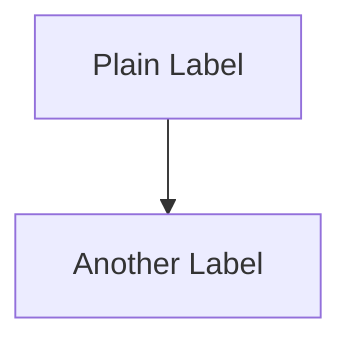

# Audit S5 — Code fences and MDX syntax (published site)

Run on every `.mdx` you touch.

## Copy-pasteable TypeScript

Same bar as vault audit A: full imports, class wrappers, no undefined symbols. Prefer `ts twoslash` when types teach.

## Expressive Code annotations (MANDATORY)

Starlight renders code blocks with [Expressive Code](https://expressive-code.com/). Use these
annotations to improve readability. Enforced by `bun run lint:ec-titles` (CI) and the pre-commit
autofixer (`scripts/pre-commit-autofix.ts`).

### `title=` — filename on the tab bar

Every code block that represents a **specific file** MUST carry `title="filename.ext"` on the
opening fence. Conceptual snippets (pseudocode, output examples, release notes) stay untitled.

```
```typescript title="cats.controller.ts"
```

The pre-commit autofixer auto-promotes `// filename.ext` first-line comments to `title=`.
The CI lint (`lint:ec-titles`) fails on any remaining comment-as-title.

### `ins=` / `del=` — progressive diffs

When a code block builds on a previous one in the same note (e.g., step 2 adds a guard to step 1's
controller), use `ins={lines}` for additions and `del={lines}` for removals. This renders green/red
diff highlighting.

```
```typescript title="app.module.ts" ins={3-4} del={2}
```

### `collapse=` — hide boilerplate

Collapse long import blocks or setup code that readers have already seen:

```
```typescript title="dynamic-serializer.interceptor.ts" collapse={1-7}
```

### `showLineNumbers` — opt-in line numbers

Use `showLineNumbers` on long algorithm implementations (30+ lines) when surrounding prose
references specific lines. Installed via `@expressive-code/plugin-line-numbers`; default is off.

## Mermaid diagrams

Mermaid blocks MUST NOT contain Obsidian wikilinks (`[[slug|Label]]`). Mermaid doesn't understand
them — they render as literal bracket text. Use plain text labels and Mermaid `click` directives:

```


Enforced: `bun run lint:mermaid-wikilinks`.

## Shell placeholders in AWS recipes

| Fence | Placeholder style | Why |
| --- | --- | --- |
| `bash` | `$VAR` or `"$VAR"` in commands; `${VAR}` inside double-quoted strings and heredocs | Shiki highlights shell variables |
| `json` (static file user edits by hand) | Angle brackets `<SRC_BUCKET>` only when there is no export block | Valid JSON; no `$` prefix (invalid in JSON strings) |
| Policy tied to `export` block above | `bash` + unquoted heredoc (`<<EOF`) emitting `.json` | `${ACCOUNT_A_ID}` expands at write time and highlights as shell |

Do not put bare `ACCOUNT_A_ID` in a `json` fence when the recipe already exports shell variables: use a heredoc in `bash` instead.

## MDX expression hazards

| Pattern | Risk | Fix |
| --- | --- | --- |
| `` `${id}` `` or `{foo}` in **prose** (outside fences) | MDX treats `{` as JSX | Use string concat in prose, or keep inside fenced blocks |
| `[[slug\|label]]` inside **table rows** (`\| col \|`) | Pipe splits the wikilink; renders as `[[slug` | Use `[label](/knowledge-base/slug/)` in tables; wikilinks are fine in body bullets |
| `<Steps>` with `###` headings or extra `<Aside>` between steps | Starlight expects one `<ol>` | Use `## N. Title` sections for long CLI recipes, or numbered list items only inside `<Steps>` |

Enforced: `bun run lint:mdx-table-wikilinks` (table alias rule).

## Twoslash

Default on teaching fences. Do not add hover-tutorial sections on every page.
