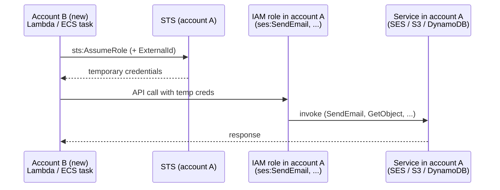

> Pattern for partial [[aws/account-migrations|AWS account migrations]]: leave a service in the old account and let new-account compute reach it via STS (Security Token Service) `AssumeRole` with an external ID and a tightly-scoped permission policy.

When workloads must move from account A to account B but one service can't be migrated immediately (sandbox, vendor approval, regulatory lock-in), leave that service in account A and let account B's compute reach it via a cross-account [[aws/iam|IAM]] role. Most useful during partial migrations where the new account doesn't yet have production access for SES (Simple Email Service), Bedrock (managed foundation-model API), or any service with a regional approval flow.

## Shape



Per the [IAM cross-account role tutorial](https://docs.aws.amazon.com/IAM/latest/UserGuide/tutorial_cross-account-with-roles.html), the trust direction is **the role lives in the account that owns the resource**, and the principal in the trust policy is the account (or specific role) that needs access.

## Recipe

Uses two named CLI profiles, `account-a` (resource owner) and `account-b` (caller).

### Pre-flight: confirm profile identities

```bash
aws sts get-caller-identity --profile account-a --output json
aws sts get-caller-identity --profile account-b --output json
```

### 1. In account A, create the role

Trust policy: allow account B's root principal (or a specific role) to assume. Save as `trust-policy.json`:

```json
{
  "Version": "2012-10-17",
  "Statement": [
    {
      "Effect": "Allow",
      "Principal": { "AWS": "arn:aws:iam::ACCOUNT_B_ID:root" },
      "Action": "sts:AssumeRole",
      "Condition": {
        "StringEquals": { "sts:ExternalId": "your-external-id" }
      }
    }
  ]
}
```

> [!warning] Always set an external ID
> [The `ExternalId` condition](https://docs.aws.amazon.com/IAM/latest/UserGuide/id_roles_create_for-user_externalid.html) prevents the [confused-deputy problem](https://docs.aws.amazon.com/IAM/latest/UserGuide/confused-deputy.html): without it, anyone in account B (a misconfigured [[aws/lambda|Lambda]], a different team) could assume your role just by knowing its ARN (Amazon Resource Name). Set a unique value per integration, store it as configuration in account B, and require it in the trust policy.

Permission policy: only the actions on the specific resource you need. Save as `permission-policy.json`:

```json
{
  "Version": "2012-10-17",
  "Statement": [
    {
      "Effect": "Allow",
      "Action": ["ses:SendEmail", "ses:SendRawEmail"],
      "Resource": [
        "arn:aws:ses:REGION:ACCOUNT_A_ID:identity/example.com",
        "arn:aws:ses:REGION:ACCOUNT_A_ID:configuration-set/*"
      ]
    }
  ]
}
```

Create the role and attach the inline policy ([`aws iam create-role`](https://docs.aws.amazon.com/cli/latest/reference/iam/create-role.html), [`aws iam put-role-policy`](https://docs.aws.amazon.com/cli/latest/reference/iam/put-role-policy.html)):

```bash
aws iam create-role \
  --profile account-a \
  --role-name CrossAccountServiceRole \
  --assume-role-policy-document file://trust-policy.json

aws iam put-role-policy \
  --profile account-a \
  --role-name CrossAccountServiceRole \
  --policy-name SesSendOnly \
  --policy-document file://permission-policy.json
```

Verify the role and its inline policies are wired up before continuing ([`aws iam get-role`](https://docs.aws.amazon.com/cli/latest/reference/iam/get-role.html), [`aws iam list-role-policies`](https://docs.aws.amazon.com/cli/latest/reference/iam/list-role-policies.html)):

```bash
aws iam get-role \
  --profile account-a \
  --role-name CrossAccountServiceRole \
  --query 'Role.{Arn:Arn,Trust:AssumeRolePolicyDocument}' --output json

aws iam list-role-policies \
  --profile account-a \
  --role-name CrossAccountServiceRole
```

### 2. In account B, grant `sts:AssumeRole`

Add to the Lambda (or ECS task) execution role. Save as `assume-policy.json`:

```json
{
  "Version": "2012-10-17",
  "Statement": [
    {
      "Effect": "Allow",
      "Action": "sts:AssumeRole",
      "Resource": "arn:aws:iam::ACCOUNT_A_ID:role/CrossAccountServiceRole"
    }
  ]
}
```

```bash
aws iam put-role-policy \
  --profile account-b \
  --role-name MyLambdaExecutionRole \
  --policy-name AssumeCrossAccountSes \
  --policy-document file://assume-policy.json
```

Quick sanity check from a workstation in account B before deploying code:

```bash
aws sts assume-role \
  --profile account-b \
  --role-arn arn:aws:iam::ACCOUNT_A_ID:role/CrossAccountServiceRole \
  --role-session-name smoke-test \
  --external-id your-external-id
```

A successful response with `Credentials` proves the trust + permission chain works before app code runs.

For a permission-only check (no temporary credentials issued), use [`aws iam simulate-principal-policy`](https://docs.aws.amazon.com/cli/latest/reference/iam/simulate-principal-policy.html) against the role:

```bash
aws iam simulate-principal-policy \
  --profile account-a \
  --policy-source-arn arn:aws:iam::ACCOUNT_A_ID:role/CrossAccountServiceRole \
  --action-names ses:SendEmail \
  --resource-arns arn:aws:ses:REGION:ACCOUNT_A_ID:identity/example.com \
  --query 'EvaluationResults[].{action:EvalActionName,decision:EvalDecision,denied:MatchedStatements[?Effect==`Deny`].SourcePolicyId}' \
  --output table
```

A `Decision: allowed` means the action is permitted; anything else lists the policy that denied it.

### 3. In application code, assume the role at startup

```ts
import { STSClient, AssumeRoleCommand } from "@aws-sdk/client-sts";
import { SESClient } from "@aws-sdk/client-ses";

async function buildSesClient() {
  const sts = new STSClient({});
  const res = await sts.send(
    new AssumeRoleCommand({
      RoleArn: process.env.SES_ROLE_ARN,
      RoleSessionName: "my-app",
      DurationSeconds: 3600,
      ExternalId: process.env.SES_EXTERNAL_ID,
    }),
  );
  const c = res.Credentials!;
  return new SESClient({
    region: "us-east-2",
    credentials: {
      accessKeyId: c.AccessKeyId!,
      secretAccessKey: c.SecretAccessKey!,
      sessionToken: c.SessionToken!,
    },
  });
}
```

[`AssumeRole`](https://docs.aws.amazon.com/STS/latest/APIReference/API_AssumeRole.html) returns short-lived credentials ([`DurationSeconds`](https://docs.aws.amazon.com/STS/latest/APIReference/API_AssumeRole.html#API_AssumeRole_RequestParameters) defaults to 3600s, max 43200s capped by the role's maximum session duration; **role chaining is capped at 1 hour** and the call fails if you ask for more). For long-running processes, refresh before expiry; the AWS SDK credential provider chain has built-in helpers (e.g. [`fromTemporaryCredentials`](https://docs.aws.amazon.com/AWSJavaScriptSDK/v3/latest/Package/-aws-sdk-credential-providers/Function/fromTemporaryCredentials/) in JS SDK v3) that handle refresh automatically.

## Permission scope traps

The first call after deploying a fresh role will often fail with an unexpected `AccessDenied` because the resource you targeted has more parts than the obvious one. Common offenders:

| Service                    | Obvious resource       | Hidden additional resource                                             |
| -------------------------- | ---------------------- | ---------------------------------------------------------------------- |
| SES `SendEmail`            | `identity/example.com` | The configuration set attached to the identity (`configuration-set/*`) |
| S3 `GetObject`             | `bucket/key`           | The bucket itself for some operations (`bucket`)                       |
| [[aws/kms\|KMS]] `Decrypt` | The key                | A grant on the key for ephemeral consumers                             |

Read the first `AccessDenied` carefully: it names the exact ARN that was checked. Add it to the resource list and retry.

## When NOT to use this pattern

- **Both accounts under your control and the service has no migration blocker**: just migrate the service. Each cross-account hop adds latency, a credential-refresh failure mode, and an audit step.
- **You'd need to refresh credentials more often than once an hour**: for high-throughput callers, the `AssumeRole` overhead and refresh complexity dominate; consider IAM Identity Center (the AWS-managed single sign-on portal, formerly AWS SSO) or a longer-lived federated mechanism.
- **The downstream service supports resource policies** (S3, SQS, SNS, KMS): you can often grant cross-account access on the resource itself without an intermediate role, which is simpler.

## Cleanup checklist after the original migration completes

- Migrate the held-back service to the new account when the blocker clears (e.g. SES production access granted).
- Delete the cross-account role in account A:

  ```bash
  aws iam delete-role-policy \
    --profile account-a \
    --role-name CrossAccountServiceRole \
    --policy-name SesSendOnly

  aws iam delete-role \
    --profile account-a \
    --role-name CrossAccountServiceRole
  ```

- Remove the `sts:AssumeRole` permission from account B's execution role:

  ```bash
  aws iam delete-role-policy \
    --profile account-b \
    --role-name MyLambdaExecutionRole \
    --policy-name AssumeCrossAccountSes
  ```

- Remove the role-assumption logic from the application (drop back to the default credential provider chain).
- Rotate the external ID before the cleanup if it was checked into source control.
