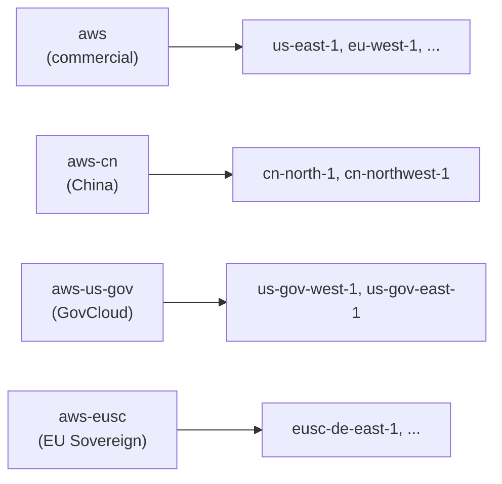

> Amazon S3 (Simple Storage Service) is an object storage service: you put bytes (an "object") into a named container (a "bucket") under a string key, and S3 makes them durable, regional, and addressable over HTTP. It's the default place to keep anything that isn't a row in a database.

## TL;DR

- **Object storage, not a filesystem.** A bucket holds objects keyed by a string; `/` in the key is convention, not a folder.
- **Pick a Region once.** Buckets are regional and the bytes never leave it without an explicit copy or replicate. Name + Region are immutable.
- **Private by default.** Grant access through [[aws/iam|IAM]], bucket policies, or Access Points; leave Block Public Access on.
- **Strong read-after-write everywhere.** A successful PUT is visible to the next GET or LIST. No torn reads. No cross-key transactions.

## When to use S3 vs. something else

- **Use S3** for: client-uploaded blobs, build artifacts, database backups, static website assets (front it with [[aws/cloudfront|CloudFront]]), data-lake parquet/json, log archives, machine-learning training data.
- **Don't use S3 as a database.** No secondary indexes, no transactional updates across objects, list operations are O(prefix-scan). For metadata-heavy lookups, store the metadata in DynamoDB or PostgreSQL and keep the bytes in S3.
- **Don't use S3 as a queue.** Object events fire via [[aws/recipes/s3-event-notifications|S3 Event Notifications]] into SNS, SQS, or [[aws/lambda|Lambda]], but S3 itself has no ordering or replay primitives.

## Buckets and objects

S3 stores **objects** (a blob plus metadata) in **buckets**. Each object is identified by `bucket + key (+ optional version-id)`. The key is just a string: `/` characters are conventional but not real folders.

A flat key namespace is what makes S3 cheap and infinitely scalable, but it's also why "rename a directory" doesn't exist as a single operation: you copy + delete every object that shares the prefix.

### Bucket naming rules

Bucket names are not free-form. AWS rejects anything that breaks these constraints ([source](https://docs.aws.amazon.com/AmazonS3/latest/userguide/bucketnamingrules.html#general-purpose-bucket-names)):

- 3-63 characters.
- Lowercase letters, numbers, periods (`.`), hyphens (`-`) only.
- Must begin and end with a letter or number.
- No two adjacent periods.
- Must not look like an IP address (`192.168.5.4`).
- Reserved prefixes (cannot start with): `xn--`, `sthree-`, `amzn-s3-demo-`.
- Reserved suffixes (cannot end with): `-s3alias`, `--ol-s3`, `.mrap`, `--x-s3`, `--table-s3`. (The suffix `-an` is reserved too, but the rule is the inverse: bucket names ending in `-an` are _only_ valid when you opt into the account regional namespace described below.)

> [!warning]- Avoid periods unless you're hosting a static website
> Buckets with periods in their name break virtual-host-style HTTPS access (the wildcard certificate `*.s3.amazonaws.com` doesn't cover `my.bucket.s3.amazonaws.com`). Buckets used with S3 Transfer Acceleration cannot have periods at all. The only place periods are routinely used is static-website-hosting buckets, where they let the bucket name match the hostname (`example.com`) ([source](https://docs.aws.amazon.com/AmazonS3/latest/userguide/bucketnamingrules.html#automatically-created-buckets)).

## Regions and namespaces

A bucket is regional. When you create it you pin a single AWS Region and the bytes never leave that Region unless you explicitly copy or replicate them ([source](https://docs.aws.amazon.com/AmazonS3/latest/userguide/Welcome.html#CoreConcepts)).

General-purpose bucket names live in a **shared global namespace** within an AWS partition by default. A partition is an isolated set of Regions sharing one IAM scope and one ARN (Amazon Resource Name) prefix:

Once `my-bucket` exists in account A's `us-east-1`, no other account can claim that name in any Region of the **same partition** until A deletes it ([source](https://docs.aws.amazon.com/AmazonS3/latest/userguide/gpbucketnamespaces.html)).

S3 also offers an opt-in **account regional namespace** for general-purpose buckets: names follow the shape `<prefix>-<AccountId>-<Region>-an` and are reserved to your account, so no cross-account squatting is possible there. Pass `x-amz-bucket-namespace: account-regional` to `CreateBucket`. Useful for templating identical bucket names across Regions ([source](https://docs.aws.amazon.com/AmazonS3/latest/userguide/gpbucketnamespaces.html#account-regional-gp-buckets)).

> [!warning] Bucket name + Region are immutable
> You cannot rename a bucket and you cannot change its Region after creation. If you picked the wrong Region, the only fix is: create a new bucket in the right Region and `aws s3 sync` everything across. See [[aws/recipes/cross-account-bucket-migration|cross-account bucket migration]] for the same shape applied across accounts.

## What S3 actually guarantees

- **Strong read-after-write consistency** for PUT, overwrite-PUT, and DELETE in all Regions. A successful PUT is visible to the next GET/LIST from any client ([source](https://docs.aws.amazon.com/AmazonS3/latest/userguide/Welcome.html#ConsistencyModel)).
- **Atomic per-key updates.** A concurrent PUT and GET on the same key returns either the old value or the new value, never a torn read. There is no atomicity across keys: if you need transactional updates spanning multiple objects, build it on top.
- **Concurrent writes to the same key: last write wins, unpredictably.** If two clients PUT to the same key at the same time, both succeed and S3 keeps the one with the later internal timestamp. You can't tell in advance which client that will be ([source](https://docs.aws.amazon.com/AmazonS3/latest/userguide/Welcome.html#ConsistencyModel)). S3 has no built-in lock for this; if you need ordering, gate writes through your own coordinator (a conditional write in DynamoDB, AWS's managed key-value store; a single-writer queue; etc.).
  - Don't reach for **S3 Object Lock** here: despite the name, it's a write-once-read-many (WORM) retention feature that prevents delete or overwrite for a fixed period, not a concurrency primitive ([source](https://docs.aws.amazon.com/AmazonS3/latest/userguide/object-lock.html)).
- **Bucket configuration is eventually consistent.** If you delete a bucket and immediately list buckets, the deleted one may still appear briefly. After first enabling versioning, AWS recommends waiting up to 15 minutes before issuing PUT or DELETE on objects, since GETs in that window can return `404 NoSuchKey` even for objects that exist ([source](https://docs.aws.amazon.com/AmazonS3/latest/userguide/manage-versioning-examples.html)).

## Versioning

A bucket has one of three versioning states ([source](https://docs.aws.amazon.com/AmazonS3/latest/userguide/Versioning.html#versioning-states)):

- **Unversioned** (default). PUTs overwrite, DELETEs remove. No history.
- **Versioning-enabled.** PUT to an existing key creates a new version with a unique version ID; the old version stays. DELETE inserts a **delete marker** as the new current version: the object "disappears" from un-versioned LISTs but every prior version is still there and restorable.
- **Versioning-suspended.** New writes get a `null` version ID and overwrite each other; existing versioned objects are preserved.

Once a bucket has been versioning-enabled, it can never go back to unversioned. The only way out is _suspended_. Pre-existing objects keep a `null` version ID until they're written again.

> [!warning]- Versions are billed as separate objects
> Each version is the entire object, not a diff. Three versions of a 1 GB file = 3 GB billed. Pair versioning with a lifecycle rule that expires noncurrent versions after N days, otherwise costs grow forever ([source](https://docs.aws.amazon.com/AmazonS3/latest/userguide/Versioning.html#versioning-lifecycle)).

## Access defaults

Buckets and the objects in them are **private by default**. Access requires an explicit grant via one of:

| Mechanism                           | When to reach for it                                                                                               |
| ----------------------------------- | ------------------------------------------------------------------------------------------------------------------ |
| [[aws/iam\|IAM]] identity policy    | Same-account principals (users, roles, services in your account).                                                  |
| Bucket policy                       | Resource-based grants, especially cross-account or "anyone in this VPC".                                           |
| S3 Access Points                    | Per-application named endpoints with their own policies; scales better than one bucket policy that everyone edits. |
| ACLs (access control lists, legacy) | Avoid. Default S3 Object Ownership disables ACLs entirely; keep it that way.                                       |

S3 also exposes a **Block Public Access** toggle at both the account and the bucket level, which short-circuits any bucket policy or ACL that AWS evaluates as granting public access ([source](https://docs.aws.amazon.com/AmazonS3/latest/userguide/access-control-block-public-access.html#access-control-block-public-access-policy-status); the documented "meaning of public" covers `Principal: *` plus broader patterns like wildcarded condition keys). Leave all four flags on unless you're deliberately serving a public website (and even then, prefer fronting it with [[aws/cloudfront|CloudFront]] + an origin access control instead of opening the bucket).

## What you actually pay for

S3 has no flat fee. The bill is the sum of six independent components ([source](https://aws.amazon.com/s3/pricing/)):

1. **Storage.** Per GB-month, varies by [[aws/s3-storage-classes|storage class]]. Standard is the most expensive per GB; Glacier Deep Archive is the cheapest by a wide margin (over an order of magnitude less per GB-month) but trades that for retrieval delays measured in hours.
2. **Requests and data retrieval.** Per-1,000-requests for PUT/COPY/POST/LIST and per-10,000-requests for GET/SELECT. Infrequent-Access and Glacier classes also charge a per-GB **retrieval fee** on top of the request fee: that's the part that surprises people who pick IA for "cheap storage" and then read the data nightly.
3. **Data transfer.** Egress out of AWS to the internet is billed per GB. Egress to other AWS Regions is billed too. Ingress is free. Transfer between S3 and an EC2 instance in the same Region is free.
4. **Management and analytics.** S3 Storage Lens (org-wide storage metrics dashboard), Inventory (scheduled CSV/Parquet listing of objects), Batch Operations (managed bulk-action jobs), and Object Tagging each have their own per-object or per-feature fee. Off by default; only billed when enabled.
5. **Replication.** Cross-Region Replication (CRR) and Same-Region Replication (SRR) bill the inter-Region transfer plus per-object replication PUTs. S3 Replication Time Control (RTC) adds a per-GB fee on top in exchange for a 15-minute replication service-level agreement (SLA) ([source](https://docs.aws.amazon.com/AmazonS3/latest/userguide/replication-time-control.html)).
6. **S3 Object Lambda and S3 Select.** Per-request fees for transforming or filtering data on the read path.

The two cost traps most teams hit: (1) **versioning without a lifecycle rule** (every overwrite doubles your bill, see the warning above), and (2) **picking IA or Glacier for data you actually access often** (retrieval fees outweigh the storage savings). Front static-asset traffic with [[aws/cloudfront|CloudFront]] to cut egress.

## See also

- [[aws/cli/s3|S3 CLI cheatsheet]]: the `aws s3` and `aws s3api` commands I reach for when inspecting or moving buckets.
- [[aws/recipes/cross-account-bucket-migration|Cross-account bucket migration]]: end-to-end recipe for moving a bucket between AWS accounts.
- [Amazon S3 user guide](https://docs.aws.amazon.com/AmazonS3/latest/userguide/Welcome.html) (official).
