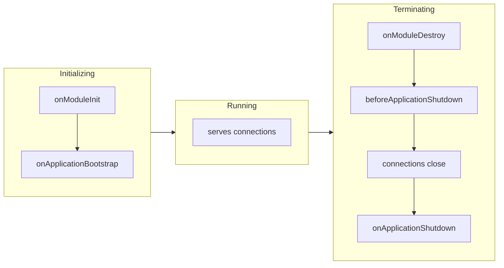

> Hooks for **application** lifetime: when modules wake up, when the process is asked to leave. Distinct from the per-request [[nestjs/fundamentals/request-lifecycle|request lifecycle]], which fires once per HTTP call.

## The three phases



The init phase fires when you call `app.init()` or `app.listen()`. The terminate phase fires when you call `app.close()` **or** when a signal arrives **and** you opted in via `enableShutdownHooks()`. No init call, no init hooks. No `enableShutdownHooks()`, no signal-driven shutdown hooks.

## The five interfaces

Implement an interface, define the matching method. The interface itself disappears at compile time; the method name is what Nest looks for at runtime, so spelling matters.

| Interface                   | Method signature                                  | Phase     | Receives signal? |
| --------------------------- | ------------------------------------------------- | --------- | ---------------- |
| `OnModuleInit`              | `onModuleInit(): any`                             | init      | no               |
| `OnApplicationBootstrap`    | `onApplicationBootstrap(): any`                   | init      | no               |
| `OnModuleDestroy`           | `onModuleDestroy(): any`                          | terminate | no               |
| `BeforeApplicationShutdown` | `beforeApplicationShutdown(signal?: string): any` | terminate | yes              |
| `OnApplicationShutdown`     | `onApplicationShutdown(signal?: string): any`     | terminate | yes              |

> [!info] Only the last two get the signal
> The official docs say "with the corresponding signal as the first parameter" when describing the terminate phase, but `OnModuleDestroy.onModuleDestroy()` takes no arguments per its interface. `beforeApplicationShutdown` runs **after** every `onModuleDestroy`, so it can't pass the signal back; if you need the signal name inside `onModuleDestroy`, stash it from your own signal handler **before** calling `app.close()`.

Hooks live on **modules, providers, and controllers**. Same class can implement multiple.

```ts
import { Injectable, OnModuleInit, OnApplicationShutdown } from "@nestjs/common";

@Injectable()
export class UsersService implements OnModuleInit, OnApplicationShutdown {
  async onModuleInit(): Promise<void> {
    // open pool, warm cache, prefetch config
  }

  async onApplicationShutdown(signal?: string): Promise<void> {
    // drain pool, flush metrics; signal is e.g. "SIGTERM"
  }
}
```

## Init: order and async

Within a single class, `onModuleInit` runs first, then later `onApplicationBootstrap`. Across the app, the official docs only state that "execution order of `onModuleInit()` and `onApplicationBootstrap()` directly depends on the order of module imports, awaiting the previous hook" ([Lifecycle events](https://docs.nestjs.com/fundamentals/lifecycle-events)). In practice that means a module's hooks run only after every module it imports has finished. Practical consequences:

- For an import graph `A → B → C` (A depends on B, B depends on C), init effectively goes `C → B → A` because Nest awaits each imported module before the importer.
- Inside one module, hook execution is sequential: bootstrap waits for init.
- Both hooks may return a `Promise` (or be `async`); Nest will not move on until it resolves or rejects.
- `@Global()` modules are visible to every other module without an explicit `imports:` entry, so the documented "order depends on the order of module imports" rule doesn't pin down where they fall in the walk. Empirically they finish init first and tear down last (the implicit-import edge puts them at the deepest level of the graph, mirrored by the [[nestjs/releases/v11|v11]] reversed-teardown rule), but the official docs don't promise this. If the order is load-bearing, write a smoke test that logs from each hook rather than relying on it.

If you need "this provider should be ready before that controller starts handling requests", `onApplicationBootstrap` is the safer slot: by the time it runs, **every** module has finished `onModuleInit`.

## Shutdown: enabling hooks and signals

Shutdown listeners are off by default because they pin extra event listeners on `process` and that adds up if you spawn many Nest apps in one Node process (Jest is the usual culprit). Opt in once at bootstrap:

```ts
import { NestFactory } from "@nestjs/core";
import { AppModule } from "./app.module";

async function bootstrap(): Promise<void> {
  const app = await NestFactory.create(AppModule);
  app.enableShutdownHooks();
  await app.listen(process.env.PORT ?? 3000);
}
bootstrap();
```

After `enableShutdownHooks()`, receiving a signal triggers the terminate sequence. Within shutdown:

1. `onModuleDestroy` runs in every class that implements it. Nest awaits the returned promises.
2. `beforeApplicationShutdown` runs next, with the signal name. Nest awaits.
3. Connections close (`app.close()` resolves internally).
4. `onApplicationShutdown` runs last, with the signal name.

> [!warning] Termination order reversed since [[nestjs/releases/v11|v11]]
> Pre-v11, init and destroy walked the module graph in the same direction (deepest-first). Since v11 the destroy walk is the reverse: for an import graph `A → B → C`, init still goes `C → B → A`, but `onModuleDestroy` now goes `A → B → C` so dependents shut down **before** their dependencies and a service can still call its DB inside its own `onModuleDestroy`. Source: [v11.0.0 release notes](https://github.com/nestjs/nest/releases/tag/v11.0.0) (PR [#14111](https://github.com/nestjs/nest/pull/14111) "Order of module destroy should be the reverse of module init") and the [v11 announcement](https://trilon.io/blog/announcing-nestjs-11-whats-new). If you maintained code against the pre-v11 order it will visibly fire in a new sequence after the upgrade.

`app.close()` only triggers the destroy/shutdown chain. It does **not** kill the Node process. If timers, open intervals, or background workers are still alive, the process keeps running. Either let your hooks clear them, or follow `await app.close()` with `process.exit(0)` once you're confident there's nothing to drain.

## Gotchas

> [!warning] Request-scoped classes are skipped
> Hooks never fire on `Scope.REQUEST` providers. Request-scoped instances are created per request and garbage-collected after the response, so they're outside the application lifecycle. Move startup/teardown logic to a default-scoped provider that the request-scoped one depends on.

> [!warning] Windows has no `SIGTERM`
> Windows kills processes unconditionally via Task Manager: there's no signal to intercept. `SIGINT` (Ctrl+C) and `SIGBREAK` work. For container/k8s deploys this is a non-issue (Linux), but local-dev on Windows can mask broken shutdown logic that production would expose.

> [!warning] `enableShutdownHooks()` adds process listeners
> Each call attaches handlers for `SIGTERM`, `SIGINT`, etc. Calling `NestFactory.create` repeatedly (parallel tests, multi-tenant runners) without disposing the previous app emits Node's `MaxListenersExceededWarning`. Either cap to one app per process, or `await app.close()` between iterations.

## See also

- [[nestjs/fundamentals/request-lifecycle|Request lifecycle]]: the **other** lifecycle, per HTTP call rather than per process
- [[nestjs/fundamentals/index|Fundamentals MOC]]
- [[nestjs/deployment/graceful-shutdown|Graceful shutdown (planned)]]: how `enableShutdownHooks` ties to Docker stop timeouts, k8s `preStop`, and PID 1 handling
- Official: [Lifecycle Events](https://docs.nestjs.com/fundamentals/lifecycle-events)
