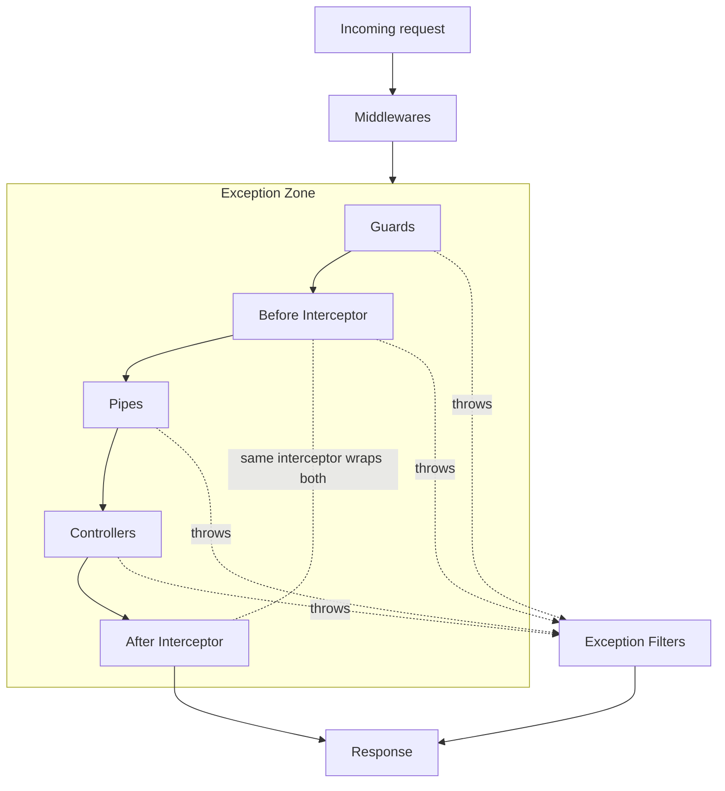

How a request flows through a NestJS app, from socket to response. Knowing the order tells you where to put each piece of logic.

## The pipeline

> [!info]- The two interceptor boxes are the **same** interceptor
> A single `intercept(context, next)` call wraps the handler. The "before" box is the code that runs prior to invoking the handler; the "after" box is the logic chained on the returned stream. Two boxes in the diagram, **one** method. Details in [[interceptors#The pre/post pattern|Interceptors > The pre/post pattern]].
>
> You can stack multiple interceptors (global + controller + route). Each one wraps the next, so the boxes nest like onion layers: pre runs in registration order, post runs in **FILO** (first in, last out).

> [!info]- Why [[middleware|middleware]] sits outside the exception zone
> Middleware runs on the raw platform layer (Express/Fastify), before Nest installs its filter chain. A synchronous `throw` inside middleware bubbles to the platform's default handler ([Express error handling](https://expressjs.com/en/guide/error-handling.html), [Fastify hooks](https://fastify.dev/docs/latest/Reference/Hooks/#errors-in-hooks)), **not** to your Nest [[exception-filters|@Catch() filters]]. To route a middleware error through the filter chain, call `next(err)` explicitly (Express) or rethrow inside an `async` middleware so the platform forwards it to Nest's exception layer.

## The order

1. Incoming request hits the HTTP adapter.
2. [[middleware|Middleware]]: global, then module bound.
3. [[guards|Guards]]: global, controller, route.
4. [[interceptors|Interceptors]] (before): global, controller, route.
5. [[pipes|Pipes]]: global, controller, route, then route parameters in reverse order.
6. **Controller handler** runs.
7. [[interceptors|Interceptors]] (after): route, controller, global. FILO order: first interceptor in is the last one out.
8. If anything threw, [[exception-filters|Exception filters]] catch it, resolving from route up to global.
9. Response is sent.

> [!info]- Filters resolve in the **opposite** direction
> Every other layer resolves outermost-first: **global → controller → route**. Exception filters invert that: **route → controller → global**. The first filter whose `@Catch()` matches wins; nothing further at the same handler sees the exception. This is why a route-bound filter can override a global one, but a global filter can never "wrap" a route filter. Rethrowing from inside a filter does **not** re-enter the per-handler chain: it falls through to the global filter layer (and ultimately `BaseExceptionFilter`). See [[exception-filters#Order: route first, then controller, then global|Exception filters > Order]].

## Why the order matters

Pick the right tool by asking _when_ it should run:

| Need                                                                     | Tool                                     |
| ------------------------------------------------------------------------ | ---------------------------------------- |
| Mutate the raw request, attach correlation IDs                           | [[middleware\|Middleware]]               |
| Authorization decision before any work                                   | [[guards\|Guards]]                       |
| Wrap the handler with logging, [[nestjs/data/caching\|caching]], retries | [[interceptors\|Interceptors]]           |
| Validate or transform input                                              | [[pipes\|Pipes]]                         |
| Convert a thrown error into an HTTP response                             | [[exception-filters\|Exception filters]] |

## Source

Adapted from the official [NestJS Request Lifecycle FAQ](https://docs.nestjs.com/faq/request-lifecycle).
