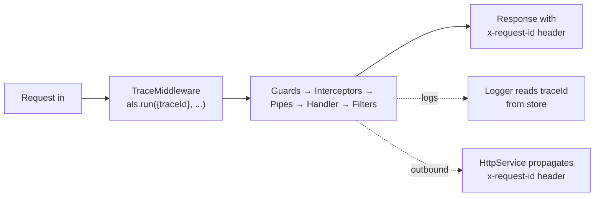

> Stamp every request with a unique ID at the edge, propagate it through [[nestjs/fundamentals/guards|guards]], [[nestjs/fundamentals/interceptors|interceptors]], [[nestjs/fundamentals/pipes|pipes]], the handler, error responses, log lines, and outbound HTTP calls. Turns "an error happened" into "request `8f2a` failed at this exact step in this exact service". The propagation layer relies only on built-in `node:async_hooks` (`AsyncLocalStorage`) plus `randomUUID` from `node:crypto`.

## How it works

`AsyncLocalStorage` (from `node:async_hooks`) is a per-async-context store: anything inside the `als.run(store, callback)` callback (and any `await` chain it spawns) sees the same `store`. A [[nestjs/fundamentals/middleware|middleware]] opens the context once per request; every downstream layer ([[nestjs/fundamentals/guards|guards]] → [[nestjs/fundamentals/interceptors|interceptors]] → [[nestjs/fundamentals/pipes|pipes]] → handler → [[nestjs/fundamentals/exception-filters|exception filters]]) reads from the same store without anyone passing it as a parameter.



## Setup

No npm install. `AsyncLocalStorage` is in Node's standard library since 12.17. Optional: `@nestjs/axios` if you want outbound HTTP propagation (covered below).

```bash
npm install --save @nestjs/axios axios   # optional, for outbound propagation
```

## Step 1: middleware opens the context

```typescript
// trace/trace-context.ts
import { AsyncLocalStorage } from "node:async_hooks";

export interface TraceStore {
  traceId: string;
}

export const traceStorage = new AsyncLocalStorage<TraceStore>();

export const getTraceId = (): string | undefined => traceStorage.getStore()?.traceId;
```

```typescript
// trace/trace.middleware.ts
import { randomUUID } from "node:crypto";
import { Injectable, NestMiddleware } from "@nestjs/common";
import { NextFunction, Request, Response } from "express";
import { traceStorage } from "./trace-context";

@Injectable()
export class TraceMiddleware implements NestMiddleware {
  use(req: Request, res: Response, next: NextFunction): void {
    const inbound = req.headers["x-request-id"];
    const traceId = (typeof inbound === "string" && inbound) || randomUUID();
    res.setHeader("x-request-id", traceId);
    traceStorage.run({ traceId }, () => next());
  }
}
```

```typescript
// app.module.ts
import { MiddlewareConsumer, Module, NestModule } from "@nestjs/common";
import { TraceMiddleware } from "./trace/trace.middleware";

@Module({})
export class AppModule implements NestModule {
  configure(consumer: MiddlewareConsumer): void {
    consumer.apply(TraceMiddleware).forRoutes("{*splat}");
  }
}
```

Why middleware, not a [[nestjs/fundamentals/guards|guard]] or [[nestjs/fundamentals/interceptors|interceptor]]? Middleware is the **only** layer that runs before guards and can wrap `next()` in `als.run()` so every downstream layer sees the store. Opening the context anywhere later means earlier layers see `undefined`.

Request:

```bash
curl -i http://localhost:3000/cats
```

Response:

```http
HTTP/1.1 200 OK
x-request-id: 8f2a4c6e-7d10-4f4e-b9a1-2c5c1d9c6f8a
content-type: application/json

[]
```

When the client sends an inbound `X-Request-ID`, it's echoed back instead of replaced.

> [!warning]- Trust inbound `X-Request-ID` only from trusted upstreams
> The middleware above echoes any client-supplied header. If your service sits directly on the public internet, attackers can poison your logs (`X-Request-ID: admin-action-success`) or collide IDs deliberately to confuse incident response. Behind a reverse proxy / API gateway you control, accept the inbound value; consider stripping it at the proxy if you want to mint fresh IDs only there.

## Step 2: logger that injects the trace ID into every line

The point of a trace ID is to find it in logs without sprinkling it through every `Logger.log()` call. Subclass Nest's `ConsoleLogger` and override [`formatPid()`](https://github.com/nestjs/nest/blob/master/packages/common/services/console-logger.service.ts#L417-L419) (called by `printMessages()` for every log line):

```typescript
// trace/trace-logger.service.ts
import { ConsoleLogger, Injectable, Scope } from "@nestjs/common";
import { getTraceId } from "./trace-context";

@Injectable({ scope: Scope.TRANSIENT })
export class TraceLogger extends ConsoleLogger {
  protected formatPid(pid: number): string {
    const traceId = getTraceId();
    const base = super.formatPid(pid);
    return traceId ? `${base}[${traceId.slice(0, 8)}] ` : base;
  }
}
```

```typescript
// main.ts
import { NestFactory } from "@nestjs/core";
import { AppModule } from "./app.module";
import { TraceLogger } from "./trace/trace-logger.service";

async function bootstrap() {
  const app = await NestFactory.create(AppModule, { bufferLogs: true });
  app.useLogger(app.get(TraceLogger));
  await app.listen(3000);
}
bootstrap();
```

`Scope.TRANSIENT` is required for custom loggers so each context that injects the logger gets its own instance with the right `context` name. The official [Custom logger → Injecting a custom logger](https://docs.nestjs.com/techniques/logger#injecting-a-custom-logger) docs show this pattern (`@Injectable({ scope: Scope.TRANSIENT })` on the logger class).

> [!warning]- `TraceLogger` MUST be `Scope.TRANSIENT`
> If `TraceLogger` is the default `Scope.DEFAULT` (singleton), Nest reuses one instance app-wide and the `formatPid` override won't pick up the per-injection context name. The official [Custom logger](https://docs.nestjs.com/techniques/logger#injecting-a-custom-logger) docs spell this out: easy to miss until logs lose their context names.

Log line for a request that hit `traceId = 8f2a4c6e-...`:

```
[Nest] 12345  - [8f2a4c6e] 04/28/2026, 10:42:13 AM     LOG [CatsController] list() called
```

The trace id sits inside the pid prefix because [`formatMessage`](https://github.com/nestjs/nest/blob/master/packages/common/services/console-logger.service.ts#L429-L442) emits `${pidMessage}${this.getTimestamp()} ${formattedLogLevel} ${contextMessage}${output}`, and the override above appends `[<traceId>]` to whatever `super.formatPid(pid)` already returned (`[Nest] 12345  - `).

When a log line is emitted **outside** any request (bootstrap, a cron tick), `getTraceId()` returns `undefined` and the prefix is omitted: no crash, no fake ID.

## Step 3: exception filter includes the trace ID in error bodies

The [[nestjs/fundamentals/exception-filters|exception filter]] runs outside the controller and is the last code that touches the response. Reading the trace ID from the store (not the request) keeps the filter platform-agnostic and works even if upstream code mutated the request.

```typescript
// trace/trace-exception.filter.ts
import { ArgumentsHost, Catch, HttpException, HttpStatus, Logger } from "@nestjs/common";
import { BaseExceptionFilter } from "@nestjs/core";
import { Response } from "express";
import { getTraceId } from "./trace-context";

@Catch()
export class TraceExceptionFilter extends BaseExceptionFilter {
  private readonly logger = new Logger(TraceExceptionFilter.name);

  catch(exception: unknown, host: ArgumentsHost): void {
    const traceId = getTraceId();
    const ctx = host.switchToHttp();
    const response = ctx.getResponse<Response>();

    const status =
      exception instanceof HttpException ? exception.getStatus() : HttpStatus.INTERNAL_SERVER_ERROR;
    const message =
      exception instanceof HttpException ? exception.getResponse() : "Internal server error";

    this.logger.error({ traceId, status, exception });

    response.status(status).json({
      statusCode: status,
      traceId,
      message,
      timestamp: new Date().toISOString(),
    });
  }
}
```

Register globally via the [[nestjs/fundamentals/global-providers|APP_FILTER provider]] (so DI gives `BaseExceptionFilter` the `HttpAdapter` it needs):

```typescript
// app.module.ts (additions)
import { APP_FILTER } from "@nestjs/core";
import { TraceExceptionFilter } from "./trace/trace-exception.filter";

@Module({
  providers: [{ provide: APP_FILTER, useClass: TraceExceptionFilter }],
})
export class AppModule {}
```

Request that triggers a `NotFoundException`:

```bash
curl -i http://localhost:3000/cats/999
```

Response:

```http
HTTP/1.1 404 Not Found
x-request-id: 8f2a4c6e-7d10-4f4e-b9a1-2c5c1d9c6f8a
content-type: application/json

{
  "statusCode": 404,
  "traceId": "8f2a4c6e-7d10-4f4e-b9a1-2c5c1d9c6f8a",
  "message": "Cat 999 not found",
  "timestamp": "2026-04-28T10:42:13.456Z"
}
```

The same `traceId` shows in the error body, the response header, and the log line: three correlation points that a support ticket can quote.

## Step 4: interceptor that times the handler with the trace ID

```typescript
// trace/timing.interceptor.ts
import { CallHandler, ExecutionContext, Injectable, Logger, NestInterceptor } from "@nestjs/common";
import { Observable, tap } from "rxjs";
import { getTraceId } from "./trace-context";

@Injectable()
export class TimingInterceptor implements NestInterceptor {
  private readonly logger = new Logger(TimingInterceptor.name);

  intercept(context: ExecutionContext, next: CallHandler): Observable<unknown> {
    const start = Date.now();
    const handler = context.getHandler().name;
    return next.handle().pipe(
      tap(() => {
        this.logger.log({ traceId: getTraceId(), handler, ms: Date.now() - start });
      }),
    );
  }
}
```

Bind globally via `APP_INTERCEPTOR`. Same trace ID appears in the timing log and the request's other log lines, so you can grep `8f2a4c6e` to reconstruct the whole request.

## Step 5: propagate to outbound HTTP calls

When your service calls another service, forward the trace ID so the next hop's logs are searchable on the same value. Use an axios request interceptor on `HttpService`:

```typescript
// trace/http-trace.module.ts
import { HttpModule, HttpService } from "@nestjs/axios";
import { Module, OnModuleInit } from "@nestjs/common";
import { getTraceId } from "./trace-context";

@Module({
  imports: [HttpModule],
  exports: [HttpModule],
})
export class HttpTraceModule implements OnModuleInit {
  constructor(private readonly http: HttpService) {}

  onModuleInit(): void {
    this.http.axiosRef.interceptors.request.use((config) => {
      const traceId = getTraceId();
      if (traceId) {
        config.headers.set("x-request-id", traceId);
      }
      return config;
    });
  }
}
```

Now any consumer that injects `HttpService` automatically forwards the inbound trace ID. The downstream service, running the same middleware, picks it up via `req.headers['x-request-id']` and continues the chain.

## Non-HTTP entry points

`AsyncLocalStorage` works the same way for microservice handlers, BullMQ consumers, websocket gateways, and cron jobs, but HTTP middleware doesn't run there, so you have to open the context yourself. The pattern is identical:

```typescript
// queues/emails.processor.ts (BullMQ example)
import { Processor, WorkerHost } from "@nestjs/bullmq";
import { randomUUID } from "node:crypto";
import { Job } from "bullmq";
import { traceStorage } from "../trace/trace-context";

@Processor("emails")
export class EmailsProcessor extends WorkerHost {
  async process(job: Job<{ traceId?: string; to: string }>) {
    const traceId = job.data.traceId ?? randomUUID();
    return traceStorage.run({ traceId }, () => this.send(job));
  }

  private async send(job: Job<{ to: string }>) {
    /* … */
  }
}
```

The producer side stores `getTraceId()` into the job payload when enqueuing; the consumer re-opens the context with that value. Same idea for Kafka consumers, scheduled tasks (`@Cron`), and anything else that doesn't go through Express.

## When to reach for it

- Microservice or multi-service architecture where one user action spans 2+ services.
- Production debugging where "find every log line for this user's failed checkout" is a daily question.
- Async background work (queues, schedules) you want to correlate with the user request that triggered it.
- Any system with `> 100 req/s` where unstructured logs become unsearchable without correlation.

## When not to

- Single-process monolith with low traffic and a single log stream: `[ip:port]` already gives enough context.
- You're already using OpenTelemetry: prefer the OTel `traceparent` header and span IDs. They subsume request IDs and add propagation across more transports.
- Per-request DB transactions or per-request cached values: use `Scope.REQUEST` providers or a transactional outbox (the integration pattern where outbound messages are written to the same DB transaction as the state change, then a separate process publishes them). `AsyncLocalStorage` is for **observability** context, not business state.

> [!info]- Correlation ID vs trace ID
> Think of a **correlation ID** as a sticker: you slap the same value on every log line for one request, then grep by it. Flat list of logs.
>
> A **trace ID** is the same sticker plus a GPS tracker: every step also records `spanId`, `parentSpanId`, and start/end timestamps, so a tracing backend can reconstruct the call tree (gateway → orders → inventory → DB) with timings per hop. The ID itself is identical; the spans are what's added.
>
> | Question you want to answer                                                | What you need  |
> | -------------------------------------------------------------------------- | -------------- |
> | "Show me all logs for that one failed checkout."                           | Correlation ID |
> | "Which of the 8 services in that checkout was slow, and what called what?" | Trace ID       |
>
> This recipe builds the correlation-ID flavor and exposes it under the `trace-id` name because the wire format and the lookup workflow are the same. Distributed tracing with W3C `traceparent` and OpenTelemetry spans is a planned separate recipe.

## Gotchas

> [!warning]- Use `als.run()`, not `als.enterWith()`
> `enterWith(store)` continues the store for the entire synchronous execution and **into the current async resource**. With Express, that async resource may outlive the current request: a follow-up tick on the same connection can still see the previous store until something else opens its own. `run(store, callback)` scopes the store to the callback's async tree and unwinds cleanly. Source: [Node docs: `asyncLocalStorage.enterWith`](https://nodejs.org/api/async_context.html#asynclocalstorageenterwithstore) and [`asyncLocalStorage.run`](https://nodejs.org/api/async_context.html#asynclocalstoragerunstore-callback-args).

> [!info]- Don't use `Scope.REQUEST` providers as a substitute
> Request-scoped providers don't run in [Passport strategies](https://docs.nestjs.com/recipes/passport#request-scoped-strategies) (the docs spell out the workaround) and they recreate the entire DI subtree per request, which the [Injection scopes → Performance](https://docs.nestjs.com/fundamentals/injection-scopes#performance) docs flag as a measurable latency hit ("slow down your average response time"; capped at ~5% in well-designed apps). The motivation for `AsyncLocalStorage` is precisely to fix the cases where `Scope.REQUEST` fails or costs too much.

> [!info]- Generate IDs with `crypto.randomUUID()`, not `Math.random()`
> [`crypto.randomUUID()`](https://nodejs.org/api/crypto.html#cryptorandomuuidoptions) emits an [RFC 9562 v4 UUID](https://www.rfc-editor.org/rfc/rfc9562.html#section-5.4) backed by a CSPRNG (cryptographically-secure pseudo-random number generator), so the same value is safe to reuse later as a deduplication key, idempotency token, or rate-limit bucket. `Math.random()` works for log correlation but locks you out of those upgrades.

> [!info]- Old C++ bindings can drop the async context
> Most actively-maintained libraries propagate context cleanly because Node's [async_hooks](https://nodejs.org/api/async_hooks.html) integrates at the platform level. Older callback-style libraries that schedule work from native bindings without registering an [`AsyncResource`](https://nodejs.org/api/async_hooks.html#class-asyncresource) may not. Symptom: `getTraceId()` returns `undefined` deep inside a third-party callback. Fix: wrap the entry point in `new AsyncResource('your-name').runInAsyncScope(...)`. Rare on libraries you're likely to use today.

> [!info]- The interceptor + filter both read from the store: that's the point
> A `LoggingInterceptor` (see [[nestjs/fundamentals/interceptors|Interceptors]]), a `TraceExceptionFilter` (see [[nestjs/fundamentals/exception-filters|Exception filters]]), a service buried five layers deep, and an outbound axios call all read the **same** `traceId` without any of them taking it as a parameter. That's the value `AsyncLocalStorage` adds over passing it on the request object.

## Common errors

| Symptom                                                           | Likely cause                                                                                                                                                                                                                                                                                                                                                                        |
| ----------------------------------------------------------------- | ----------------------------------------------------------------------------------------------------------------------------------------------------------------------------------------------------------------------------------------------------------------------------------------------------------------------------------------------------------------------------------- |
| `getTraceId()` returns `undefined` in the controller              | `TraceMiddleware` not registered, or registered for the wrong path. Use `forRoutes('{*splat}')` (Express v5 / Nest 11 wildcard)                                                                                                                                                                                                                                                     |
| `getTraceId()` returns `undefined` in an exception filter         | Filter bound with `useGlobalFilters(new X())` in a [hybrid app](https://docs.nestjs.com/faq/hybrid-application): `useGlobal*` covers HTTP only unless you pass `inheritAppConfig: true` to `connectMicroservice`. Module-scoped registration via `APP_FILTER` ([custom providers](https://docs.nestjs.com/exception-filters#binding-filters)) participates in DI on every transport |
| `getTraceId()` returns `undefined` in a queue consumer            | HTTP middleware doesn't run for queue handlers. Open the context manually with `traceStorage.run()` in the processor                                                                                                                                                                                                                                                                |
| `getTraceId()` returns `undefined` after `await someThirdParty()` | Library doesn't preserve async context. Wrap with `new AsyncResource('lib').runInAsyncScope(...)`                                                                                                                                                                                                                                                                                   |
| Two concurrent requests show the same trace ID in logs            | Used `enterWith()` instead of `run()`. Switch to `run()`                                                                                                                                                                                                                                                                                                                            |
| Custom logger context prefix never appears                        | `TraceLogger` registered without `Scope.TRANSIENT`                                                                                                                                                                                                                                                                                                                                  |
| Outbound axios calls don't include `x-request-id`                 | Interceptor registered on a fresh axios instance, not on `HttpService.axiosRef`                                                                                                                                                                                                                                                                                                     |
| Trace ID changes mid-request                                      | A library is calling `als.run()` on its own. Audit middlewares; only `TraceMiddleware` should call `run()`                                                                                                                                                                                                                                                                          |

## See also

- [[nestjs/fundamentals/middleware|Middleware]]: where the context is opened. The pipeline reason this is the only correct layer.
- [[nestjs/fundamentals/exception-filters|Exception filters]]: where the trace ID lands in the error body.
- [[nestjs/fundamentals/interceptors|Interceptors]]: where the trace ID prefixes timing and structured logs.
- [[nestjs/fundamentals/global-providers|Global pipes, guards, interceptors, and filters via DI]]: how `APP_FILTER` and `APP_INTERCEPTOR` register the trace-aware versions.
- [[nestjs/fundamentals/request-lifecycle|Request lifecycle hub]]: where in the pipeline each piece runs.
- Official: [Async Local Storage recipe](https://docs.nestjs.com/recipes/async-local-storage), [Custom logger](https://docs.nestjs.com/techniques/logger), [HTTP module](https://docs.nestjs.com/techniques/http-module).
- Node: [`AsyncLocalStorage` API](https://nodejs.org/api/async_context.html#class-asynclocalstorage).
