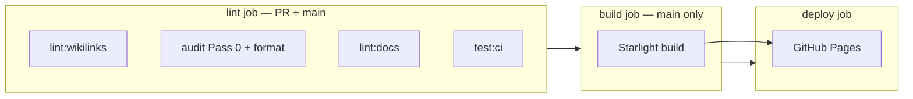

# CI and quality gates

How vault markdown, Starlight MDX, and GitHub Pages fit together. **Source of truth for commands:** root `package.json` and `.github/workflows/deploy.yml`.

## Deploy flow (main only)

| Step | Command / script | What it guards |
| --- | --- | --- |
| Vault wikilinks | `bun run lint:wikilinks` | Full `content/` — symmetry, first-mention, discoverability, tagline, agents-mirror |
| Vault ↔ MDX parity | `bun run lint:publish-parity` | Every vault note (except `inbox.md`) has matching `.mdx` |
| Pass 0 + format | `cd scripts/audit-notes && bun run lint:content && bun run lint:format` | Em-dash, double-hyphen, Prettier on `content/` |
| Starlight | `bun run lint:docs` | `astro check`, MDX wikilinks, link hygiene (`--strict`) |
| Starlight build (PR + main) | `bun run docs:build` | Twoslash compiles, static export succeeds |
| Pages | `deploy-pages` | Serves `sites/docs/dist/` at `base: /knowledge-base` |

**Published coverage:** every vault note (except `inbox.md`) has a Starlight MDX sibling — enforced by `bun run lint:publish-parity`. `content/` remains the audit/discovery mirror.

## Local commands (repo root)

| Goal | Command |
| --- | --- |
| Match CI lint job | `bun run lint:ci` |
| Starlight only | `bun run lint:docs` / `bun run docs:build` / `bun run docs:dev` |
| Vault post-edit (`content/`) | `bun run vault:check --base HEAD~1` (needs `CURSOR_API_KEY` for triage audit) |
| Vault + docs when MDX changed | `vault:check` runs `lint:docs` if `sites/docs/` is in the git diff |
| Script unit tests | `bun run test:ci` |

## What each linter owns

| Linter | Scope | Not responsible for |
| --- | --- | --- |
| `lint:wikilinks` | `content/**/*.md` | MDX |
| `lint:mdx-wikilinks` | `sites/docs/src/content/docs/**/*.mdx` | Vault `related:` |
| `lint:mdx-link-hygiene` | No full-site URLs in MDX — use wikilinks or `/knowledge-base/...` paths | External links |
| `lint:mdx-table-wikilinks` | No `[[slug\|label]]` inside table rows (pipe breaks cells) | Prose wikilinks |
| `lint:docs` | Starlight typecheck + all MDX linters | Full vault wikilinks |
| `vault:check` | Diff-scoped `content/*.md` + optional `lint:docs` | Full-vault wikilink pass (use `lint:wikilinks` separately) |

## Gaps and intentional limits

- **LLM audit** is not in CI (cost + `CURSOR_API_KEY`). CI runs Pass 0 only; triage stays local via `vault:check`.
- **Unit tests** run in the CI `lint` job (`bun run test:ci`). They do not re-run `docs:build` (separate `docs-build` job).
- **Untracked files** are invisible to `git diff` — run `bun run lint:docs` locally after MDX edits.
- **Deploy smoke** — `main` `build` job checks key paths under `sites/docs/dist/`.
- **Backlinks / graph** — not on Starlight yet (vault-only until an index is built).
- **`check-source-urls.sh`** is manual (GitHub rate limits); run after touching vault `source:` URLs.

## Doc drift watchlist

| Location | Role |
| --- | --- |
| `docs/PUBLISHING.md` | Starlight authoring + publish validate |
| `docs/PIPELINE.md` | CI map (this file) |
| `AGENTS.md` | Vault invariants + publish gates; mirror to copilot-instructions |
| `.github/skills/kb-author/SKILL.md` | Vault audits A–P, MDX audits S1–S6 |
| `.github/instructions/starlight.instructions.md` | Copilot: `sites/docs/**/*.mdx` |
| `.github/instructions/content.instructions.md` | Copilot: `content/**/*.md` |

## Related docs

- [`STARLIGHT-FEATURES.md`](STARLIGHT-FEATURES.md) — MDX capabilities and link classes
- [`AGENTS.md`](../AGENTS.md) — vault authoring contract
- [`scripts/audit-notes/README.md`](../scripts/audit-notes/README.md) — audit profiles
