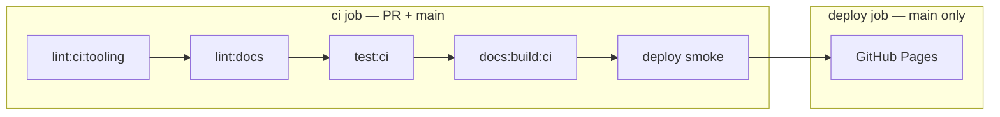

# CI and quality gates

> **Step 5: CI/CD Quality Gates & Deployments**: Automated validation pipeline, local vs CI linter checks, and GitHub Pages deployment lifecycle. Prerequisite: [Step 4: Script Automation & Tooling](TOOLING.md); next step: [Step 6: AI Editing Operating Contract](../AGENTS.md).

How vault markdown, Starlight MDX, and GitHub Pages fit together. **Source of truth for commands:** root `package.json` and `.github/workflows/deploy.yml`.

## CI and deploy flow

| Step | Command / script | What it guards |
| --- | --- | --- |
| Vault wikilinks | `bun run lint:wikilinks` | Full `content/` — symmetry, first-mention, discoverability, tagline, agents-mirror |
| Vault ↔ MDX parity | `bun run lint:publish-parity` | Every vault note (except `inbox.md`) has matching `.mdx` |
| Pass 0 + format | `cd scripts/audit-notes && bun run lint:content && bun run lint:format` | Em-dash, double-hyphen, Prettier on `content/` |
| Starlight | `bun run lint:docs` | `astro check`, MDX wikilinks, link hygiene (`--strict`) |
| Starlight build (CI) | `bun run docs:build:ci` | `astro build` only (check already ran in `lint:docs`) |
| Starlight build (local) | `bun run docs:build` | `astro check && astro build` |
| Pages | `deploy-pages` | Serves `sites/docs/dist/` at `base: /knowledge-base` |

**Published coverage:** every MDX page has a matching `content/` slug — enforced by `bun run lint:publish-parity`. `content/` is legacy (do not edit); MDX under `sites/docs/` is canonical.

## Local commands (repo root)

| Goal | Command |
| --- | --- |
| Match CI lint job | `bun run lint:ci` |
| Starlight only | `bun run lint:docs` / `bun run docs:build` / `bun run docs:dev` |
| Vault + MDX post-edit | `bun run vault:check --base HEAD~1` — parity, diff-scoped Pass 0 (vault + MDX), `lint:docs` when `sites/docs/` changed, optional vault/`mdx-triage` when `CURSOR_API_KEY` is set |
| MDX LLM triage only | `bun run audit:mdx-triage -- --base HEAD~1` (same LLM pass as `vault:check` MDX leg) |
| Script unit tests | `bun run test:ci` |

## What each linter owns

| Linter | Scope | Not responsible for |
| --- | --- | --- |
| `lint:wikilinks` | `content/**/*.md` | MDX |
| `lint:mdx-wikilinks` | `sites/docs/src/content/docs/**/*.mdx` | Vault `related:` |
| `lint:mdx-link-hygiene` | No full-site URLs in MDX — use wikilinks or `/knowledge-base/...` paths | External links |
| `lint:mdx-table-wikilinks` | No `[[slug\|label]]` inside table rows (pipe breaks cells) | Prose wikilinks |
| `lint:docs` | Starlight typecheck + all MDX linters | Full vault wikilinks |
| `vault:check` | Diff-scoped `content/*.md` + optional `lint:docs` | Full-vault wikilink pass (use `lint:wikilinks` separately) |

## Gaps and intentional limits

- **LLM audit** is not in CI (cost + `CURSOR_API_KEY`). CI runs Pass 0 only; triage stays local via `vault:check`.
- **Unit tests** run in the CI job (`bun run test:ci`) before a single `docs:build:ci` (no duplicate Starlight build).
- **Untracked files** are invisible to `git diff` — run `bun run lint:docs` locally after MDX edits.
- **Deploy smoke** — `main` CI job checks key paths under `sites/docs/dist/` before upload.
- **Backlinks** — Starlight pages get a build-time `## Backlinks` section; vault graph stays in Obsidian.
- **`check-source-urls.sh`** is manual (GitHub rate limits); run after touching vault `source:` URLs.

`vault:check` is the default post-edit gate, not a byte-for-byte CI clone: it always runs
publish parity, diff-scoped vault and MDX Pass 0, `lint:docs` when `sites/docs/` changed,
optional vault/`mdx-triage` when `CURSOR_API_KEY` is set, and skips Prettier. Run `bun run lint:ci` for the full linter-only CI chain.

## Doc drift watchlist

| Location | Role |
| --- | --- |
| `docs/PUBLISHING.md` | Starlight authoring + publish validate |
| `docs/TOOLING.md` | Skills + scripts inventory (revalidated for Starlight-only) |
| `docs/PIPELINE.md` | CI map (this file) |
| `AGENTS.md` | Vault invariants + publish gates; mirror to copilot-instructions |
| `.github/skills/kb-author/SKILL.md` | Vault audits A–P, MDX audits S1–S6 |
| `.github/instructions/starlight.instructions.md` | Copilot: `sites/docs/**/*.mdx` |
| `.github/instructions/content.instructions.md` | Copilot: `content/**/*.md` |

## Related docs

- [`STARLIGHT-FEATURES.md`](STARLIGHT-FEATURES.md) — MDX capabilities and link classes
- [`AGENTS.md`](../AGENTS.md) — vault authoring contract
- [`scripts/audit-notes/README.md`](../scripts/audit-notes/README.md) — audit profiles
