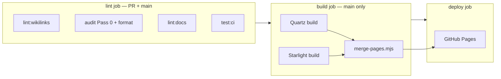

# CI and quality gates

How vault markdown, Starlight MDX, and GitHub Pages fit together. **Source of truth for commands:** root `package.json` and `.github/workflows/deploy.yml`.

## Deploy flow (main only)

| Step | Command / script | What it guards |
| --- | --- | --- |
| Vault wikilinks | `bun run lint:wikilinks` | Full `content/` — symmetry, first-mention, discoverability, tagline, agents-mirror |
| Pass 0 + format | `cd scripts/audit-notes && bun run lint:content && bun run lint:format` | Em-dash, double-hyphen, Prettier on `content/` |
| Starlight | `bun run lint:docs` | `astro check`, MDX wikilinks, link hygiene (`--strict`) |
| Starlight build (PR) | `bun run docs:build` | Twoslash compiles, static export succeeds |
| Quartz build | `npx quartz build -d content` (fork checkout) | Vault HTML |
| Merge | `node scripts/merge-pages.mjs quartz/public sites/docs/dist merged-public` | Starlight **overwrites** Quartz on same path |
| Merge smoke | `test -f merged-public/effect-ts/index.html` (main `build` job) | Catches empty/wrong merge output |
| Pages | `deploy-pages` | `base: /knowledge-base` |

**Merge rule:** paths present in both trees keep the Starlight file. Migrated Effect-TS URLs serve MDX; unmigrated areas stay Quartz.

## Local commands (repo root)

| Goal | Command |
| --- | --- |
| Match CI lint job | `bun run lint:ci` |
| Starlight only | `bun run lint:docs` / `bun run docs:build` / `bun run docs:dev` |
| Vault post-edit (content/) | `bun run vault:check --base HEAD~1` (needs `CURSOR_API_KEY` for triage audit) |
| Vault + docs when MDX changed | `vault:check` runs `lint:docs` automatically if `sites/docs/` is in the git diff |
| Script unit tests | `bun run test:ci` (root + audit-notes + `merge-pages.test.mjs`) |

## What each linter owns

| Linter | Scope | Not responsible for |
| --- | --- | --- |
| `lint:wikilinks` | `content/**/*.md` | MDX, Starlight |
| `lint:mdx-wikilinks` | `sites/docs/src/content/docs/**/*.mdx` | Vault `related:` |
| `lint:mdx-link-hygiene` | MDX Quartz URLs → migrated slugs | External links |
| `lint:docs` | Starlight typecheck + both MDX linters | Full vault wikilinks |
| `vault:check` | Diff-scoped `content/*.md` + optional `lint:docs` | Full-vault wikilink pass (use `lint:wikilinks` separately) |

## Gaps and intentional limits

- **LLM audit** is not in CI (cost + `CURSOR_API_KEY`). CI runs Pass 0 only; triage stays local via `vault:check`.
- **Unit tests** run in the CI `lint` job (`bun run test` + `scripts/audit-notes` tests). They do not re-run `docs:build` (that is the PR `docs-build` job).
- **Untracked files** are invisible to `git diff --name-only <ref>` — `vault:check` will not run `lint:docs` until `sites/docs/` paths are tracked. After MDX edits: `bun run lint:docs` locally, or stage/commit then `vault:check`.
- **Merged site smoke test** — `main` `build` job checks key paths under `merged-public/` after merge; not a full link crawl.
- **Backlinks / graph** exist on Quartz only until a Starlight index is built.
- **`check-source-urls.sh`** is manual (GitHub rate limits); run after touching `source:` URLs.
- **`merge-pages.mjs`** — covered by `scripts/merge-pages.test.mjs` in `bun run test`.
- **Quartz fork** is private; PR CI cannot build the merged site without `QUARTZ_FORK_READ_TOKEN` — PRs run Starlight `docs:build` instead.

## Doc drift watchlist (keep in sync)

| Location | Role |
| --- | --- |
| `docs/PIPELINE.md` | CI map (this file) |
| `AGENTS.md` "When you finish" | Canonical vault + Starlight gates; mirror to copilot-instructions |
| `.github/instructions/content.instructions.md` | Copilot: `content/**/*.md` |
| `.github/instructions/starlight.instructions.md` | Copilot: `sites/docs/**/*.mdx` |
| `.github/skills/kb-starlight-author/SKILL.md` | MDX authoring playbook |
| `openspec/config.yaml` | `lint:ci` + `test:ci` in verify |

## Related docs

- [`STARLIGHT-MIGRATION.md`](STARLIGHT-MIGRATION.md) — per-note MDX workflow
- [`STARLIGHT-FEATURES.md`](STARLIGHT-FEATURES.md) — MDX capabilities and link classes
- [`AGENTS.md`](../AGENTS.md) — vault authoring contract
- [`scripts/audit-notes/README.md`](../scripts/audit-notes/README.md) — audit profiles
