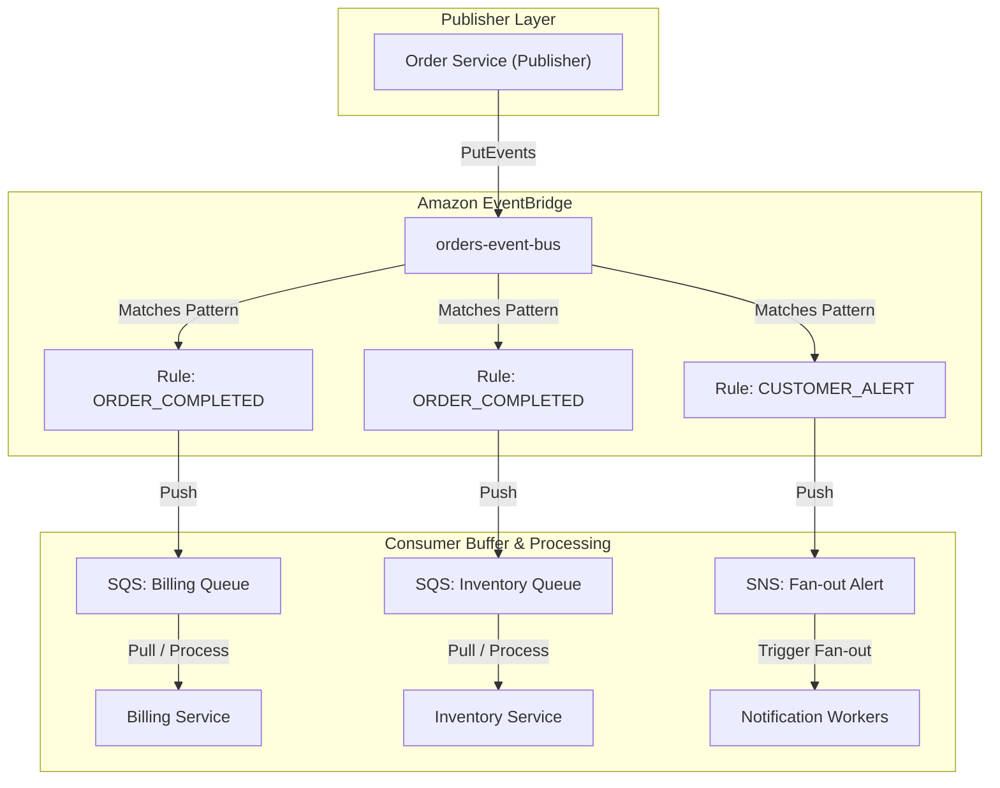

import { Aside, Steps, Tabs, TabItem } from "@astrojs/starlight/components";

> Amazon EventBridge decouples distributed microservices by acting as an asynchronous serverless event bus, matching structured JSON payloads against declarative rules, and routing events to targets.

<Aside type="tip" title="Prerequisites">

This note is part of the **[AWS Serverless Track](/knowledge-base/aws/)**. Before designing decoupled event-driven systems, make sure you understand:
- [[aws/sqs|SQS Queues]]: Pull-based queue structures used as horizontal worker buffers.
- [[aws/sns|SNS Pub/Sub]]: Push-based pub/sub fan-out mechanisms.

</Aside>

---

## The Post Office Analogy

To understand EventBridge's role in a distributed architecture, think of it as a **high-speed post office sorting facility**:

- **Publishers (Mailboxes)**: Your microservices drop events (letters) into the system without knowing or caring who will eventually receive them.
- **Event Bus (Conveyor Belt)**: A central [[effect-ts/streams|stream]] where all incoming events circulate.
- **Rules (Optical Scanners)**: High-speed cameras that inspect the outside of each envelope (its JSON metadata). If a letter has a specific destination zip code prefix or detail-type, the rule routes it to a specific bin.
- **Targets (Delivery Bins)**: [[aws/sqs|SQS]] queues, [[aws/lambda|Lambda]] functions, or [[aws/ecs|ECS]] tasks where matching events are deposited for processing.

By decoupling the mail drop-off from the delivery routing, publishers remain completely unaware of consumers, and adding new consumers is as simple as aiming another optical scanner (Rule) at the belt.

---

## Visualizing Decoupled Topology

The following diagram illustrates how a central Custom Event Bus decouples an upstream Order Service from downstream Billing, Inventory, and Notification services using target buffers:



---

## Deep JSON Pattern Matching

EventBridge rules perform highly optimized JSON structure matching directly at the bus ingestion boundary. Unlike [[aws/sqs|SQS]] or [[aws/sns|SNS]], which require spinning up compute containers to parse and inspect messages, EventBridge executes filtering rules natively, preventing unnecessary compute costs.

### 1. Prefix Matching
Matches strings that start with a specific value. Useful for matching routing domains or namespaces:

<Tabs>
  <TabItem label="Rule Pattern">
    ```json
    {
      "source": [{ "prefix": "mycompany.sales" }]
    }
    ```
  </TabItem>
  <TabItem label="Matching Payload">
    ```json
    {
      "source": "mycompany.sales.invoice",
      "detail-type": "INVOICE_GENERATED"
    }
    ```
  </TabItem>
</Tabs>

### 2. Numeric Range Constraints
Enforces ranges or inequality constraints. Highly effective for filtering alerts based on thresholds or routing orders above specific monetary limits:

<Tabs>
  <TabItem label="Rule Pattern">
    ```json
    {
      "detail": {
        "amount": [{ "numeric": [">=", 1000] }]
      }
    }
    ```
  </TabItem>
  <TabItem label="Matching Payload">
    ```json
    {
      "source": "mycompany.orders",
      "detail-type": "ORDER_COMPLETED",
      "detail": {
        "orderId": 4096,
        "amount": 1250.00
      }
    }
    ```
  </TabItem>
</Tabs>

### 3. Suffix / Wildcard Matching
Matches elements at the end of a string. Useful for filtering files by extension:

<Tabs>
  <TabItem label="Rule Pattern">
    ```json
    {
      "detail": {
        "filename": [{ "suffix": ".pdf" }]
      }
    }
    ```
  </TabItem>
  <TabItem label="Matching Payload">
    ```json
    {
      "source": "mycompany.reports",
      "detail": {
        "filename": "monthly_report_may2026.pdf"
      }
    }
    ```
  </TabItem>
</Tabs>

### 4. Exists Checks
Checks for the presence or absence of specific properties inside the event envelope:

<Tabs>
  <TabItem label="Rule Pattern">
    ```json
    {
      "detail": {
        "vipCustomer": [{ "exists": true }]
      }
    }
    ```
  </TabItem>
  <TabItem label="Matching Payload">
    ```json
    {
      "source": "mycompany.orders",
      "detail": {
        "orderId": 5012,
        "vipCustomer": true
      }
    }
    ```
  </TabItem>
</Tabs>

---

## Type-Safe Event Validation with `effect/Schema`

In distributed architectures, contract drift is a major footgun. If a publisher alters its event structure, downstream consumers can fail silently or crash. 

To prevent this, we construct a runtime boundary validation layer using `effect/Schema` (see [[effect-ts/schema|Schema deep-dive]]). This ensures that raw inbound payloads from SQS or EventBridge targets are decoded, validated, and translated into strict, type-safe TypeScript structures before executing business logic:

```typescript twoslash
import { Data, Effect, ParseResult, Schema } from "effect";

// 1. Define custom, tagged domain error for validation failures
export class EventValidationError extends Data.TaggedError("EventValidationError")<{
  readonly issues: string;
}> {}

// 2. Define the Event Detail Schema contract
export const OrderCompletedDetail = Schema.Struct({
  orderId: Schema.Number,
  amount: Schema.Number,
  customerEmail: Schema.String,
});

// Extract inferred TypeScript type directly from Schema
export type OrderCompletedDetail = Schema.Schema.Type<typeof OrderCompletedDetail>;

// 3. Define the EventBridge Envelope Schema
export const EventBridgeEnvelope = Schema.Struct({
  id: Schema.String,
  source: Schema.String,
  "detail-type": Schema.String,
  time: Schema.String,
  region: Schema.String,
  detail: OrderCompletedDetail,
});

export type EventBridgeEnvelope = Schema.Schema.Type<typeof EventBridgeEnvelope>;

/**
 * Parses and validates raw inbound JSON event payloads into type-safe envelopes.
 * Emits EventValidationError on parse/validation failures.
 */
export const validateEventPayload = (
  rawPayload: unknown
): Effect.Effect<EventBridgeEnvelope, EventValidationError> =>
  Schema.decodeUnknown(EventBridgeEnvelope)(rawPayload).pipe(
    // Map raw parsing error to clean domain-specific tagged errors
    Effect.mapError(
      (parseError) =>
        new EventValidationError({
          issues: ParseResult.TreeFormatter.formatErrorSync(parseError),
        })
    )
  );
```

<Aside type="note" title="Validate at the ingress boundary only">
Execute the [[nestjs/recipes/validation|validation]] once at your consumer's controller or SQS queue listener. Once the payload passes the `validateEventPayload` boundary, propagate the clean `EventBridgeEnvelope` type throughout your internal services rather than parsing/validating the values again.
</Aside>

---

## Secure Cross-Account Event Routing

A powerful architectural pattern in enterprise systems is forwarding events from Account A (Source) to Account B (Target) to coordinate business domains across separate AWS accounts.

```
 [ Account A (Source) ]                    [ Account B (Target) ]
  ┌─────────────────┐                       ┌─────────────────┐
  │   Event Bus     │                       │ Target Event Bus│
  └────────┬────────┘                       └────────▲────────┘
           │ (Matches Pattern)                       │
      ┌────▼────┐                                    │
      │  Rule   │                                    │
      └────┬────┘                                    │
           │ (IAM Role Assumed)                      │
           └────────────────── PutEvents ────────────┘
```

### 1. Configure Target Account B Policy
In the Target Account (Account B), configure the custom event bus's resource policy to allow Account A to publish events to it:

```json
{
  "Version": "2012-10-17",
  "Statement": [
    {
      "Sid": "AllowAccountAToPutEvents",
      "Effect": "Allow",
      "Principal": {
        "AWS": "arn:aws:iam::ACCOUNT_A_ID:root"
      },
      "Action": "events:PutEvents",
      "Resource": "arn:aws:events:us-east-1:ACCOUNT_B_ID:event-bus/target-event-bus"
    }
  ]
}
```

### 2. Configure Source Account A IAM Routing Role
In the Source Account (Account A), EventBridge requires an IAM role to assume permission to forward events across accounts.

#### Trust Policy (AssumeRole)
The role must trust the EventBridge service:

```json
{
  "Version": "2012-10-17",
  "Statement": [
    {
      "Effect": "Allow",
      "Principal": {
        "Service": "events.amazonaws.com"
      },
      "Action": "sts:AssumeRole"
    }
  ]
}
```

#### Permission Policy
The role must carry permissions to invoke the `PutEvents` action on Account B's event bus:

```json
{
  "Version": "2012-10-17",
  "Statement": [
    {
      "Effect": "Allow",
      "Action": "events:PutEvents",
      "Resource": "arn:aws:events:us-east-1:ACCOUNT_B_ID:event-bus/target-event-bus"
    }
  ]
}
```

### 3. Create the Routing Rule in Account A
Finally, attach a routing rule in Account A matching your target events, referencing Account B's bus as the Target and specifying the IAM routing role designed in Step 2. Verify that the CLI returns `{ "FailedEntryCount": 0 }` to confirm successful association:

```bash
aws events put-targets \
  --rule "forward-to-account-b-rule" \
  --event-bus-name "orders-event-bus" \
  --targets "Id=1,Arn=arn:aws:events:us-east-1:ACCOUNT_B_ID:event-bus/target-event-bus,RoleArn=arn:aws:iam::ACCOUNT_A_ID:role/EventBridgeRoutingRole" \
  --region "us-east-1"
```

Expected JSON response showing successful target association:
```json
{
  "FailedEntryCount": 0,
  "FailedEntries": []
}
```

Counterexample response showing a failure (e.g., target event bus does not exist in target account B or routing IAM role has insufficient permissions):
```json
{
  "FailedEntryCount": 1,
  "FailedEntries": [
    {
      "Id": "1",
      "ErrorCode": "ResourceNotFoundException",
      "ErrorMessage": "Event bus target-event-bus does not exist in target account."
    }
  ]
}
```

---

## SQS vs. SNS vs. EventBridge Matrix

To make informed architectural decisions, evaluate our core cloud messaging tools across these key dimensions:

| Feature | [Amazon SQS](/knowledge-base/aws/sqs/) | [Amazon SNS](/knowledge-base/aws/sns/) | [Amazon EventBridge](/knowledge-base/aws/eventbridge/) |
| :--- | :--- | :--- | :--- |
| **Model** | **Pull-based Queue** (Point-to-point buffer) | **Push-based Pub/Sub** (Broad event fan-out) | **Push-based Serverless Event Bus** (Enterprise Event Mesh) |
| **Throughput** | Standard: Unlimited.<br/>FIFO: Capped (3,000 req/s with batch). | Practically unlimited. | Extremely high: Default 10,000+ put-events/s (soft limit, auto-scales). |
| **Payload Filtering** | **None** (Consumers must parse the entire body or filter using raw metadata attributes). | **Metadata attributes only** (Filter policies matching numeric or string arrays). | [Deep JSON matching](#deep-json-pattern-matching) (Filter patterns matching deep nested objects in event bodies). |
| **Target Integration** | Queue-centric (Lambda, HTTP, SQS targets). | Restrictive endpoints (SQS, Lambda, HTTPS, SMS, Email). | **Vast ecosystem** (35+ AWS native services, HTTP SaaS API Destinations directly). |
| **Reliability / DLQ** | Handled by consumer visibility timeout + redrive policies on SQS queue. | Event delivery retry policies (up to 23 hours) + SQS DLQs on subscriptions. | Deep retry configurations (up to 24 hours, 185 retries) + **native target SQS DLQs**. |
| **Ideal Workloads** | Heavy task decoupling, async jobs, worker pools, smoothing load spikes. | Real-time fan-out notifications, simple alarms, alerting stacks. | Microservices event bus, SaaS ingestion, complex multi-recipient routing. |

---

## See also

- [[aws/eventbridge|EventBridge service index]]: Slim overview and mental model.
- [[aws/eventbridge/quickstart|EventBridge quickstart]]: Ten-minute hands-on CLI walkthrough.
- [[aws/sqs|SQS]]: Pull-based messaging structures commonly paired with EventBridge.
- [[aws/sns|SNS]]: Pub/sub fan-out comparisons.
- [Amazon EventBridge Rules Guide](https://docs.aws.amazon.com/eventbridge/latest/userguide/eb-create-rule.html) (official).
