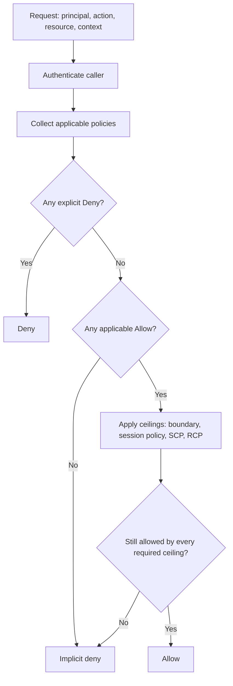

import { Aside } from "@astrojs/starlight/components";

> IAM policy evaluation is the authorization pass behind every AWS API call: start at deny, find every applicable allow, then let explicit denies and guardrail policies decide what survives.

<Aside type="tip" title="Prerequisites">
Before diving in, make sure you understand:
- [[aws/cli/profiles-and-credentials|AWS Profiles & Credentials]]: since verifying policy evaluation models requires inspecting identities and credentials.
</Aside>

## TL;DR

- **Default is deny.** AWS evaluates the caller, action, resource, and request context, then allows the request only if applicable policies allow it ([source](https://docs.aws.amazon.com/IAM/latest/UserGuide/reference_policies_evaluation-logic.html)).
- **Explicit deny wins.** One matching `Deny` statement overrides any number of matching `Allow` statements ([source](https://docs.aws.amazon.com/IAM/latest/UserGuide/reference_policies_evaluation-logic_policy-eval-denyallow.html)).
- **Same-account access can come from either side.** Identity-based and resource-based policies are generally a union in the same account, then explicit denies still override ([source](https://docs.aws.amazon.com/IAM/latest/UserGuide/reference_policies_evaluation-logic.html#policy-eval-basics-id-rdp)).
- **Cross-account access needs both accounts.** The trusted account and trusting account must both evaluate to `Allow` ([source](https://docs.aws.amazon.com/IAM/latest/UserGuide/reference_policies_evaluation-logic-cross-account.html)).
- **Boundaries, session policies, SCPs, and RCPs are ceilings.** They do not grant permissions; they limit what identity or resource policies can grant ([source](https://docs.aws.amazon.com/IAM/latest/UserGuide/access_policies.html)).

## Evaluation flow



AWS describes the authorization input as a request context, then evaluates identity policies, resource policies, permissions boundaries, AWS Organizations controls, and session policies to reach the final decision ([source](https://docs.aws.amazon.com/IAM/latest/UserGuide/reference_policies_evaluation-logic.html)). The diagram is a debugging model, not a replacement for service-specific rules.

<Aside type="caution" title="Resource policies have service-specific edges">

The union/intersection rules are the starting point, but resource policies have exceptions. Permissions boundaries interact differently with grants to IAM users, role ARNs, and role sessions. When a denial depends on a resource policy plus a boundary, read the boundary doc before changing permissions ([source](https://docs.aws.amazon.com/IAM/latest/UserGuide/access_policies_boundaries.html)).

</Aside>

## Policy layers

| Layer                 | Where it lives                                                                         | Can allow?                     | Can limit?                | Inspect first when                                                                                                                                                                       |
| --------------------- | -------------------------------------------------------------------------------------- | ------------------------------ | ------------------------- | ---------------------------------------------------------------------------------------------------------------------------------------------------------------------------------------- |
| [Identity-based policy](#1-identity-allow-loses-to-an-s3-bucket-explicit-deny) | Attached to a user, group, or role                                                     | Yes                            | Yes, with explicit `Deny` | The error says no identity-based policy allows the action (see [Example 1](#1-identity-allow-loses-to-an-s3-bucket-explicit-deny) and [Example 3](#3-permissions-boundary-blocks-an-identity-allow)). |
| [Resource-based policy](#1-identity-allow-loses-to-an-s3-bucket-explicit-deny) | Attached to a resource, such as an S3 bucket, SQS queue, KMS key, or role trust policy | Yes                            | Yes, with explicit `Deny` | The resource owner controls access, especially cross-account access (see [Example 1](#1-identity-allow-loses-to-an-s3-bucket-explicit-deny)).                                           |
| [Permissions boundary](#3-permissions-boundary-blocks-an-identity-allow)  | Managed policy attached as a maximum-permissions boundary on an IAM user or role       | No                             | Yes                       | Identity policies allow the action, but the principal still cannot perform it (see [Example 3](#3-permissions-boundary-blocks-an-identity-allow)).                                       |
| Session policy        | Inline or managed policy passed when creating temporary credentials                    | No                             | Yes                       | The caller is an assumed role session, and the app passed `Policy` or `PolicyArns` to STS ([source](https://docs.aws.amazon.com/STS/latest/APIReference/API_AssumeRole.html)).           |
| SCP                   | AWS Organizations service control policy on an account or organizational unit          | No                             | Yes                       | Every principal in the account is blocked, or the error mentions a service control policy ([source](https://docs.aws.amazon.com/IAM/latest/UserGuide/access_policies.html)).             |
| RCP                   | AWS Organizations resource control policy                                              | No                             | Yes                       | The denial is tied to an Organizations resource guardrail rather than one principal's identity policy ([source](https://docs.aws.amazon.com/IAM/latest/UserGuide/access_policies.html)). |
| [Trust policy](#2-cross-account-role-assumption-needs-caller-permission-and-target-trust)          | Resource-based policy on an IAM role                                                   | Yes, for `sts:AssumeRole` only | Yes                       | `AssumeRole` fails before the target service call happens (see [Example 2](#2-cross-account-role-assumption-needs-caller-permission-and-target-trust)).                                 |

## Worked examples

### 1. Identity allow loses to an S3 bucket explicit deny

A role can have an identity policy that allows `s3:GetObject`:

```json
{
  "Version": "2012-10-17",
  "Statement": [
    {
      "Effect": "Allow",
      "Action": "s3:GetObject",
      "Resource": "arn:aws:s3:::example-reports/*"
    }
  ]
}
```

The bucket can still deny the same role through a bucket policy:

```json
{
  "Version": "2012-10-17",
  "Statement": [
    {
      "Sid": "DenyReportReadsForThisRole",
      "Effect": "Deny",
      "Principal": {
        "AWS": "arn:aws:iam::111122223333:role/AppRole"
      },
      "Action": "s3:GetObject",
      "Resource": "arn:aws:s3:::example-reports/*"
    }
  ]
}
```

Result: `GetObject` is denied. AWS evaluates identity-based and resource-based policies together, and an explicit deny in either policy type overrides an allow ([source](https://docs.aws.amazon.com/IAM/latest/UserGuide/reference_policies_evaluation-logic.html#policy-eval-basics-id-rdp)). S3 supports both identity-based policies and resource-based bucket policies ([source](https://docs.aws.amazon.com/AmazonS3/latest/userguide/security_iam_service-with-iam.html)).

### 2. Cross-account role assumption needs caller permission and target trust

For account B to assume a role in account A, account B's caller needs an identity policy that allows `sts:AssumeRole` on the role ARN:

```json
{
  "Version": "2012-10-17",
  "Statement": [
    {
      "Effect": "Allow",
      "Action": "sts:AssumeRole",
      "Resource": "arn:aws:iam::111122223333:role/ReadReportsRole"
    }
  ]
}
```

The role in account A also needs a trust policy that names the trusted principal:

```json
{
  "Version": "2012-10-17",
  "Statement": [
    {
      "Effect": "Allow",
      "Principal": {
        "AWS": "arn:aws:iam::444455556666:role/AppRuntimeRole"
      },
      "Action": "sts:AssumeRole"
    }
  ]
}
```

Result: if either side is missing, `AssumeRole` fails before the app reaches S3, KMS, SES, or any other target service. The STS `AssumeRole` docs specify that the target role trust policy defines who can assume the role, and cross-account assumption requires the caller's account to be trusted by that role ([source](https://docs.aws.amazon.com/STS/latest/APIReference/API_AssumeRole.html)).

For the full migration pattern, use [[aws/recipes/cross-account-role-pattern|Cross-account assume-role pattern]].

### 3. Permissions boundary blocks an identity allow

An identity policy can allow bucket deletion:

```json
{
  "Version": "2012-10-17",
  "Statement": [
    {
      "Effect": "Allow",
      "Action": "s3:DeleteBucket",
      "Resource": "arn:aws:s3:::example-reports"
    }
  ]
}
```

A permissions boundary on the same role can limit the role to read-only S3 actions:

```json
{
  "Version": "2012-10-17",
  "Statement": [
    {
      "Effect": "Allow",
      "Action": ["s3:GetObject", "s3:ListBucket"],
      "Resource": ["arn:aws:s3:::example-reports", "arn:aws:s3:::example-reports/*"]
    }
  ]
}
```

Result: `s3:DeleteBucket` is denied. A permissions boundary sets the maximum permissions an identity-based policy can grant, so the effective permissions are the intersection of the identity policies and the boundary ([source](https://docs.aws.amazon.com/IAM/latest/UserGuide/access_policies_boundaries.html)).

Use the same mental model for session policies and Organizations guardrails: first find the allow, then ask which ceiling removed it. SCPs and RCPs define maximum available permissions and do not grant permissions by themselves ([source](https://docs.aws.amazon.com/IAM/latest/UserGuide/access_policies.html)).

## Diagnose with `simulate-principal-policy`

Use `simulate-principal-policy` when you need a fast read on identity policies, permissions boundaries, session-like inputs, or a single hypothetical call. It does not perform the API operation; it checks whether the simulated policies allow or deny the request ([source](https://docs.aws.amazon.com/cli/latest/reference/iam/simulate-principal-policy.html)).

Run the simulation with the principal, action, and resource from the error. In the output, verify `EvalDecision` first, then `MatchedStatements` and `MissingContextValues`.

```bash
aws iam simulate-principal-policy \
  --policy-source-arn arn:aws:iam::111122223333:role/AppRole \
  --action-names s3:GetObject \
  --resource-arns arn:aws:s3:::example-reports/2026/summary.csv \
  --output json
```

Representative output:

```json
{
  "EvaluationResults": [
    {
      "EvalActionName": "s3:GetObject",
      "EvalResourceName": "arn:aws:s3:::example-reports/2026/summary.csv",
      "EvalDecision": "allowed",
      "MatchedStatements": [
        {
          "SourcePolicyId": "AllowReportReads",
          "StartPosition": { "Line": 3, "Column": 19 },
          "EndPosition": { "Line": 9, "Column": 10 }
        }
      ],
      "MissingContextValues": []
    }
  ]
}
```

| Field                  | Meaning                                                                                                                                                          |
| ---------------------- | ---------------------------------------------------------------------------------------------------------------------------------------------------------------- |
| [`EvalDecision`](#diagnose-with-simulate-principal-policy) | `allowed`, `explicitDeny`, or `implicitDeny`. Start here (see [simulation example](#diagnose-with-simulate-principal-policy)). |
| [`MatchedStatements`](#diagnose-with-simulate-principal-policy) | Which statement decided the result. For explicit deny, the deny statement is the useful one (see [simulation example](#diagnose-with-simulate-principal-policy)). |
| [`MissingContextValues`](#diagnose-with-simulate-principal-policy) | Condition keys the simulator needed but did not receive. Add `--context-entries` when the real request depends on keys such as `aws:SourceIp` or `s3:prefix`. |

<Aside type="caution" title="The simulator is a diagnostic, not the live authorization engine">

The simulator has documented gaps. It does not perform the API call, resource-based policy simulation is not supported for IAM roles, and AWS documents unsupported cases around RCPs, SCPs with conditions, and cross-account simulation for IAM roles and users ([source](https://docs.aws.amazon.com/IAM/latest/UserGuide/access_policies_testing-policies.html); [CLI source](https://docs.aws.amazon.com/cli/latest/reference/iam/simulate-principal-policy.html)). Use it to narrow the search, then verify the live principal, resource policy, and service-specific error.

</Aside>

## AccessDenied triage

Start with the caller, then the exact action and resource. Do not edit policies until you know which layer denied the request.

### 1. Confirm the caller

Run this first because the wrong profile means every later policy check points at the wrong account. Verify `Account` and `Arn` match the principal you intended to debug.

```bash
aws sts get-caller-identity --profile <profile>
```

### 2. Copy the action and resource from the error

Modern AWS `AccessDenied` messages can say whether the request was blocked by an explicit deny or because no policy type allowed the action ([source](https://docs.aws.amazon.com/IAM/latest/UserGuide/troubleshoot_access-denied.html)). Preserve the exact strings:

```text
User: arn:aws:iam::111122223333:role/AppRole is not authorized to perform: s3:GetObject on resource: arn:aws:s3:::example-reports/2026/summary.csv because no identity-based policy allows the s3:GetObject action
```

### 3. Check explicit denies first

Look in identity policies, resource policies, permissions boundaries, session policies, SCPs, and RCPs for a matching `Deny`. One explicit deny overrides a matching allow ([source](https://docs.aws.amazon.com/IAM/latest/UserGuide/reference_policies_evaluation-logic_policy-eval-denyallow.html)).

### 4. Check the identity side

For roles, inspect attached policies, inline policies, and the role trust policy. In the output, verify the role name, policy ARNs, and `AssumeRolePolicyDocument` before editing anything.

```bash
aws iam list-attached-role-policies --role-name <role>
aws iam list-role-policies --role-name <role>
aws iam get-role --role-name <role> --query Role.AssumeRolePolicyDocument
```

For a managed policy, fetch the default version and inspect the policy document. Verify the `Action`, `Resource`, and `Condition` blocks match the denied request.

```bash
aws iam get-policy --policy-arn <policy-arn>
aws iam get-policy-version --policy-arn <policy-arn> --version-id <default-version-id>
```

### 5. Check the resource side

For cross-account access, inspect the resource policy in the account that owns the resource. S3 bucket policies, KMS key policies, SNS topic policies, SQS queue policies, and role trust policies can all be the deciding layer. KMS is especially strict: key policy, IAM policy, and grants can all participate in the final decision ([source](https://docs.aws.amazon.com/kms/latest/developerguide/policy-evaluation.html)).

### 6. Check ceilings last

If an allow exists but the request is still denied, inspect the ceilings:

- Permissions boundary on the user or role.
- Session policy passed to STS, usually visible in the code or caller that created temporary credentials.
- SCP or RCP from AWS Organizations.

AWS documents `AccessDenied` examples for permissions boundaries, SCPs, RCPs, VPC endpoint policies, and role trust policies ([source](https://docs.aws.amazon.com/IAM/latest/UserGuide/troubleshoot_access-denied.html)).

## See also

- [[aws/iam|IAM]]: principals, roles, and the service-level mental model.
- [[aws/iam/cli|IAM CLI cheatsheet]]: read-only commands for policy and trust-policy inspection.
- [[aws/recipes/cross-account-role-pattern|Cross-account assume-role pattern]]: practical trust policy plus caller permission setup.
- [[aws/kms|KMS]]: key policies as the primary authority for KMS keys.
- [[aws/s3|S3]]: bucket policies, access defaults, and Block Public Access.
- [Policy evaluation logic](https://docs.aws.amazon.com/IAM/latest/UserGuide/reference_policies_evaluation-logic.html) in the IAM User Guide.
