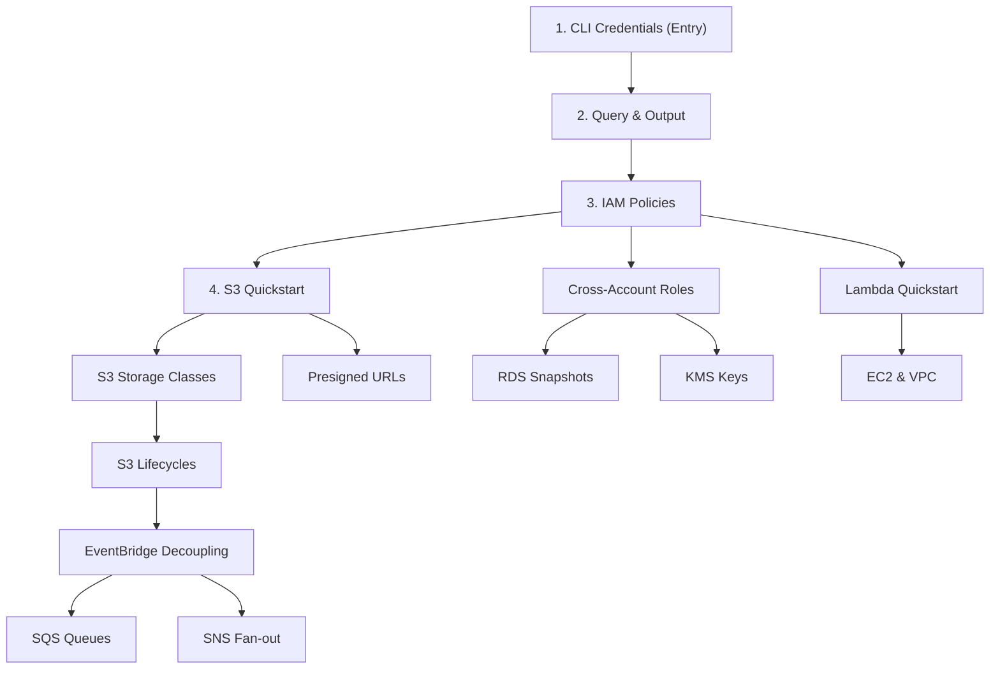

import { Aside, Card, CardGrid, Steps, Tabs, TabItem } from "@astrojs/starlight/components";

> Map of content for AWS. Each service lives in `aws/<service>/`: `index` is the concept note, `cli` is the cheatsheet, and deep-dives or recipes sit alongside. Cross-cutting recipes live under [[aws/recipes|AWS recipes]]; CLI fundamentals under [[aws/cli|AWS CLI]].

## TL;DR

- **Start with CLI + IAM**: [[aws/cli/profiles-and-credentials|profiles]], [[aws/iam|IAM]], then a hands-on [[aws/s3/quickstart|S3 quickstart]].
- **Cross-account pattern recurs everywhere**: [[aws/recipes/cross-account-role-pattern|assume-role + ExternalId]] underlies RDS, S3, KMS, and partial migrations.
- **Account migrations**: [[aws/account-migrations|playbook]] stitches per-service recipes into one ordered cutover.
- **Compute choice**: [[aws/lambda-vs-ec2|Lambda vs EC2 vs Fargate]]: workload shape, not "serverless good".

## Learning Pathway Sequence

A highly structured roadmap designed to take you from foundational cloud credentials up to advanced, decoupled event-driven queues.

## Services

| Service    | Index                                           | Notes                                                                                              |
| ---------- | ----------------------------------------------- | -------------------------------------------------------------------------------------------------- |
| S3         | [S3](/knowledge-base/aws/s3/)                   | Deep siblings: [storage classes](/knowledge-base/aws/s3/storage-classes/), [lifecycle](/knowledge-base/aws/s3/lifecycle-rules/), [events](/knowledge-base/aws/s3/event-notifications/), [presigned URLs](/knowledge-base/aws/s3/presigned-urls/), [static site](/knowledge-base/aws/s3/static-website/) |
| IAM        | [IAM](/knowledge-base/aws/iam/)                 | Authn/authz and [policy evaluation](/knowledge-base/aws/iam/policy-evaluation/) for every API call |
| RDS        | [RDS](/knowledge-base/aws/rds/)                 | Snapshots as the migration primitive: [cross-account snapshot](/knowledge-base/aws/rds/cross-account-snapshot/) |
| CloudFront | [CloudFront](/knowledge-base/aws/cloudfront/)   | CDN; aliases globally unique                                                                       |
| Amplify    | [Amplify Hosting](/knowledge-base/aws/amplify/) | Managed frontend; CloudFront under the hood                                                        |
| KMS        | [KMS](/knowledge-base/aws/kms/)                 | Encryption keys; cross-account needs both policies                                                 |
| Lambda     | [Lambda](/knowledge-base/aws/lambda/)           | Event-driven compute                                                                               |
| EC2        | [EC2](/knowledge-base/aws/ec2/)                 | VMs, AMIs, EBS                                                                                     |
| VPC        | [VPC](/knowledge-base/aws/vpc/)                 | Private network                                                                                    |
| DynamoDB   | [DynamoDB](/knowledge-base/aws/dynamodb/)       | Key-value + document                                                                               |
| SQS        | [SQS](/knowledge-base/aws/sqs/)                 | Managed queue                                                                                      |
| SNS        | [SNS](/knowledge-base/aws/sns/)                 | Pub/sub fan-out                                                                                    |
| ECS        | [ECS and Fargate](/knowledge-base/aws/ecs/)     | Containers                                                                                         |
| EventBridge| [EventBridge](/knowledge-base/aws/eventbridge/) | Serverless event bus for [decoupling distributed microservices](/knowledge-base/aws/eventbridge/event-driven-decoupling/) |

## Cross-cutting

- [[aws/recipes|AWS recipes]]: cross-service procedures.
- [[aws/account-migrations|Account migrations]]: end-to-end playbook.
- [[aws/lambda-vs-ec2|Lambda vs EC2 vs Fargate]]: compute decision matrix.
- [[aws/secrets-manager|Secrets Manager]]: named secrets under KMS.
- [[aws/eventbridge/event-driven-decoupling|Event-driven decoupling with EventBridge]]: designing multi-consumer event patterns, type-safe contracts, and cross-account routing.

## Planned Concepts & Recipes

To expand our cloud infrastructure coverage, the following AWS topics and architectural guides are planned to be added next:

- **Distributed [[effect-ts/observability|Observability]] with CloudWatch & X-Ray**: Setting up trace context propagation, CloudWatch log aggregation, alarm configurations, and service maps.
- **Dynamic DNS & Traffic Management with Route 53**: Configuring private hosted zones, health checks, failover routing, and alias records.
- **Secure ECS Secrets Orchestration**: Wiring KMS keys and Secrets Manager values dynamically into ECS task definition environment variables and container secrets without manual injection.
