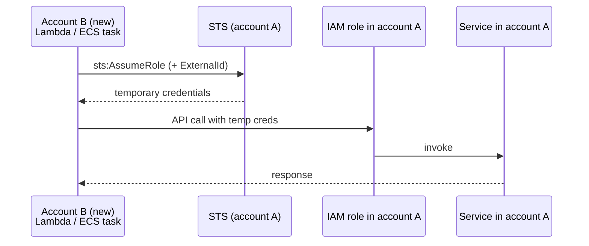

import { Aside } from "@astrojs/starlight/components";

> Pattern for partial [[aws/account-migrations|account migrations]]: leave a service in the old account and let new-account compute reach it via STS `AssumeRole` with ExternalId and a tightly scoped permission policy.

When workloads move from account A to B but one service can't migrate yet (sandbox, vendor approval, regulatory lock-in), account B's compute assumes a role in account A. Common during partial migrations for SES, Bedrock, or any service with regional approval flows.

## Shape



Per the [IAM cross-account tutorial](https://docs.aws.amazon.com/IAM/latest/UserGuide/tutorial_cross-account-with-roles.html), the **role lives in the account that owns the resource**; the trust policy names account B's principal.

## Recipe

Profiles: `account-a` (resource owner), `account-b` (caller).

## 1. Pre-flight

```bash
aws sts get-caller-identity --profile account-a --output json
aws sts get-caller-identity --profile account-b --output json
```

## 2. In account A, create the role

Trust policy (`trust-policy.json`):

```json
{
"Version": "2012-10-17",
"Statement": [
{
"Effect": "Allow",
"Principal": { "AWS": "arn:aws:iam::ACCOUNT_B_ID:root" },
"Action": "sts:AssumeRole",
"Condition": {
"StringEquals": { "sts:ExternalId": "your-external-id" }
}
}
]
}
```

<Aside type="caution" title="Always set an ExternalId">

[ExternalId](https://docs.aws.amazon.com/IAM/latest/UserGuide/id_roles_create_for-user_externalid.html) prevents the [confused-deputy problem](https://docs.aws.amazon.com/IAM/latest/UserGuide/confused-deputy.html). Unique per integration; required in trust policy and in every AssumeRole call.

</Aside>

Permission policy example (`permission-policy.json`):

```json
{
"Version": "2012-10-17",
"Statement": [
{
"Effect": "Allow",
"Action": ["ses:SendEmail", "ses:SendRawEmail"],
"Resource": [
"arn:aws:ses:REGION:ACCOUNT_A_ID:identity/example.com",
"arn:aws:ses:REGION:ACCOUNT_A_ID:configuration-set/*"
]
}
]
}
```

```bash
aws iam create-role \
--profile account-a \
--role-name CrossAccountServiceRole \
--assume-role-policy-document file://trust-policy.json

aws iam put-role-policy \
--profile account-a \
--role-name CrossAccountServiceRole \
--policy-name SesSendOnly \
--policy-document file://permission-policy.json
```

## 3. In account B, grant sts:AssumeRole

```json
{
"Version": "2012-10-17",
"Statement": [
{
"Effect": "Allow",
"Action": "sts:AssumeRole",
"Resource": "arn:aws:iam::ACCOUNT_A_ID:role/CrossAccountServiceRole"
}
]
}
```

Smoke test from account B:

```bash
aws sts assume-role \
--profile account-b \
--role-arn arn:aws:iam::ACCOUNT_A_ID:role/CrossAccountServiceRole \
--role-session-name smoke-test \
--external-id your-external-id
```

## 4. In application code, assume at startup

```typescript
import { STSClient, AssumeRoleCommand } from "@aws-sdk/client-sts";
import { SESClient } from "@aws-sdk/client-ses";

async function buildSesClient() {
const sts = new STSClient({});
const res = await sts.send(
new AssumeRoleCommand({
RoleArn: process.env.SES_ROLE_ARN!,
RoleSessionName: "my-app",
DurationSeconds: 3600,
ExternalId: process.env.SES_EXTERNAL_ID!,
}),
);
const c = res.Credentials!;
return new SESClient({
region: "us-east-2",
credentials: {
accessKeyId: c.AccessKeyId!,
secretAccessKey: c.SecretAccessKey!,
sessionToken: c.SessionToken!,
},
});
}
```

[`AssumeRole`](https://docs.aws.amazon.com/STS/latest/APIReference/API_AssumeRole.html) returns short-lived credentials (default 3600 s, max 43200 s capped by role max; role chaining capped at 1 hour). Use SDK helpers like [`fromTemporaryCredentials`](https://github.com/aws/aws-sdk-js-v3/blob/main/packages/credential-providers/src/fromTemporaryCredentials.ts) for refresh.

## Permission scope traps

| Service | Obvious resource | Hidden resource |
| --- | --- | --- |
| SES `SendEmail` | `identity/example.com` | Configuration set on the identity |
| S3 `GetObject` | `bucket/key` | Bucket ARN for some operations |
| [KMS](/knowledge-base/aws/kms/) `Decrypt` | The key | KMS grant for short-lived consumers |

Read the first `AccessDenied` — it names the exact ARN checked.

## When NOT to use

- Both accounts yours and no blocker — migrate the service instead.
- High-throughput callers refreshing more than hourly — consider IAM Identity Center or federation.
- Resource supports resource policies (S3, SQS, SNS, KMS) — often simpler without an intermediate role.

## Cleanup after migration

```bash
aws iam delete-role-policy --profile account-a --role-name CrossAccountServiceRole --policy-name SesSendOnly
aws iam delete-role --profile account-a --role-name CrossAccountServiceRole
aws iam delete-role-policy --profile account-b --role-name MyLambdaExecutionRole --policy-name AssumeCrossAccountSes
```

Remove app-side AssumeRole logic; rotate ExternalId if it was committed to source control.
