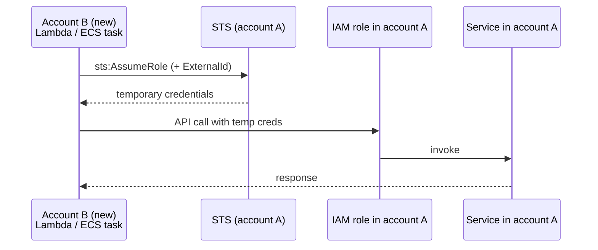

> Pattern for partial [[aws/account-migrations|account migrations]]: leave a service in the old account and let new-account compute reach it via STS `AssumeRole` with ExternalId and a tightly scoped permission policy.

import { Aside } from "@astrojs/starlight/components";
import DecisionGuide from '/src/components/interactive/DecisionGuide.astro';

<Aside type="tip" title="Prerequisites">
Before diving in, make sure you understand:
- [[aws/iam/policy-evaluation|IAM Policy Evaluation]]: since establishing cross-account trust boundaries requires a deep understanding of resource-based and identity-based policies.
</Aside>

When workloads move from account A to B but one service can't migrate yet (sandbox, vendor approval, regulatory lock-in), account B's compute assumes a role in account A. Common during partial migrations for SES, Bedrock, or any service with regional approval flows.

## Shape



Per the [IAM cross-account tutorial](https://docs.aws.amazon.com/IAM/latest/UserGuide/tutorial_cross-account-with-roles.html), the **role lives in the account that owns the resource**; the trust policy names account B's principal. [[aws/iam/policy-evaluation|IAM policy evaluation]] explains why the caller policy and target trust policy both have to allow the handoff.

## Recipe

Profiles: `account-a` (resource owner / account A), `account-b` (caller / account B). Headings below use account A/B; commands use the profile names.

```bash
export ACCOUNT_A_ID=111122223333
export ACCOUNT_B_ID=444455556666
export REGION=us-east-1
export EXTERNAL_ID=your-external-id
export EXECUTION_ROLE_NAME=my-new-account-app-role
```

## 1. Pre-flight

Replace `ACCOUNT_A_ID` / `ACCOUNT_B_ID` in the JSON below with the `Account` values from each profile:

```bash
aws sts get-caller-identity --profile account-a --output json
aws sts get-caller-identity --profile account-b --output json
```

## 2. In account A, create the role

In account A, create the role. Write `trust-policy.json` with `${ACCOUNT_B_ID}` and `${EXTERNAL_ID}` expanded from the exports above:

```bash
cat > trust-policy.json <<EOF
{
  "Version": "2012-10-17",
  "Statement": [
    {
      "Effect": "Allow",
      "Principal": { "AWS": "arn:aws:iam::${ACCOUNT_B_ID}:root" },
      "Action": "sts:AssumeRole",
      "Condition": {
        "StringEquals": { "sts:ExternalId": "${EXTERNAL_ID}" }
      }
    }
  ]
}
EOF
```

<Aside type="caution" title="Always set an ExternalId">

[ExternalId](https://docs.aws.amazon.com/IAM/latest/UserGuide/id_roles_create_for-user_externalid.html) prevents the [confused-deputy problem](https://docs.aws.amazon.com/IAM/latest/UserGuide/confused-deputy.html). Unique per integration; required in trust policy and in every AssumeRole call.

</Aside>

Permission policy (`permission-policy.json`) with `${REGION}` and `${ACCOUNT_A_ID}` in ARNs:

```bash
cat > permission-policy.json <<EOF
{
  "Version": "2012-10-17",
  "Statement": [
    {
      "Effect": "Allow",
      "Action": ["ses:SendEmail", "ses:SendRawEmail"],
      "Resource": [
        "arn:aws:ses:${REGION}:${ACCOUNT_A_ID}:identity/example.com",
        "arn:aws:ses:${REGION}:${ACCOUNT_A_ID}:configuration-set/*"
      ]
    }
  ]
}
EOF

aws iam create-role \
--profile account-a \
--role-name CrossAccountServiceRole \
--assume-role-policy-document file://trust-policy.json

aws iam put-role-policy \
--profile account-a \
--role-name CrossAccountServiceRole \
--policy-name SesSendOnly \
--policy-document file://permission-policy.json
```

## 3. In account B, grant sts:AssumeRole

Attach an inline policy on the Lambda/ECS execution role in account B that allows assuming only the account A role ARN:

```bash
cat > assume-account-a-policy.json <<EOF
{
"Version": "2012-10-17",
"Statement": [
{
"Effect": "Allow",
"Action": "sts:AssumeRole",
"Resource": "arn:aws:iam::${ACCOUNT_A_ID}:role/CrossAccountServiceRole"
}
]
}
EOF

aws iam put-role-policy \
--profile account-b \
--role-name "$EXECUTION_ROLE_NAME" \
--policy-name AssumeAccountAServiceRole \
--policy-document file://assume-account-a-policy.json
```

Smoke test from account B. A healthy response includes a `Credentials` object; `AccessDenied` means the trust policy, external ID, or caller permission is wrong.

```bash
aws sts assume-role \
--profile account-b \
--role-arn "arn:aws:iam::${ACCOUNT_A_ID}:role/CrossAccountServiceRole" \
--role-session-name smoke-test \
--external-id "$EXTERNAL_ID"
```

## 4. In application code, assume at startup

```typescript
import { STSClient, AssumeRoleCommand } from "@aws-sdk/client-sts";
import { SESClient } from "@aws-sdk/client-ses";

async function buildSesClient() {
  // Set SES_ROLE_ARN and SES_EXTERNAL_ID in the runtime environment.
  const sts = new STSClient({});
  const res = await sts.send(
    new AssumeRoleCommand({
      RoleArn: process.env.SES_ROLE_ARN!,
      RoleSessionName: "my-app",
      DurationSeconds: 3600,
      ExternalId: process.env.SES_EXTERNAL_ID!,
    }),
  );
  const c = res.Credentials!;
  return new SESClient({
    region: "us-east-2",
    credentials: {
      accessKeyId: c.AccessKeyId!,
      secretAccessKey: c.SecretAccessKey!,
      sessionToken: c.SessionToken!,
    },
  });
}
```

[`AssumeRole`](https://docs.aws.amazon.com/STS/latest/APIReference/API_AssumeRole.html) returns short-lived credentials (default 3600 s, max 43200 s capped by role max; role chaining capped at 1 hour). Use SDK helpers like [`fromTemporaryCredentials`](https://github.com/aws/aws-sdk-js-v3/blob/main/packages/credential-providers/src/fromTemporaryCredentials.ts) for refresh.

## Permission scope traps

| Service                                   | Obvious resource       | Hidden resource                                                                                         |
| ----------------------------------------- | ---------------------- | ------------------------------------------------------------------------------------------------------- |
| SES `SendEmail`                           | `identity/example.com` | Configuration set on the identity; see the [permission-policy example](#2-in-account-a-create-the-role) |
| S3 `GetObject`                            | `bucket/key`           | Bucket ARN for some operations                                                                          |
| [KMS](/knowledge-base/aws/kms/) `Decrypt` | The key                | KMS grant for short-lived consumers                                                                     |

Read the first `AccessDenied`: it names the exact ARN checked.

## When NOT to use

<DecisionGuide
  title="Do you need cross-account AssumeRole?"
  steps={[
    { id: "start", question: "Is the resource in a different AWS account from your compute?", options: [
      { label: "Yes — compute in account B, resource in account A", next: "can-migrate" },
      { label: "No — same account", next: "r-no" },
    ]},
    { id: "can-migrate", question: "Can you migrate the resource to account B?", options: [
      { label: "No — regulatory lock, vendor approval, sandbox, or shared resource", next: "resource-policy" },
      { label: "Yes — nothing blocking migration", next: "r-migrate" },
    ]},
    { id: "resource-policy", question: "Does the resource support resource-based policies (S3, SQS, SNS, KMS)?", options: [
      { label: "Yes — the resource accepts cross-account access via its own policy", next: "r-resource-policy" },
      { label: "No — the service requires IAM credentials (SES, Bedrock, etc.)", next: "throughput" },
    ]},
    { id: "throughput", question: "How frequently does your compute call the resource?", options: [
      { label: "Moderate — credential refresh hourly or less is fine", next: "r-assume-role" },
      { label: "High throughput — refreshing credentials would add latency", next: "r-federation" },
    ]},
    { id: "r-no", result: "No cross-account pattern needed", explanation: "Your compute and resource are in the same account. Use standard IAM roles and policies." },
    { id: "r-migrate", result: "Migrate the resource instead", explanation: "If nothing blocks moving the resource to account B, migration is simpler than maintaining a cross-account bridge. Eliminate the hop entirely.", link: "#when-not-to-use" },
    { id: "r-resource-policy", result: "Use a resource-based policy", explanation: "S3 bucket policies, SQS queue policies, SNS topic policies, and KMS key policies can grant cross-account access directly — no intermediate role needed. Simpler to audit and rotate.", link: "#when-not-to-use" },
    { id: "r-assume-role", result: "Use AssumeRole with ExternalId ✅", explanation: "The cross-account assume-role pattern is the right fit. Follow the recipe on this page: create the role in account A, grant sts:AssumeRole in account B, and always set an ExternalId.", link: "#recipe" },
    { id: "r-federation", result: "Consider IAM Identity Center or federation", explanation: "For high-throughput callers that would churn through temporary credentials, IAM Identity Center (SSO) or SAML/OIDC federation provides longer-lived session tokens with less operational overhead.", link: "#when-not-to-use" },
  ]}
/>

- Both accounts yours and no blocker: migrate the service instead.
- High-throughput callers refreshing more than hourly: consider IAM Identity Center or federation.
- Resource supports resource policies (S3, SQS, SNS, KMS): often simpler without an intermediate role.

## Cleanup after migration

When the service finally moves to account B, tear down the bridge role and the caller's `sts:AssumeRole` grant (order: inline policies first, then role):

```bash
aws iam delete-role-policy --profile account-a --role-name CrossAccountServiceRole --policy-name SesSendOnly
aws iam delete-role --profile account-a --role-name CrossAccountServiceRole
aws iam delete-role-policy --profile account-b --role-name MyLambdaExecutionRole --policy-name AssumeCrossAccountSes
```

Remove app-side AssumeRole logic; rotate ExternalId if it was committed to source control.
