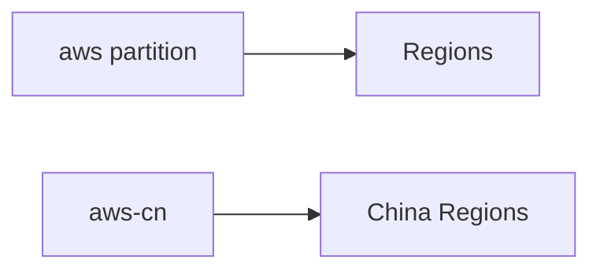

import { Aside } from "@astrojs/starlight/components";

> Amazon S3 is object storage: put bytes in a bucket under a string key; S3 makes them durable, regional, and addressable over HTTP. Default place for anything that is not a database row.

## TL;DR

- **Object storage, not a filesystem.** `/` in keys is convention, not folders.
- **Region + name are immutable** after create: wrong Region means new bucket + sync ([[aws/s3/cross-account-migration|cross-account migration]] shape).
- **Private by default**: [[aws/iam|IAM]], bucket policies, Access Points; keep Block Public Access on.
- **Strong read-after-write** for PUT/overwrite-PUT/DELETE: no torn reads on a single key ([source](https://docs.aws.amazon.com/AmazonS3/latest/userguide/Welcome.html#ConsistencyModel)).
- **Concurrent same-key PUTs: last write wins unpredictably**: not a concurrency lock; don't use S3 Object Lock for that ([source](https://docs.aws.amazon.com/AmazonS3/latest/userguide/object-lock.html)).

## When to use S3 vs something else

- **Use S3** for: uploads, artifacts, backups, [[aws/s3/static-website|static assets]] (+ [[aws/cloudfront|CloudFront]]), data-lake files, logs.
- **Don't use as a database**: no indexes, no cross-key transactions.
- **Don't use as a queue**: use [[aws/s3/event-notifications|event notifications]] into SQS/Lambda instead.

## Buckets and naming

3–63 chars, lowercase alphanumeric, `.`, `-`; global namespace per partition unless using account-regional namespace (`x-amz-bucket-namespace: account-regional`) ([source](https://docs.aws.amazon.com/AmazonS3/latest/userguide/gpbucketnamespaces.html)).

<Aside type="caution" title="Avoid periods except static website buckets">

Periods break virtual-host HTTPS wildcard certs ([source](https://docs.aws.amazon.com/AmazonS3/latest/userguide/bucketnamingrules.html#automatically-created-buckets)).

</Aside>

## Versioning

| State | Behavior |
| --- | --- |
| Unversioned | PUT overwrites; DELETE removes |
| Enabled | PUT creates new version; DELETE adds delete marker |
| Suspended | New writes null version ID; old versions kept |

Once enabled, cannot return to unversioned: only suspend.

<Aside type="caution" title="Each version bills as full object">

Pair versioning with [[aws/s3/lifecycle-rules|NoncurrentVersionExpiration]] or costs grow forever.

</Aside>

## Access defaults

| Mechanism | When |
| --- | --- |
| [IAM](/knowledge-base/aws/iam/) identity policy | Same-account principals |
| Bucket policy | Cross-account, public reads (rare) |
| S3 Access Points | Per-app endpoints at scale |
| ACLs | Avoid: keep Object Ownership bucket-owner-enforced |

Block Public Access at account + bucket ([source](https://docs.aws.amazon.com/AmazonS3/latest/userguide/access-control-block-public-access.html)).

## What you pay for

Six components ([source](https://aws.amazon.com/s3/pricing/)): storage ([[aws/s3/storage-classes|class]]), requests/retrieval, egress, management (Inventory, Lens), replication, Object Lambda/Select.

Common traps: versioning without lifecycle; IA/Glacier on frequently read data.

## Deep dives

| Topic | Page |
| --- | --- |
| Hands-on first bucket | [Quickstart](/knowledge-base/aws/s3/quickstart/) |
| Storage classes | [Storage classes](/knowledge-base/aws/s3/storage-classes/) |
| Lifecycle automation | [Lifecycle rules](/knowledge-base/aws/s3/lifecycle-rules/) |
| Event-driven pipelines | [Event notifications](/knowledge-base/aws/s3/event-notifications/) |
| Temporary share links | [Presigned URLs](/knowledge-base/aws/s3/presigned-urls/) |
| Static HTTP site | [Static website](/knowledge-base/aws/s3/static-website/) |
| Cross-account move | [Cross-account migration](/knowledge-base/aws/s3/cross-account-migration/) |
| CLI | [S3 CLI cheatsheet](/knowledge-base/aws/s3/cli/) |

## See also

- [Amazon S3 user guide](https://docs.aws.amazon.com/AmazonS3/latest/userguide/Welcome.html) (official).
