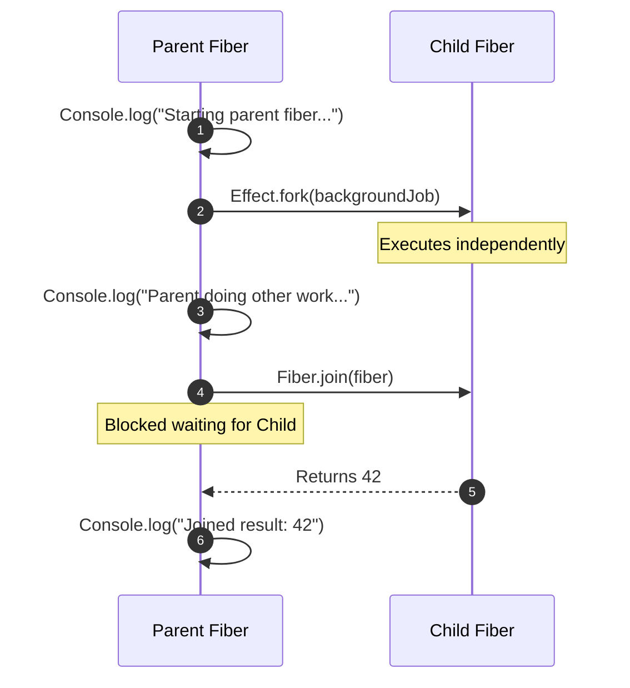

import { Aside, Steps, Tabs, TabItem } from "@astrojs/starlight/components";

> Structured concurrency in Effect: asynchronous units of execution called **fibers** are organized in a strict parent-child hierarchy, guaranteeing no leaked operations or abandoned computations.

<Steps>

1. Spawn asynchronous operations as background workers using `Effect.fork`.
2. Synchronize results with `Fiber.join` or abort tasks using `Fiber.interrupt`.
3. Choose execution modes (sequential vs. parallel) using `Effect.all` or `Effect.forEach`.
4. Prevent system exhaustion by configuring bounded concurrency limits.
5. Guarantee LIFO cleanups on interruption using [[effect-ts/scoped-resources|Scope]] and `Effect.onInterrupt`.

</Steps>

## What is a fiber?

In JavaScript, asynchronous tasks are scheduled on the event loop as Tasks or Microtasks. In Effect, concurrency is managed using **fibers** (sometimes called virtual threads or green threads). 

A fiber is a lightweight description of a execution thread managed entirely by the Effect runtime, not the operating system. Because fibers are allocation-cheap and run cooperative multitasking, you can spawn hundreds of thousands of them concurrently on a single Node.js thread without exhausting system memory.

---

## Spawning background work

To run an `Effect` in the background, spawn it as a fiber using `Effect.fork`. This returns a [`Fiber<Success, Error>`](https://effect.website/docs/concurrency/fibers) handle:

```ts twoslash
import { Console, Effect, Fiber } from "effect";

const backgroundJob = Effect.gen(function* () {
  yield* Effect.sleep("100 millis");
  yield* Console.log("Background job completed.");
  return 42;
});

const program = Effect.gen(function* () {
  yield* Console.log("Starting parent fiber...");
  
  // Spawns the job on a child fiber and continues immediately
  const fiber = yield* Effect.fork(backgroundJob);
  
  yield* Console.log("Parent fiber doing other work concurrently...");
  
  // Await the background fiber's result (blocking until done)
  const result = yield* Fiber.join(fiber);
  yield* Console.log(`Joined result: ${result}`);
});

Effect.runPromise(program);
```

### Visualizing execution flow



---

## Controlling fiber lifecycles

Every fiber can be aborted by calling `Fiber.interrupt`. Aborting a fiber halts its execution immediately and triggers its finalization cleanup hooks:

```ts twoslash
import { Console, Effect, Fiber } from "effect";

const longRunning = Effect.gen(function* () {
  yield* Console.log("Starting persistent calculation...");
  yield* Effect.sleep("10 seconds");
  yield* Console.log("This should never print!");
});

const program = Effect.gen(function* () {
  const fiber = yield* Effect.fork(longRunning);
  
  // Let the fiber spin up
  yield* Effect.sleep("500 millis");
  
  yield* Console.log("Halting background calculation...");
  // Aborts the target fiber and blocks until all its cleanups are run
  yield* Fiber.interrupt(fiber);
  
  yield* Console.log("Calculation cleanly halted.");
});

Effect.runPromise(program);
```

---

## Sequential vs. Parallel execution

High-level APIs like `Effect.all` (combinator for arrays) and `Effect.forEach` (combinator for iterations) run **sequentially** by default. To unlock parallel fiber execution, pass a `{ concurrency: ... }` option.

| Concurrency Option | Type | Behavior |
| --- | --- | --- |
| `undefined` | Default | **Sequential**: Runs each effect in order, waiting for the previous to finish. |
| `"unbounded"` | string | **Unbounded Parallel**: Spawns all effects concurrently as child fibers immediately. |
| `N` | number | **Bounded Parallel**: Spawns at most `N` concurrent child fibers, queueing the rest. |
| `"inherit"` | string | **Inherited Parallel**: Inherits the concurrency configuration of the enclosing context. |

### Sequential vs. Parallel comparison

<Tabs>
  <TabItem label="Sequential (Default)">
    ```ts twoslash
    import { Console, Effect } from "effect";

    const task = (id: number) => Effect.gen(function* () {
      yield* Effect.sleep("100 millis");
      yield* Console.log(`Completed task ${id}`);
      return id;
    });

    const program = Effect.all([task(1), task(2), task(3)]);

    Effect.runPromise(program);
    // Completes in ~300ms:
    // Completed task 1
    // Completed task 2
    // Completed task 3
    ```
  </TabItem>
  <TabItem label="Parallel (Unbounded)">
    ```ts twoslash
    import { Console, Effect } from "effect";

    const task = (id: number) => Effect.gen(function* () {
      yield* Effect.sleep("100 millis");
      yield* Console.log(`Completed task ${id}`);
      return id;
    });

    // Spawns tasks as concurrent child fibers
    const program = Effect.all([task(1), task(2), task(3)], { concurrency: "unbounded" });

    Effect.runPromise(program);
    // Completes in ~100ms:
    // Completed task 1
    // Completed task 2
    // Completed task 3
    ```
  </TabItem>
</Tabs>

---

## Bounded Concurrency Limits

Unbounded parallel execution is dangerous for high-throughput tasks like fetching thousands of records from an API or doing database lookups. Without limits, the event loop will trigger file descriptor depletion, socket exhaustion, or memory out-of-bounds crashes.

Effect allows you to enforce bounded concurrency by passing a numeric limit (`N`) directly to combinators or by configuring the context using `Effect.withConcurrency`:

```ts twoslash
import { Effect } from "effect";

const fetchRecord = (id: number) => Effect.gen(function* () {
  yield* Effect.sleep("50 millis");
  return `Record ${id}`;
});

const ids = Array.from({ length: 1000 }, (_, i) => i + 1);

// Processes 1000 records in batches of at most 10 parallel fibers
const program = Effect.forEach(ids, (id) => fetchRecord(id), { concurrency: 10 });

Effect.runPromise(program);
```

### Contextual inherited concurrency

By setting `{ concurrency: "inherit" }`, your combinators defer to the surrounding lexical boundary, allowing you to configure execution bounds globally or dynamically:

```ts twoslash
import { Console, Effect } from "effect";

const fetchItem = (id: number) => Effect.gen(function* () {
  yield* Effect.sleep("10 millis");
  yield* Console.log(`Fetched ${id}`);
});

// The combinator defers limits to its parent scope
const fetchAll = Effect.forEach([1, 2, 3, 4, 5], fetchItem, { concurrency: "inherit" });

// Bind the parent scope to run at most 2 parallel fibers
const program = fetchAll.pipe(Effect.withConcurrency(2));

Effect.runPromise(program);
```

---

## Interruption Lifecycle and Cleanups

Structured Concurrency dictates that **child fibers are bound to their parent's scope**. If a parent fiber fails or is interrupted, the runtime automatically interrupts all its active child fibers, preventing orphan tasks or background leaks.

When a fiber is interrupted, all its finalizers and cleanup boundaries execute cleanly. You can hook into this lifecycle using two mechanisms: `Effect.onInterrupt` and `Scope`.

### 1. In-line interception with `Effect.onInterrupt`

Register a callback that executes only if the computation is aborted:

```ts twoslash
import { Console, Effect, Fiber } from "effect";

const queryApi = Effect.gen(function* () {
  yield* Console.log("Executing transaction...");
  yield* Effect.sleep("5 seconds");
  yield* Console.log("Transaction saved.");
}).pipe(
  // Runs if this fiber is cancelled before completion
  Effect.onInterrupt(() => Console.log("Transaction interrupted! Rolling back changes..."))
);

const program = Effect.gen(function* () {
  const fiber = yield* Effect.fork(queryApi);
  
  yield* Effect.sleep("1 second");
  yield* Console.log("Timeout triggered!");
  yield* Fiber.interrupt(fiber);
});

Effect.runPromise(program);
// Executing transaction...
// Timeout triggered!
// Transaction interrupted! Rolling back changes...
```

### 2. Guarded resource lifecycles with `Scope`

When using `Effect.acquireRelease` within a fiber, finalizers run in reverse order (LIFO) if the fiber is interrupted. This guarantees that half-acquired sockets, database pools, or open files are cleanly closed:

```ts twoslash
import { Console, Effect, Fiber } from "effect";

class Resource {
  constructor(readonly name: string) {}
  release() {
    return Console.log(`Cleaning up resource: ${this.name}`);
  }
}

const managedResource = (name: string) =>
  Effect.acquireRelease(
    Effect.sync(() => {
      console.log(`Acquired resource: ${name}`);
      return new Resource(name);
    }),
    (r) => r.release()
  );

const work = Effect.gen(function* () {
  yield* managedResource("PrimaryConnection");
  yield* managedResource("SecondaryConnection");
  yield* Console.log("Processing batch on active connections...");
  yield* Effect.sleep("5 seconds");
  yield* Console.log("Batch finished.");
});

const program = Effect.gen(function* () {
  const fiber = yield* Effect.fork(Effect.scoped(work));
  
  yield* Effect.sleep("500 millis");
  yield* Console.log("Forced cancellation!");
  yield* Fiber.interrupt(fiber);
});

Effect.runPromise(program);
// Acquired resource: PrimaryConnection
// Acquired resource: SecondaryConnection
// Processing batch on active connections...
// Forced cancellation!
// Cleaning up resource: SecondaryConnection
// Cleaning up resource: PrimaryConnection
```

Notice that even though the fiber was abruptly cancelled while sleeping, both connections are closed in strict **reverse order (LIFO)**. For more resource cleanup patterns, see [[effect-ts/scoped-resources|Scoped resources]].

---

<Aside type="caution" title="Avoid manual Fiber.fork inside services">
  Spawning manual background fibers using `Effect.fork` is generally discouraged inside service layers. It pulls complex synchronization and state management into your services. Instead, use declarative concurrency via `Effect.all(..., { concurrency })` or modular stream-based processing to handle high-throughput parallel pipelines naturally.
</Aside>

---

## See also

- [[effect-ts/scoped-resources|Scoped resources]]
- [[effect-ts/fault-tolerant-ingestion|Fault-tolerant ingestion]]
- [[effect-ts|Effect-TS MoC]]
- [Concurrency in Effect](https://effect.website/docs/concurrency/introduction/) (official)
- [Fibers guide](https://effect.website/docs/concurrency/fibers/) (official)
