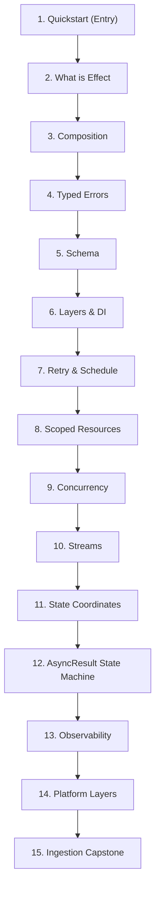

import { Aside, Card, CardGrid } from "@astrojs/starlight/components";

> Effect is a TypeScript library for building robust applications with [[effect-ts/typed-errors|typed errors]], dependency injection, and structured concurrency (child fibers cancelled with their parent scope). Programs are values (`Effect<A, E, R>`) that a runtime executes; everything you do with them stays type-safe.

## TL;DR

- The core type is [`Effect<Success, Error, Requirements>`](https://effect.website/docs/getting-started/the-effect-type/#type-parameters), abbreviated `A`, `E`, `R`. Errors and dependencies are tracked in the type, not lost in `try/catch` and DI containers.
- Effect values are **lazy descriptions**, not running code. A runtime ([`Effect.runPromise` / `Effect.runSync` / `Effect.runFork`](https://effect.website/docs/getting-started/running-effects/)) executes them when you ask.
- Replaces (and absorbs) [`fp-ts`](https://github.com/gcanti/fp-ts): per its README, fp-ts is "officially merging with the Effect-TS ecosystem" and "Effect-TS can be regarded as the successor to fp-ts v2".
- Single npm package for the core (`effect`); the rest of the ecosystem ships under `@effect/*` ([[effect-ts/platform|platform]], cli, sql, ai, workflow, rpc, cluster, [[effect-ts/observability|opentelemetry]], vitest, …).
- Latest stable: check [npm `effect`](https://www.npmjs.com/package/effect) before citing a version in prose.

## When to use

- **Use Effect** for: backend services with non-trivial error taxonomies, data pipelines (typed streams with backpressure: `Stream` is pull-based, so a slow downstream operator naturally throttles upstream production without manual buffer management; [Stream.ts#L57-L61](https://github.com/Effect-TS/effect/blob/main/packages/effect/src/Stream.ts#L57-L61)), CLI tools (`@effect/cli`), durable workflows (`@effect/workflow`), schema-first apps (built-in `Schema` module), large-language-model (LLM) agents (`@effect/ai`).
- **Don't use Effect** for: tiny scripts where the runtime overhead and learning curve outweigh the wins; teams unwilling to learn generator syntax (`Effect.gen(function* () { ... })`) and [[effect-ts/composition|composition]] idioms.
- **Adoption signal**: compare weekly npm downloads for `effect` vs your incumbent stack when making a team decision; library momentum and job-market demand are different questions.

## Mental model

```ts twoslash
import { Effect } from "effect";

// Effect<void, never, never> — success void, no errors, no services required
const program = Effect.sync(() => {
  console.log("lazy until run");
});
```

| Concept           | Shape                                                                                              | Reader hook                                                               |
| ----------------- | -------------------------------------------------------------------------------------------------- | ------------------------------------------------------------------------- |
| `Effect<A, E, R>` | Value describing a computation that, when run, either yields `A`, fails with `E`, or asks for `R`. | A typed `Promise` that also tracks errors and dependencies (see [What is Effect](/knowledge-base/effect-ts/what-is-effect/)). |
| Runtime           | The thing that _executes_ an `Effect`.                                                             | Like calling a thunk: nothing happens until `Effect.runPromise(program)` (see [What is Effect](/knowledge-base/effect-ts/what-is-effect/)). |
| Layers (`R`)      | Typed dependency graph.                                                                            | DI container, but the compiler tells you when a dependency is missing (see [Layers and DI](/knowledge-base/effect-ts/layers-and-di/)). |
| `Effect.gen`      | Generator-based DSL: `yield*` an effect to "await" it.                                             | `async/await` for `Effect` (see [Composition](/knowledge-base/effect-ts/composition/)). |

See [[effect-ts/what-is-effect|What is Effect]] for the longer version.

## Learning Pathway Sequence

Follow this structured step-by-step track sequence to master Effect-TS, from foundational generator composition up to fault-tolerant streaming pipelines:



## Start here

<CardGrid>
  <Card title="Step 1: Quickstart" icon="rocket">
    <p>
      <a href="/knowledge-base/effect-ts/quickstart/">Install, write, and run</a> your first effect
      (~10 min).
    </p>
  </Card>
  <Card title="Step 2: What is Effect" icon="open-book">
    <p>
      <a href="/knowledge-base/effect-ts/what-is-effect/">What is Effect</a>: mental model,
      laziness, and the three channels.
    </p>
  </Card>
  <Card title="Step 3: Composition" icon="seti:typescript">
    <p>
      <a href="/knowledge-base/effect-ts/composition/">pipe, gen, and fn</a>: when to reach for
      each.
    </p>
  </Card>
  <Card title="Step 4: Typed errors" icon="warning">
    <p>
      The <code>E</code> channel:{" "}
      <a href="/knowledge-base/effect-ts/typed-errors/">try, catchTag</a>.
    </p>
  </Card>
  <Card title="Step 5: Schema" icon="document">
    <p>
      <a href="/knowledge-base/effect-ts/schema/">Runtime boundaries</a>: decode unknown input into
      typed effects.
    </p>
  </Card>
  <Card title="Step 6: Layers and DI" icon="setting">
    <p>
      The <code>R</code> channel:{" "}
      <a href="/knowledge-base/effect-ts/layers-and-di/">Context.Tag, Layer</a>.
    </p>
  </Card>
  <Card title="Step 7: Retry and Schedule" icon="retry">
    <p>
      <a href="/knowledge-base/effect-ts/retry-and-schedule/">Bounded retries and backoff</a>.
    </p>
  </Card>
  <Card title="Step 8: Scoped resources" icon="approve-check">
    <p>
      <a href="/knowledge-base/effect-ts/scoped-resources/">acquireRelease, Scope</a>.
    </p>
  </Card>
  <Card title="Step 9: Concurrency" icon="random">
    <p>
      <a href="/knowledge-base/effect-ts/concurrency/">Fibers, fork, and bounded execution</a>.
    </p>
  </Card>
  <Card title="Step 10: Streams" icon="list-format">
    <p>
      <a href="/knowledge-base/effect-ts/streams/">Pull-based streams and backpressure</a>.
    </p>
  </Card>
  <Card title="Step 11: State coordinates" icon="seti:db">
    <p>
      <a href="/knowledge-base/effect-ts/state/">Lock-free fiber coordinates</a>: <code>Ref</code> (see [[effect-ts/state|State coordinates]]), <code>SubscriptionRef</code>, and Software Transactional Memory (STM).
    </p>
  </Card>
  <Card title="Step 12: AsyncResult" icon="document">
    <p>
      <a href="/knowledge-base/effect-ts/async-result/">Reactive state machines</a>: modeling remote async lifecycles, avoiding loading defaults, and local atom/ref derivation.
    </p>
  </Card>
  <Card title="Step 13: Observability" icon="star">
    <p>
      <a href="/knowledge-base/effect-ts/observability/">Structured telemetry</a>: logging, <code>withLogSpan</code>, and OpenTelemetry.
    </p>
  </Card>
  <Card title="Step 14: Platform layers" icon="laptop">
    <p>
      <a href="/knowledge-base/effect-ts/platform/">Runtime-agnostic contexts</a>: FileSystem, HttpClient, and modular routing.
    </p>
  </Card>
  <Card title="Step 15: Ingestion capstone" icon="approve-check">
    <p>
      <a href="/knowledge-base/effect-ts/fault-tolerant-ingestion/">Fault-tolerant pipeline</a>{" "}
      recipe.
    </p>
  </Card>
</CardGrid>

After the sequence above, [[effect-ts/ecosystem-map|Ecosystem map]] is a lookup reference for `@effect/*` packages.

## Pending notes (vault)

- **Durability Boundaries**: Establishing reliable error recovery thresholds by contrasting in-memory `Effect.retry` scheduling patterns against durable distributed queues and workflow engines.

## See also

- [[effect-ts/quickstart|Quickstart]]
- [[effect-ts/concurrency|Concurrency]]
- [[effect-ts/streams|Streams]]
- [[effect-ts/schema|Schema]]
- [[effect-ts/layers-vs-nestjs-di|Layers vs NestJS DI]]
- [Effect documentation](https://effect.website/docs/getting-started/introduction/) (official)
- [Effect-TS/effect on GitHub](https://github.com/Effect-TS/effect)
