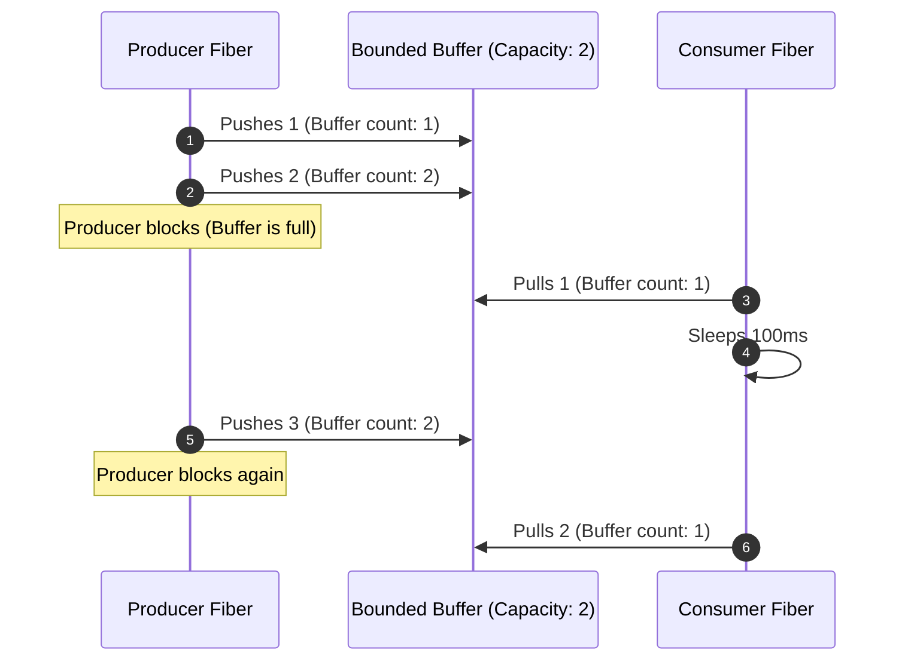

import { Aside, Steps, Tabs, TabItem } from "@astrojs/starlight/components";

> Pull-based streams in Effect: asynchronous data generators that naturally coordinate ingestion rates with consumer capacity, resolving backpressure without manual buffer management.

<Steps>

1. Construct streams from collections, promises, or generators.
2. Transform elements using functional combinators like `Stream.map` and `Stream.filter`.
3. Configure load safety bounds using `Stream.buffer` or `Stream.bufferChunks`.
4. Group and batch elements using `Stream.grouped` for high-overhead database or API uploads.
5. Safely manage resource scopes using `Stream.acquireRelease` and stream finalizers.

</Steps>

## The push vs. pull paradigm

In traditional asynchronous JavaScript programming, streams are almost always **push-based** (e.g., RxJS Observables, Node.js EventEmitter, or standard EventTargets). In a push-based model, the *producer* controls the rate of emissions, shoving data down the pipeline as soon as it becomes available. If the *consumer* is slow, the unconsumed data accumulates in-memory, leading to heap fragmentation, high latency, or out-of-memory crashes.

Effect uses **pull-based streams** (`Stream<A, E, R>`). In a pull-based model, the *consumer* explicitly asks the producer for the next element when it is ready. This naturally resolves the problem of **backpressure**: if the consumer slows down, the producer naturally halts production because no pulls are requested.

| Feature | Push-based Streams (RxJS, Node Events) | Pull-based Streams (Effect Stream) |
| --- | --- | --- |
| **Control Owner** | Producer (pushes data immediately) | Consumer (pulls data when ready) |
| **Backpressure** | Manual (requires complex buffers/operators) | Native (inherent in the pulling mechanism) |
| **Memory Risk** | High (memory swells if consumer lags behind) | Low (bounded by consumer's demand rate) |
| **Resource Safety** | Add-on (manually unsubscribe or close handles) | Strict (fully bound to the enclosing Scope lifecycle) |

---

## Minimal working example

Creating and executing a stream in Effect is lazy. A stream is simply a description of a data pipeline; no data is pulled until you execute a runner like `Stream.runCollect` or `Stream.runForEach`:

```ts twoslash
import { Console, Effect, Stream } from "effect";

// Create a lazy stream of numbers and double them
const stream = Stream.make(1, 2, 3).pipe(
  Stream.map((n) => n * 10),
);

const program = Effect.gen(function* () {
  // Execute the stream and collect all elements into a Chunk
  const result = yield* Stream.runCollect(stream);
  yield* Console.log(`Collected elements: [${Array.from(result).join(", ")}]`);
});

Effect.runPromise(program);
```

---

## Managing backpressure with buffers

While native pull-based iteration guarantees that a slow consumer will never be overwhelmed, there are times you want the producer to run slightly ahead of the consumer (for example, fetching records from a database while the consumer performs CPU-heavy analysis).

Effect provides `Stream.buffer` to boundedly buffer elements. This spawns a background [[effect-ts/concurrency|fiber]] to pull elements from the producer up to a specified capacity, allowing the producer and consumer to operate at different speeds within safe memory bounds:

```ts twoslash
import { Console, Effect, Stream } from "effect";

const source = Stream.range(1, 5).pipe(
  Stream.tap((n) => Console.log(`Produced: ${n}`)),
);

// Buffer at most 2 elements to allow producer to run slightly ahead
const buffered = Stream.buffer(source, { capacity: 2 });

const program = Effect.gen(function* () {
  yield* Console.log("Starting consumption...");
  yield* Stream.runForEach(buffered, (n) =>
    Effect.gen(function* () {
      yield* Effect.sleep("100 millis"); // Simulate slow consumer
      yield* Console.log(`  Consumed: ${n}`);
    })
  );
});

Effect.runPromise(program);
```

### Visualizing buffered backpressure



---

## Batching and Windowing

When communicating with external databases or HTTP APIs, processing items one-by-one is highly inefficient. You can group stream elements into batches of a specific size using `Stream.grouped`:

```ts twoslash
import { Console, Effect, Stream } from "effect";

// Emit numbers 1 to 10
const source = Stream.range(1, 10);

// Group every 3 elements into a Chunk
const batched = source.pipe(Stream.grouped(3));

const program = Stream.runForEach(batched, (chunk) =>
  Console.log(`Uploading database batch: [${Array.from(chunk).join(", ")}]`)
);

Effect.runPromise(program);
// Uploading database batch: [1, 2, 3]
// Uploading database batch: [4, 5, 6]
// Uploading database batch: [7, 8, 9]
// Uploading database batch: [10]
```

---

## Guarded resource scope integration

If your stream opens external resources (like database connections, files, or network sockets), you must guarantee that these resources are closed cleanly whether the stream finishes successfully, fails, or is interrupted.

Effect streams fully support the `Scope` model. Using `Stream.acquireRelease`, resource allocation is bound directly to the stream execution boundary:

```ts twoslash
import { Console, Effect, Stream } from "effect";

class SocketConnection {
  constructor(readonly id: number) {}
  send(data: string) {
    return Console.log(`Sending '${data}' via Socket ${this.id}`);
  }
  close() {
    return Console.log(`Socket ${this.id} cleanly closed.`);
  }
}

let socketCounter = 0;

const connectSocket = () =>
  Effect.sync(() => {
    const id = ++socketCounter;
    console.log(`Connecting to Socket ${id}...`);
    return new SocketConnection(id);
  });

// Opens the resource as part of the stream's execution
const socketStream = Stream.acquireRelease(
  connectSocket(),
  (socket) => socket.close()
);

const program = Effect.gen(function* () {
  yield* Stream.runForEach(socketStream, (socket) =>
    Effect.gen(function* () {
      yield* socket.send("Payload A");
      yield* socket.send("Payload B");
    })
  );
});

Effect.runPromise(program);
// Connecting to Socket 1...
// Sending 'Payload A' via Socket 1
// Sending 'Payload B' via Socket 1
// Socket 1 cleanly closed.
```

If the consumer had failed during execution or was interrupted by a timeout, the finalizer `socket.close()` would still be executed by the runtime in strict **LIFO** order, guaranteeing that resources are never leaked. For details on scope finalization, see [[effect-ts/scoped-resources|Scoped resources]].

---

<Aside type="caution" title="Avoid unbuffered streams for network operations">
  While pull-based streams naturally prevent consumer exhaustion, they can introduce high latency if every element requires an individual asynchronous round-trip. When reading network sockets or files, always use chunked/buffered read operations (`Stream.bufferChunks` or `Stream.grouped`) to batch requests and keep CPU cores saturated without introducing blocking lag.
</Aside>

---

## See also

- [[effect-ts/concurrency|Concurrency and fibers]]
- [[effect-ts/scoped-resources|Scoped resources]]
- [[effect-ts/fault-tolerant-ingestion|Fault-tolerant ingestion]]
- [[effect-ts|Effect-TS MoC]]
- [Streaming in Effect](https://effect.website/docs/streaming/introduction/) (official)
- [Stream module API reference](https://effect.website/docs/reference/stream/) (official)
