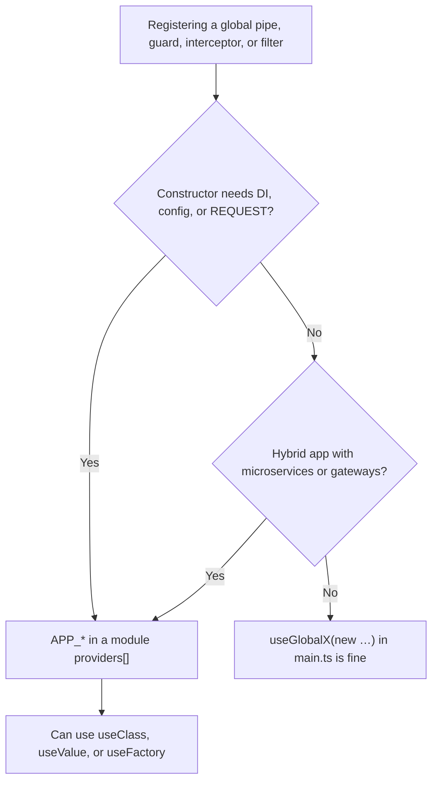

> Two ways to register a global pipe, guard, interceptor, or exception filter. They look interchangeable. They are not.

import { Aside, Steps, Tabs, TabItem } from "@astrojs/starlight/components";

<Aside type="tip" title="Prerequisites">
Before diving into global enhancers, make sure you understand:
- [[nestjs/fundamentals|Dependency Injection]]: since the `APP_*` provider tokens rely on the NestJS DI container to instantiate global enhancers.
</Aside>

## Choose in 30 seconds



| You need                                     | Pick                                       |
| -------------------------------------------- | ------------------------------------------ |
| Static `ValidationPipe({ whitelist: true })` | [Either: useGlobalPipes is simplest](#two-registration-styles) |
| `ConfigService` drives pipe options          | [`APP_PIPE` + `useFactory`](#config-driven-app_pipe)                  |
| Guard reads `x-tenant-id` per request        | [`APP_GUARD` + request scope](#request-scoped-app_guard)                |
| Throttler / JWT guard from a package         | `APP_GUARD` (they inject deps)             |
| Same filter on HTTP + microservice           | `APP_FILTER`, not `useGlobalFilters` alone |

## Two registration styles

<Tabs>
  <TabItem label="app.useGlobalX()">
    Instantiate in `main.ts` **outside** the DI container:

    ```typescript title="main.ts"
    import { NestFactory } from "@nestjs/core";
    import { ValidationPipe } from "@nestjs/common";
    import { AppModule } from "./app.module";

    async function bootstrap() {
      const app = await NestFactory.create(AppModule);
      app.useGlobalPipes(new ValidationPipe({ whitelist: true }));
      await app.listen(3000);
    }
    bootstrap();
    ```

    Whatever you pass to `new` is what runs. No constructor injection, no request scope.

  </TabItem>
  <TabItem label="APP_* provider">
    Register in **any** module's `providers` array; Nest builds the instance:

    ```typescript title="app.module.ts"
    import { Module, ValidationPipe } from "@nestjs/common";
    import { APP_PIPE } from "@nestjs/core";

    @Module({
      providers: [{ provide: APP_PIPE, useClass: ValidationPipe }],
    })
    export class AppModule {}
    ```

    Same global effect on the wire ([pipes binding](https://docs.nestjs.com/pipes#binding-pipes), [guards](https://docs.nestjs.com/guards#binding-guards), [interceptors](https://docs.nestjs.com/interceptors#binding-interceptors), [filters](https://docs.nestjs.com/exception-filters#binding-filters): "regardless of the module where this construction is employed", the enhancer is global).

  </TabItem>
</Tabs>

## Pick one

| Concern                                            | `app.useGlobalX(new T())`            | `{ provide: APP_X, useClass: T }`            |
| -------------------------------------------------- | ------------------------------------ | -------------------------------------------- |
| Inject providers (`ConfigService`, repos, loggers) | No                                   | Yes                                          |
| Request scope                                      | No                                   | Yes                                          |
| Hybrid app gateways / microservices                | No (unless `inheritAppConfig: true`) | Yes (provider registries on every transport) |
| Where it lives                                     | `main.ts`                            | Any module `providers`                       |
| Literal options object                             | Trivial                              | `useValue` or `useFactory`                   |

**Rule of thumb:** stateless + static config → either works. Needs DI or request scope → `APP_*`.

<Steps>

1. **Static `ValidationPipe`**: `useGlobalPipes(new ValidationPipe({ whitelist: true }))` in `main.ts` is enough; no injection.
2. **Config-driven pipe**: `APP_PIPE` + `useFactory` injecting `ConfigService` so `whitelist` follows env.
3. **Request-scoped guard**: `APP_GUARD` + `@Injectable({ scope: Scope.REQUEST })`; `useGlobalGuards(new TenantGuard())` cannot inject `REQUEST`.
4. **Interceptor with deps**: `APP_INTERCEPTOR` when the constructor needs `ConfigService` or a logger from the container.

</Steps>

## Worked examples

### Config-driven `APP_PIPE`

```typescript title="validation.config.ts"
import { ValidationPipe } from "@nestjs/common";
import { ConfigService } from "@nestjs/config";
import { APP_PIPE } from "@nestjs/core";

export const validationPipeProvider = {
  provide: APP_PIPE,
  inject: [ConfigService],
  useFactory: (config: ConfigService) =>
    new ValidationPipe({
      whitelist: config.get<boolean>("STRICT_VALIDATION", true),
      transform: true,
    }),
};
```

```typescript title="app.module.ts"
import { Module } from "@nestjs/common";
import { ConfigModule } from "@nestjs/config";
import { validationPipeProvider } from "./validation.config";

@Module({
  imports: [ConfigModule.forRoot()],
  providers: [validationPipeProvider],
})
export class AppModule {}
```

With `useGlobalPipes` in `main.ts`, you can hand-resolve `app.get(ConfigService)`, but `APP_PIPE` keeps the wiring inside DI and easier to test.

### Request-scoped `APP_GUARD`

```typescript title="tenant.guard.ts"
import { CanActivate, ExecutionContext, Inject, Injectable, Scope } from "@nestjs/common";
import { REQUEST } from "@nestjs/core";
import type { Request } from "express";
import { TenantService } from "./tenant.service";

@Injectable({ scope: Scope.REQUEST })
export class TenantGuard implements CanActivate {
  constructor(
    @Inject(REQUEST) private readonly req: Request,
    private readonly tenants: TenantService,
  ) {}

  async canActivate(_: ExecutionContext): Promise<boolean> {
    const tenantId = this.req.header("x-tenant-id");
    return tenantId ? this.tenants.exists(tenantId) : false;
  }
}
```

```typescript title="app.module.ts"
import { Module } from "@nestjs/common";
import { APP_GUARD } from "@nestjs/core";
import { TenantGuard } from "./tenant.guard";
import { TenantService } from "./tenant.service";

@Module({
  providers: [TenantService, { provide: APP_GUARD, useClass: TenantGuard }],
})
export class AppModule {}
```

`app.useGlobalGuards(new TenantGuard(/* ??? */))` has no request to inject and no `TenantService` from the container.

## Provider shapes

| Form         | When                                                 |
| ------------ | ---------------------------------------------------- |
| `useClass`   | Nest resolves every constructor dep (worked example: [Request-scoped APP_GUARD](#request-scoped-app_guard)) |
| `useValue`   | Pre-built instance, e.g. `new ValidationPipe({ … })` (worked example: [combined array](#provider-shapes)) |
| `useFactory` | Async setup, env, or manual `inject: [...]` (worked example: [Config-driven APP_PIPE](#config-driven-app_pipe)) |

```typescript title="main.ts"
import { Logger, ValidationPipe } from "@nestjs/common";
import { APP_FILTER, APP_INTERCEPTOR, APP_PIPE } from "@nestjs/core";

// Stub classes to satisfy the compiler
class LoggingInterceptor {}
class SentryFilter {
  constructor(logger: Logger, options: { release?: string }) {}
}

const providers = [
  { provide: APP_INTERCEPTOR, useClass: LoggingInterceptor },
  { provide: APP_PIPE, useValue: new ValidationPipe({ whitelist: true }) },
  {
    provide: APP_FILTER,
    inject: [Logger],
    useFactory: (logger: Logger) =>
      new SentryFilter(logger, { release: process.env.RELEASE }),
  },
];
```

<Aside type="caution" title="Hybrid apps">

`app.useGlobalGuards()` / `useGlobalPipes()` / etc. apply to the **HTTP** layer only. Microservice listeners and WebSocket gateways stay uncovered unless you pass `{ inheritAppConfig: true }` to `connectMicroservice`, or register via `APP_*` so Nest's enhancer registries pick up globals on every transport ([hybrid application FAQ](https://docs.nestjs.com/faq/hybrid-application)).

</Aside>

<Aside type="note" title="Middleware has no APP_* token">

[[nestjs/fundamentals/middleware|Middleware]] uses `MiddlewareConsumer` or `app.use()`: not this pattern. Only [[nestjs/fundamentals/pipes|pipes]], [[nestjs/fundamentals/guards|guards]], [[nestjs/fundamentals/interceptors|interceptors]], and filters have `APP_PIPE` / `APP_GUARD` / `APP_INTERCEPTOR` / `APP_FILTER`.

</Aside>

## Edge cases

- **Multiple `APP_*` registrations stack**: e.g. logging + timeout interceptors both run.
- **Mixing `useGlobalPipes` and `APP_PIPE`**: both land in the same global list ([`application-config.ts#L60-L62`](https://github.com/nestjs/nest/blob/master/packages/core/application-config.ts#L60-L62), [`scanner.ts#L693-L695`](https://github.com/nestjs/nest/blob/master/packages/core/scanner.ts#L693-L695)). Pick one style per enhancer kind so order stays predictable.
- **No `exports` needed**: official binding examples never export the `APP_*` token; Nest scans `providers` from any module.
- **[[nestjs/recipes/testing|Testing]] overrides**: `.overrideProvider(APP_GUARD)` alone fails: `APP_GUARD` is a multi-provider slot. Refactor to `{ provide: APP_GUARD, useExisting: JwtAuthGuard }` plus a normal `JwtAuthGuard` provider, then `.overrideProvider(JwtAuthGuard).useClass(MockGuard)` ([testing docs](https://docs.nestjs.com/fundamentals/testing#overriding-globally-registered-enhancers)). See [[nestjs/recipes/testing|Testing with @nestjs/testing]] for the full pattern.

## See also

- [[nestjs/fundamentals/pipes|Pipes]] · [[nestjs/fundamentals/guards|Guards]] · [[nestjs/fundamentals/interceptors|Interceptors]] · [[nestjs/fundamentals/exception-filters|Exception filters]]
- [[nestjs/recipes/configuration|Configuration with @nestjs/config]]: config-driven `APP_*` factories
- [[nestjs/recipes/testing|Testing with @nestjs/testing]]: override patterns for globals
- [[nestjs/recipes/validation|Validation recipe]]: common `APP_PIPE` use case
- [[effect-ts/layers-vs-nestjs-di|Layers vs NestJS DI]]: parallel composition model
- [Hybrid application](https://docs.nestjs.com/faq/hybrid-application) (official)
