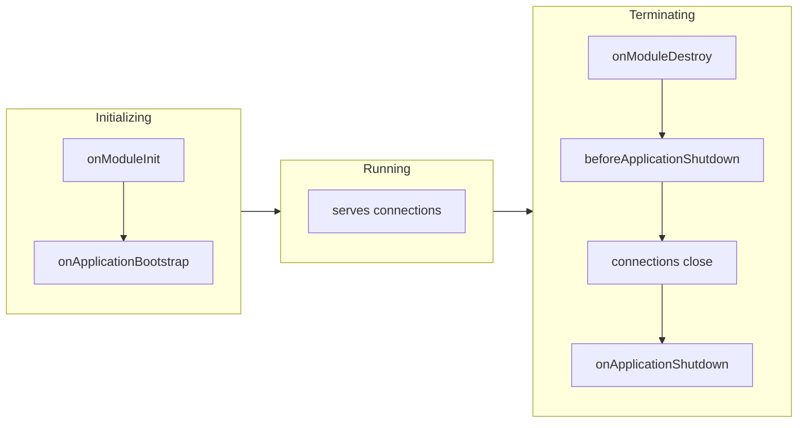

> Hooks for **application** lifetime: when modules wake up and when the process is asked to leave. Distinct from the per-request [[nestjs/fundamentals/request-lifecycle|request lifecycle]].

import { Aside, Steps, Tabs, TabItem } from "@astrojs/starlight/components";

<Aside type="tip" title="Prerequisites">
Before diving into lifecycle hooks, make sure you understand:
- [[nestjs/fundamentals|Dependency Injection]] & [[nestjs/fundamentals|Modules]]: since modules and their resolved DI providers are the target classes that implement these hook interfaces.
</Aside>

## Two different "lifecycles"

| | [Request lifecycle](/knowledge-base/nestjs/fundamentals/request-lifecycle/) | **This page** |
| --- | --- | --- |
| Runs | Every HTTP call (or RPC/WS message) | Once per process boot / shutdown |
| Examples | Guard, pipe, interceptor | Open DB pool, drain queue on `SIGTERM` |
| Opt-in for signals | N/A | `enableShutdownHooks()` required |
| Request-scoped providers | Created per request | **Hooks never run** on `Scope.REQUEST` |

## Three phases



Init runs when you call `app.init()` or `app.listen()`. Terminate runs on `app.close()` **or** on a process signal **after** `enableShutdownHooks()`. No init call → no init hooks. No `enableShutdownHooks()` → no signal-driven shutdown hooks.

## The five interfaces

| Interface | Method | Phase | Signal argument? |
| --- | --- | --- | --- |
| `OnModuleInit` | [`onModuleInit()`](#worked-example) | init | no |
| `OnApplicationBootstrap` | `onApplicationBootstrap()` | init | no |
| `OnModuleDestroy` | `onModuleDestroy()` | terminate | no |
| `BeforeApplicationShutdown` | `beforeApplicationShutdown(signal?)` | terminate | yes |
| `OnApplicationShutdown` | [`onApplicationShutdown(signal?)`](#worked-example) | terminate | yes |

<Aside type="note" title="Only the last two receive the signal">

`onModuleDestroy` takes no arguments per [`on-destroy.interface.ts`](https://github.com/nestjs/nest/blob/master/packages/common/interfaces/hooks/on-destroy.interface.ts). Only `BeforeApplicationShutdown` and `OnApplicationShutdown` declare `signal?: string` ([`on-application-shutdown.interface.ts`](https://github.com/nestjs/nest/blob/master/packages/common/interfaces/hooks/on-application-shutdown.interface.ts)). If you need the signal inside `onModuleDestroy`, stash it from your own handler before `app.close()`.

</Aside>

Hooks apply to **modules, providers, and controllers**. One class can implement several.

<span id="worked-example"></span>
```typescript title="prisma.service.ts"
import { Injectable, OnModuleInit, OnApplicationShutdown } from "@nestjs/common";

@Injectable()
export class UsersService implements OnModuleInit, OnApplicationShutdown {
  async onModuleInit(): Promise<void> {
    // open pool, warm cache
  }

  async onApplicationShutdown(signal?: string): Promise<void> {
    // drain pool; signal is e.g. "SIGTERM"
  }
}
```

<Tabs>
  <TabItem label="Init order">
    Within a class: `onModuleInit` then `onApplicationBootstrap`. Across the app, order follows **module imports**: Nest awaits each imported module before the importer ([lifecycle events](https://docs.nestjs.com/fundamentals/lifecycle-events)).

    For `A → B → C` (A imports B, B imports C), init effectively runs **C → B → A**.

    `@Global()` modules initialize first and destroy last ([v11 migration: lifecycle hooks](https://github.com/nestjs/docs.nestjs.com/blob/master/content/migration.md#lifecycle-hooks-execution-order)). If order is load-bearing, log from each hook in a smoke test instead of guessing from the graph.

    Use `onApplicationBootstrap` when you need **every** module's `onModuleInit` finished first.
  </TabItem>
  <TabItem label="Shutdown order (v11+)">
    <Steps>

    1. `onModuleDestroy`: all implementors; Nest awaits promises.
    2. `beforeApplicationShutdown(signal)`: still before connections close.
    3. Connections close (`app.close()` resolves internally).
    4. `onApplicationShutdown(signal)`: last.

    </Steps>

    <Aside type="caution" title="Destroy order reversed in NestJS 11">

    Pre-v11, destroy walked the same direction as init (deepest-first). Since v11, for `A → B → C`, init still goes **C → B → A**, but `onModuleDestroy` goes **A → B → C** so dependents shut down before dependencies ([v11.0.0 release](https://github.com/nestjs/nest/releases/tag/v11.0.0), PR [#14111](https://github.com/nestjs/nest/pull/14111)).

    </Aside>
  </TabItem>
</Tabs>

## Enable shutdown hooks

```typescript title="main.ts"
import { NestFactory } from "@nestjs/core";
import { AppModule } from "./app.module";

async function bootstrap(): Promise<void> {
  const app = await NestFactory.create(AppModule);
  app.enableShutdownHooks();
  await app.listen(process.env.PORT ?? 3000);
}
bootstrap();
```

Off by default: each call adds `SIGTERM` / `SIGINT` listeners on `process`. Many `NestFactory.create` calls in one Node process (parallel Jest) without `await app.close()` triggers `MaxListenersExceededWarning`.

`app.close()` runs the destroy chain but does **not** exit the process. Clear timers and workers in hooks, or `process.exit(0)` after drain when nothing else keeps the event loop alive.

## Gotchas

<Aside type="caution" title="Request-scoped providers are skipped">

`Scope.REQUEST` instances are created per request and discarded after the response. Lifecycle hooks never run on them. Put startup/teardown on a default-scoped provider the request-scoped one depends on.

</Aside>

<Aside type="caution" title="Windows has no SIGTERM">

Task Manager kills without a signal. `SIGINT` (Ctrl+C) and `SIGBREAK` work locally. Container/Linux deploys are unaffected.

</Aside>

## See also

- [[nestjs/fundamentals/request-lifecycle|Request lifecycle]]: per HTTP call, not per process
- [[nestjs/fundamentals|Fundamentals MOC]]
- [[nestjs/releases/v11|NestJS 11 release notes]]: destroy-order change in context
- [Lifecycle events](https://docs.nestjs.com/fundamentals/lifecycle-events) (official)
