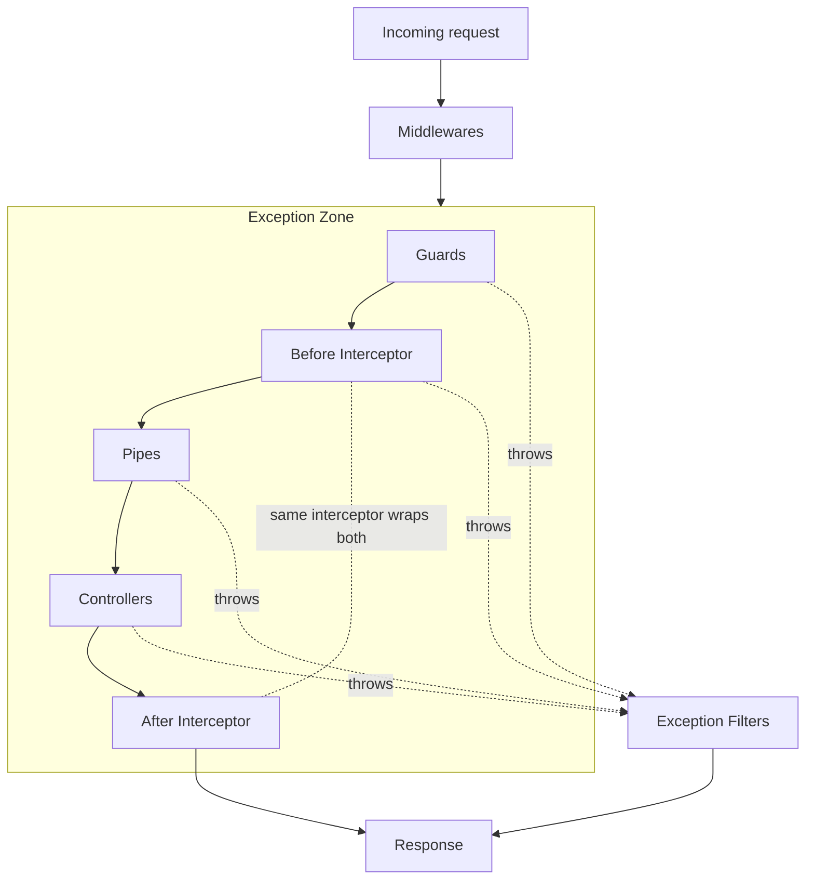

import { Aside, Steps, Tabs, TabItem } from "@astrojs/starlight/components";

> How a request flows through a NestJS app, from socket to response. Knowing the order tells you where to put each piece of logic.

<Aside type="note" title="Not application lifecycle">

Boot and shutdown (`OnModuleInit`, `enableShutdownHooks`) are **process** lifetime — see [[nestjs/fundamentals/lifecycle-hooks|Lifecycle hooks]]. This page is **one HTTP request** from socket to response.

</Aside>

## Debugging: start in the right layer

| Symptom | Layer to open first |
| --- | --- |
| Request never reaches your controller | [Middleware](/knowledge-base/nestjs/fundamentals/middleware/) or route path |
| `403` before handler runs | [Guards](/knowledge-base/nestjs/fundamentals/guards/) |
| `400` on body/query/params | [Pipes](/knowledge-base/nestjs/fundamentals/pipes/) or [Validation recipe](/knowledge-base/nestjs/recipes/validation/) |
| Handler runs but response shape/timing is wrong | [Interceptors](/knowledge-base/nestjs/fundamentals/interceptors/) |
| Thrown error becomes wrong HTTP status/body | [Exception filters](/knowledge-base/nestjs/fundamentals/exception-filters/) |
| Global guard/pipe "missing" on one route | [Global enhancers](/knowledge-base/nestjs/fundamentals/global-providers/) binding |

## The pipeline



<Aside type="note" title="The two interceptor boxes are the same interceptor">

A single `intercept(context, next)` call wraps the handler. The "before" box runs before `next.handle()`; the "after" box is whatever you chain on the returned `Observable`. Details on [[nestjs/fundamentals/interceptors|Interceptors]] (pre/post pattern).

Stacked interceptors nest: **pre** runs in registration order, **post** runs **FILO** (first in, last out).

</Aside>

## Walk the pipeline

<Steps>

1. **HTTP adapter** — Express or Fastify receives the raw request.
2. [[nestjs/fundamentals/middleware|Middleware]] — global, then module-scoped; mutates `req`/`res` before Nest's enhancer chain.
3. [[nestjs/fundamentals/guards|Guards]] — global → controller → route; `canActivate` must be true to continue.
4. [[nestjs/fundamentals/interceptors|Interceptors]] (before) — same order; wrap everything below.
5. [[nestjs/fundamentals/pipes|Pipes]] — validate/transform params and body; route-param pipes run in **reverse** order.
6. **Controller handler** — your `@Get()` / `@Post()` method runs.
7. [[nestjs/fundamentals/interceptors|Interceptors]] (after) — FILO unwind on the response stream.
8. [[nestjs/fundamentals/exception-filters|Exception filters]] — only if something threw; **route → controller → global** (opposite of steps 3–5).
9. **Response** — sent to the client.

</Steps>

<Aside type="caution" title="Middleware sits outside the exception zone">

Middleware runs on the platform layer **before** Nest installs `@Catch()` filters. A sync `throw` or (Express 5+) `async` middleware rejection via `next(err)` hits Express/Fastify default error handling ([Express](https://expressjs.com/en/guide/error-handling.html), [Fastify hooks](https://fastify.dev/docs/latest/Reference/Hooks/#errors-in-hooks)), **not** your Nest [[nestjs/fundamentals/exception-filters|exception filters]]. Move auth and validation into [[nestjs/fundamentals/guards|guards]] or [[nestjs/fundamentals/interceptors|interceptors]] when you need `@Catch()` behavior.

</Aside>

## Resolution direction (the easy mistake)

Most enhancers pick the **most specific** binding last: **global → controller → route**.

Exception filters invert that: **route → controller → global**. First `@Catch()` match wins.

<Tabs>
  <TabItem label="Guards, pipes, interceptors">
    Registration order for **incoming** work:

    | Scope | Runs when multiple apply |
    | --- | --- |
    | Global | First |
    | Controller | Second |
    | Route | **Wins** (most specific) |

    Example: a route-level `RolesGuard` overrides a global `AuthGuard` only if both run — Nest executes **all** guards in order; each must return true.
  </TabItem>
  <TabItem label="Exception filters">
    Registration order for **errors**:

    | Scope | Checked |
    | --- | --- |
    | Route | First |
    | Controller | Second |
    | Global | Last resort |

    Throwing **inside** a filter does not re-enter the per-handler chain ([`exceptions-handler.ts`](https://github.com/nestjs/nest/blob/master/packages/core/exceptions/exceptions-handler.ts) calls `filter.func` once). It **does** hit a second global-only handler Nest mounts at boot ([`routes-resolver.ts#L162-L183`](https://github.com/nestjs/nest/blob/master/packages/core/router/routes-resolver.ts#L162-L183)). `BaseExceptionFilter` is the floor when nothing matches — not Express `finalhandler`. See [[nestjs/fundamentals/exception-filters|Exception filters]] (order section).
  </TabItem>
</Tabs>

## One route, all layers

Decorators on a single handler show **where** each layer attaches (Express adapter; imports omitted on purpose in prose — the fence is copy-pasteable):

```typescript
import {
  Controller,
  Get,
  UseGuards,
  UseInterceptors,
  UsePipes,
} from "@nestjs/common";
import { AuthGuard } from "./auth.guard"; // CanActivate
import { AdminGuard } from "./admin.guard"; // CanActivate
import { LoggingInterceptor } from "./logging.interceptor";
import { ParseIntPipe } from "@nestjs/common";

@Controller("cats")
@UseGuards(AuthGuard) // controller scope — runs before every route in this class
@UseInterceptors(LoggingInterceptor)
export class CatsController {
  @Get(":id")
  @UseGuards(AdminGuard) // route scope — AdminGuard: CanActivate; see guards note
  findOne(
    @Param("id", ParseIntPipe) id: number, // pipe runs after guards + before-interceptor
  ) {
    // handler — step 6 in the pipeline
    return { id };
  }
}
```

Global `APP_GUARD`, `APP_INTERCEPTOR`, and `APP_PIPE` providers run **before** controller decorators ([[nestjs/fundamentals/global-providers|global enhancers]] note).

## Pick the right tool

| Need | Tool | Why this layer |
| --- | --- | --- |
| Correlation ID on raw `req` before Nest | [Middleware](/knowledge-base/nestjs/fundamentals/middleware/) | Runs on Express/Fastify; see [trace IDs](/knowledge-base/nestjs/recipes/trace-id/) |
| Allow/deny before handler work | [Guards](/knowledge-base/nestjs/fundamentals/guards/) | `false` → `403` without touching the handler |
| Logging, caching, timing around handler + response | [Interceptors](/knowledge-base/nestjs/fundamentals/interceptors/) | Wraps `next.handle()` and the returned stream |
| DTO validation, param coercion | [Pipes](/knowledge-base/nestjs/fundamentals/pipes/) | Last chance to shape input before the method body |
| Map `NotFoundException` → JSON body | [Exception filters](/knowledge-base/nestjs/fundamentals/exception-filters/) | Only runs when something threw inside the exception zone |

## See also

- [[nestjs/fundamentals|Fundamentals MOC]] — links to each layer note
- [NestJS Request Lifecycle FAQ](https://docs.nestjs.com/faq/request-lifecycle) (primary source)
