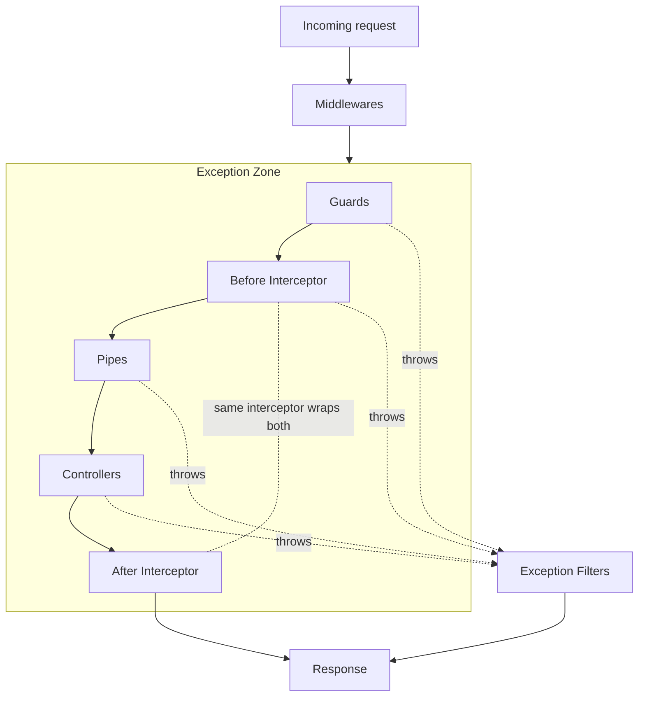

import { Aside, Steps, Tabs, TabItem } from "@astrojs/starlight/components";

> How a request flows through a NestJS app, from socket to response. Knowing the order tells you where to put each piece of logic.

<Aside type="tip" title="Prerequisites">

None. This is the **foundational entry point** of the **[[nestjs|NestJS Track]]**.

</Aside>

<Aside type="note" title="Not application lifecycle">

Boot and shutdown (`OnModuleInit`, `enableShutdownHooks`) are **process** lifetime: see [[nestjs/fundamentals/lifecycle-hooks|Lifecycle hooks]]. This page is **one HTTP request** from socket to response.

</Aside>

## Debugging: start in the right layer

| Symptom | Layer to open first |
| --- | --- |
| Request never reaches your controller | [Middleware](/knowledge-base/nestjs/fundamentals/middleware/) or route path |
| `403` before handler runs | [Guards](/knowledge-base/nestjs/fundamentals/guards/) |
| `400` on body/query/params | [Pipes](/knowledge-base/nestjs/fundamentals/pipes/) or [Validation recipe](/knowledge-base/nestjs/recipes/validation/) |
| Handler runs but response shape/timing is wrong | [Interceptors](/knowledge-base/nestjs/fundamentals/interceptors/) |
| Thrown error becomes wrong HTTP status/body | [Exception filters](/knowledge-base/nestjs/fundamentals/exception-filters/) |
| Global guard/pipe "missing" on one route | [Global enhancers](/knowledge-base/nestjs/fundamentals/global-providers/) binding |

## The pipeline



<Aside type="note" title="The two interceptor boxes are the same interceptor">

A single `intercept(context, next)` call wraps the handler. The "before" box runs before `next.handle()`; the "after" box is whatever you chain on the returned `Observable`. Details on [[nestjs/fundamentals/interceptors|Interceptors]] (pre/post pattern).

Stacked interceptors nest: **pre** runs in registration order, **post** runs **FILO** (first in, last out).

</Aside>

## Detailed execution-order matrix

The following table maps common production concerns to their precise layer in the request lifecycle, clarifying exactly where requests are intercepted, validated, mutated, or rejected.

| Execution Order | Phase / Layer | Scope / Type | Common Production Use Cases | Exception Zone |
| :--- | :--- | :--- | :--- | :--- |
| **1** | **HTTP Adapter** | Low-Level Node | Raw HTTP parsing, CORS headers, basic compression. | No (Native Server Error) |
| **2** | **Middleware** | Express / Fastify | Session parsing, cookie parsing, early correlation/trace IDs, body parsing. | No (Express / Fastify Handler) |
| **3** | **Guards** | Nest Enhancer | Token authentication (JWT verify), role-based authorization, rate limiting (throttling) (see [One route, all layers](#one-route-all-layers)). | Yes (Nest Exception Filter) |
| **4** | **Interceptors (Pre)**| Nest Enhancer | Request caching checks, start timer (performance profiling), request logging (see [One route, all layers](#one-route-all-layers)). | Yes (Nest Exception Filter) |
| **5** | **Pipes** | Nest Enhancer | Input validation (`class-validator`), data parsing / coercion (`ParseIntPipe`) (see [One route, all layers](#one-route-all-layers)). | Yes (Nest Exception Filter) |
| **6** | **Controller** | Business Logic | Executing target database queries, service delegation, mapping response objects (see [One route, all layers](#one-route-all-layers)). | Yes (Nest Exception Filter) |
| **7** | **Interceptors (Post)**| Nest Enhancer | Mapping / transforming response objects, profiling duration telemetry, logs formatting (see [One route, all layers](#one-route-all-layers)). | Yes (Nest Exception Filter) |
| **8** | **Exception Filters**| Nest Enhancer | Formatting `HttpException` status and payload, catching custom DB errors (such as unique constraint). | Final Safety Net |
| **9** | **HTTP Adapter** | Low-Level Node | Serializing JSON payload, writing outbound HTTP headers, terminating TCP socket. | Final Safety Net |

### Understanding the exception zone boundary

One of the most critical structural gotchas is that **Middleware runs completely outside Nest's exception zone**. 

- **Inside the Exception Zone**: If an error is thrown inside a Guard, Interceptor, Pipe, or Controller handler, the Nest runtime catches it and delegates it directly to the matching [[nestjs/fundamentals/exception-filters|Exception filter]] chain.
- **Outside the Exception Zone**: If an exception is thrown synchronously or asynchronously inside a Middleware function, the Nest Exception Filters **never** catch it. Instead, the error bypasses Nest entirely and falls back to the underlying platform's default error handler (such as Express's default HTML error page or Fastify's default JSON error formatter). 

<Aside type="caution" title="Middleware exception exclusion">

If you perform token validation inside custom Middleware and throw a `UnauthorizedException`, your custom `HttpExceptionFilter` will **not** handle it. The client will receive the platform's default raw error response. For robust error handling, always perform token validation and credential extraction in a Nest [[nestjs/fundamentals/guards|Guard]].

</Aside>

## Walk the pipeline

<Steps>

1. **HTTP adapter**: Express or Fastify receives the raw request.
2. [[nestjs/fundamentals/middleware|Middleware]]: global, then module-scoped; mutates `req`/`res` before Nest's enhancer chain.
3. [[nestjs/fundamentals/guards|Guards]]: global → controller → route; `canActivate` must be true to continue.
4. [[nestjs/fundamentals/interceptors|Interceptors]] (before): same order; wrap everything below.
5. [[nestjs/fundamentals/pipes|Pipes]]: validate/transform params and body; route-param pipes run in **reverse** order.
6. **Controller handler**: your `@Get()` / `@Post()` method runs.
7. [[nestjs/fundamentals/interceptors|Interceptors]] (after): FILO unwind on the response stream.
8. [[nestjs/fundamentals/exception-filters|Exception filters]]: only if something threw; **route → controller → global** (opposite of steps 3–5).
9. **Response**: sent to the client.

</Steps>

<Aside type="caution" title="Middleware sits outside the exception zone">

Middleware runs on the platform layer **before** Nest installs `@Catch()` filters. A sync `throw` or (Express 5+) `async` middleware rejection via `next(err)` hits Express/Fastify default error handling ([Express](https://expressjs.com/en/guide/error-handling.html), [Fastify hooks](https://fastify.dev/docs/latest/Reference/Hooks/#errors-in-hooks)), **not** your Nest [[nestjs/fundamentals/exception-filters|exception filters]]. Move auth and validation into [[nestjs/fundamentals/guards|guards]] or [[nestjs/fundamentals/interceptors|interceptors]] when you need `@Catch()` behavior.

</Aside>

## Resolution direction (the easy mistake)

Most enhancers pick the **most specific** binding last: **global → controller → route**.

Exception filters invert that: **route → controller → global**. First `@Catch()` match wins.

<Tabs>
  <TabItem label="Guards, pipes, interceptors">
    Registration order for **incoming** work:

    | Scope | Runs when multiple apply |
    | --- | --- |
    | Global | First |
    | Controller | Second |
    | Route | **Wins** (most specific) |

    Example: a route-level `RolesGuard` overrides a global `AuthGuard` only if both run: Nest executes **all** guards in order; each must return true.
  </TabItem>
  <TabItem label="Exception filters">
    Registration order for **errors**:

    | Scope | Checked |
    | --- | --- |
    | Route | First |
    | Controller | Second |
    | Global | Last resort |

    Throwing **inside** a filter does not re-enter the per-handler chain ([`exceptions-handler.ts`](https://github.com/nestjs/nest/blob/master/packages/core/exceptions/exceptions-handler.ts) calls `filter.func` once). It **does** hit a second global-only handler Nest mounts at boot ([`routes-resolver.ts#L162-L183`](https://github.com/nestjs/nest/blob/master/packages/core/router/routes-resolver.ts#L162-L183)). `BaseExceptionFilter` is the floor when nothing matches: not Express `finalhandler`. See [[nestjs/fundamentals/exception-filters|Exception filters]] (order section).
  </TabItem>
</Tabs>

## One route, all layers

Decorators on a single handler show **where** each layer attaches (Express adapter; imports omitted on purpose in prose: the fence is copy-pasteable):

```typescript
import {
  Controller,
  Get,
  Param,
  UseGuards,
  UseInterceptors,
  CanActivate,
  ExecutionContext,
  NestInterceptor,
  CallHandler,
} from "@nestjs/common";
import { Observable } from "rxjs";
import { ParseIntPipe } from "@nestjs/common";

// Standalone mocks to ensure complete copy-pasteability
export class AuthGuard implements CanActivate {
  canActivate(context: ExecutionContext): boolean { return true; }
}

export class AdminGuard implements CanActivate {
  canActivate(context: ExecutionContext): boolean { return true; }
}

export class LoggingInterceptor implements NestInterceptor {
  intercept(context: ExecutionContext, next: CallHandler): Observable<any> {
    return next.handle();
  }
}

@Controller("cats")
@UseGuards(AuthGuard) // controller scope — runs before every route in this class
@UseInterceptors(LoggingInterceptor)
export class CatsController {
  @Get(":id")
  @UseGuards(AdminGuard) // route scope — AdminGuard: CanActivate; see guards note
  findOne(
    @Param("id", ParseIntPipe) id: number, // pipe runs after guards + before-interceptor
  ) {
    // handler — step 6 in the pipeline
    return { id };
  }
}
```

Global `APP_GUARD`, `APP_INTERCEPTOR`, and `APP_PIPE` providers run **before** controller decorators ([[nestjs/fundamentals/global-providers|global enhancers]] note).

## Pick the right tool

| Need | Tool | Why this layer |
| --- | --- | --- |
| Correlation ID on raw `req` before Nest | [Middleware](/knowledge-base/nestjs/fundamentals/middleware/) | Runs on Express/Fastify; see [trace IDs](/knowledge-base/nestjs/recipes/trace-id/) |
| Allow/deny before handler work | [Guards](/knowledge-base/nestjs/fundamentals/guards/) | `false` → `403` without touching the handler (worked example: [AuthGuard](#one-route-all-layers)) |
| Logging, caching, timing around handler + response | [Interceptors](/knowledge-base/nestjs/fundamentals/interceptors/) | Wraps `next.handle()` and the returned stream (worked example: [LoggingInterceptor](#one-route-all-layers)) |
| DTO validation, param coercion | [Pipes](/knowledge-base/nestjs/fundamentals/pipes/) | Last chance to shape input before the method body (worked example: [ParseIntPipe](#one-route-all-layers)) |
| Map `NotFoundException` → JSON body | [Exception filters](/knowledge-base/nestjs/fundamentals/exception-filters/) | Only runs when something threw inside the exception zone |

## See also

- [[nestjs/fundamentals|Fundamentals MOC]]: links to each layer note
- [NestJS Request Lifecycle FAQ](https://docs.nestjs.com/faq/request-lifecycle) (primary source)
