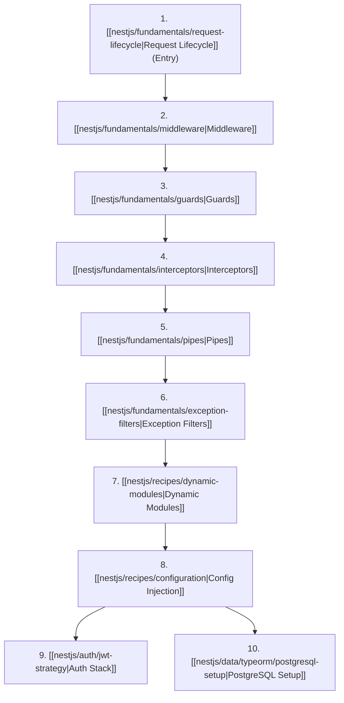

import { Card, CardGrid, Steps, Tabs, TabItem } from "@astrojs/starlight/components";

> TypeScript [[effect-ts/platform|HTTP]] framework built on Express (default) or Fastify: modules, DI, and a fixed per-request pipeline.

## TL;DR

- Every HTTP request walks the same **pipeline**: middleware → guards → interceptors → pipes → handler → (filters on error). See [[nestjs/fundamentals/request-lifecycle|Request lifecycle]].
- **[[nestjs/fundamentals/guards|Guards]]** authorize; **[[nestjs/fundamentals/pipes|pipes]]** validate one argument; **[[nestjs/fundamentals/interceptors|interceptors]]** wrap the handler stream; **filters** shape errors.
- **Globals** register once via `APP_*` (DI) or `useGlobalX()` (manual `new`): [[nestjs/fundamentals/global-providers|Global enhancers]].
- **Boot/shutdown** is separate from per-request flow: [[nestjs/fundamentals/lifecycle-hooks|Lifecycle hooks]].
- Default dev build in this KB: [[nestjs/recipes/swc-setup|SWC]] + `--type-check`.

## Learning Pathway Sequence

Follow this highly curated step-by-step reading flow to build deep engineering intuition, starting from the low-level request pipeline up to production auth stacks.

## Start here

<CardGrid>
  <Card title="Request lifecycle" icon="list-format">
    
<a href="/knowledge-base/nestjs/fundamentals/request-lifecycle/">Pipeline order</a>

  </Card>
  <Card title="Fundamentals" icon="open-book">
    
<a href="/knowledge-base/nestjs/fundamentals/">Fundamentals MOC</a>

  </Card>
  <Card title="Recipes" icon="rocket">
    
<a href="/knowledge-base/nestjs/recipes/">[[nestjs/recipes/validation|Validation]], uploads, SWC, [[effect-ts/observability|tracing]], …</a>

  </Card>
  <Card title="Data" icon="document">
    
<a href="/knowledge-base/nestjs/data/">TypeORM, [[nestjs/data/caching|caching]]</a>

  </Card>
  <Card title="Auth" icon="setting">
    
<a href="/knowledge-base/nestjs/auth/jwt-strategy/">JWT + Passport</a>

  </Card>
  <Card title="Releases" icon="information">
    
<a href="/knowledge-base/nestjs/releases/v11/">[[nestjs/releases/v11|v11]] / [[nestjs/releases/v10|v10]] cheat sheets</a>

  </Card>
</CardGrid>

## Sections

| Section | MOC |
| --- | --- |
| Fundamentals | [Fundamentals](/knowledge-base/nestjs/fundamentals/) |
| Recipes | [Recipes](/knowledge-base/nestjs/recipes/) |
| Data | [Data](/knowledge-base/nestjs/data/) |
| Auth | [Auth](/knowledge-base/nestjs/auth/) |
| Releases | [Releases](/knowledge-base/nestjs/releases/) |
