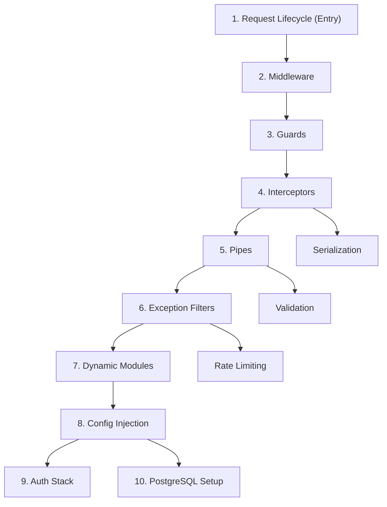

import { Card, CardGrid, Steps, Tabs, TabItem } from "@astrojs/starlight/components";

> TypeScript [[effect-ts/platform|HTTP]] framework built on Express (default) or Fastify: modules, DI, and a fixed per-request pipeline.

## TL;DR

- Every HTTP request walks the same **pipeline**: [[nestjs/fundamentals/middleware|middleware]] → [[nestjs/fundamentals/guards|guards]] → [[nestjs/fundamentals/interceptors|interceptors]] → [[nestjs/fundamentals/pipes|pipes]] → handler → (filters on error). See [[nestjs/fundamentals/request-lifecycle|Request lifecycle]].
- **[[nestjs/fundamentals/guards|Guards]]** authorize; **[[nestjs/fundamentals/pipes|pipes]]** validate one argument; **[[nestjs/fundamentals/interceptors|interceptors]]** wrap the handler stream; **[[nestjs/fundamentals/exception-filters|filters]]** shape errors.
- **Globals** register once via `APP_*` (DI) or `useGlobalX()` (manual `new`): [[nestjs/fundamentals/global-providers|Global enhancers]].
- **Boot/shutdown** is separate from per-request flow: [[nestjs/fundamentals/lifecycle-hooks|Lifecycle hooks]].
- Default dev build in this KB: [[nestjs/recipes/swc-setup|SWC]] + `--type-check`.

## Learning Pathway Sequence

Follow this highly curated step-by-step reading flow to build deep engineering intuition, starting from the low-level request pipeline up to production auth stacks.

## Start here

<CardGrid>
  <Card title="Request lifecycle" icon="list-format">
    [[nestjs/fundamentals/request-lifecycle|Request Lifecycle]]: learn the execution order from socket to response.
  </Card>
  <Card title="Fundamentals" icon="open-book">
    Review the [[nestjs/fundamentals|Fundamentals MOC]] to understand the core parts of NestJS.
  </Card>
  <Card title="Recipes" icon="rocket">
    Explore [[nestjs/recipes/validation|Validation]], [[nestjs/recipes/file-uploads|file uploads]], [[nestjs/recipes/swc-setup|SWC setup]], and [[nestjs/recipes/trace-id|request tracing]] (see [[nestjs/recipes|all recipes]]).
  </Card>
  <Card title="Data" icon="document">
    Configure [[nestjs/data/typeorm/postgresql-setup|TypeORM]] database setup and configure [[nestjs/data/caching|caching]] layers (see [[nestjs/data|all data guides]]).
  </Card>
  <Card title="Auth" icon="setting">
    Configure the [[nestjs/auth/jwt-strategy|JWT + Passport]] authentication stack (see [[nestjs/auth|all auth guides]]).
  </Card>
  <Card title="Releases" icon="information">
    Read the [[nestjs/releases/v11|v11]] and [[nestjs/releases/v10|v10]] cheat sheets (see [[nestjs/releases|all releases]]).
  </Card>
</CardGrid>

## Recipes at a glance

- [[nestjs/recipes/configuration|Configuration]]: env loading, [[nestjs/recipes/validation|validation]], typed factories via `@nestjs/config`.
- [[nestjs/recipes/validation|Validation]]: global `ValidationPipe`, DTOs, whitelist and groups.
- [[nestjs/recipes/serialization|Serialization]]: `class-transformer` to exclude fields on the way out.
- [[nestjs/recipes/file-uploads|File uploads]]: Multer, `ParseFilePipeBuilder`, size and mime checks.
- [[nestjs/recipes/testing|Testing]]: `@nestjs/testing` — unit vs HTTP vs E2E, guard overrides.
- [[nestjs/recipes/rate-limiting|Rate limiting]]: `@nestjs/throttler`, global guard, 429 behavior.
- [[nestjs/recipes/trace-id|Trace IDs]]: `AsyncLocalStorage` for logs, errors, outbound HTTP.
- [[nestjs/recipes/dynamic-modules|Dynamic modules]]: `ConfigurableModuleBuilder`, async options.
- [[nestjs/recipes/monorepo|Monorepo]]: Nest CLI workspaces, apps, libraries, `@app/*` aliases.

## Sections

| Section | MOC |
| --- | --- |
| Fundamentals | [Fundamentals](/knowledge-base/nestjs/fundamentals/) |
| Recipes | [Recipes](/knowledge-base/nestjs/recipes/) |
| Data | [Data](/knowledge-base/nestjs/data/) |
| Auth | [Auth](/knowledge-base/nestjs/auth/) |
| Releases | [Releases](/knowledge-base/nestjs/releases/) |
