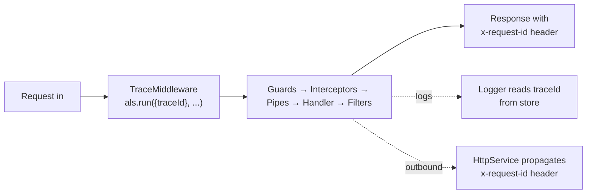

> Stamp every request with a unique ID at the edge, propagate it through [[nestjs/fundamentals/guards|guards]], [[nestjs/fundamentals/interceptors|interceptors]], [[nestjs/fundamentals/pipes|pipes]], the handler, error responses, log lines, and outbound HTTP calls. Turns "an error happened" into "request `8f2a` failed at this exact step in this exact service". The propagation layer relies only on Node's built-in `node:async_hooks` (`AsyncLocalStorage`) plus `randomUUID` from `node:crypto`.

import { Aside, Steps, Tabs, TabItem } from "@astrojs/starlight/components";

<Aside type="tip" title="Prerequisites">
Before diving into trace propagation, make sure you understand:
- [[nestjs/fundamentals/middleware|Middleware]]: since AsyncLocalStorage context must be opened early in the request execution chain via middleware.
</Aside>

## How it works

`AsyncLocalStorage` (from Node's `node:async_hooks` module) acts as a per-async-context store: anything executing inside the `als.run(store, callback)` callback (and any asynchronous `await` chain it spawns) sees the same `store`. 

A [[nestjs/fundamentals/middleware|middleware]] opens the context once per request: every downstream layer ([[nestjs/fundamentals/guards|guards]] -> [[nestjs/fundamentals/interceptors|interceptors]] -> [[nestjs/fundamentals/pipes|pipes]] -> handler -> [[nestjs/fundamentals/exception-filters|exception filters]]) reads from the same store without needing to pass the ID explicitly as a parameter.



---

## Setup

No external npm packages are required for the core correlation pattern. `AsyncLocalStorage` is part of the Node.js standard library. Optionally, you can use `@nestjs/axios` for outbound HTTP propagation (step 5).

<Steps>

1. **Middleware opens the context**: create the store helper and middleware:

   ```typescript title="trace/trace-context.ts"
   import { AsyncLocalStorage } from "node:async_hooks";

   export interface TraceStore {
     readonly traceId: string;
   }

   export const traceStorage = new AsyncLocalStorage<TraceStore>();

   export const getTraceId = (): string | undefined => traceStorage.getStore()?.traceId;
   ```

   ```typescript title="trace/trace.middleware.ts"
   import { randomUUID } from "node:crypto";
   import { Injectable, NestMiddleware } from "@nestjs/common";
   import { Request, Response, NextFunction } from "express";
   import { traceStorage } from "./trace-context";

   @Injectable()
   export class TraceMiddleware implements NestMiddleware {
     use(req: Request, res: Response, next: NextFunction): void {
       const inbound = req.headers["x-request-id"];
       const traceId = (typeof inbound === "string" && inbound) || randomUUID();
       
       // Echo back in the response headers immediately
       res.setHeader("x-request-id", traceId);
       
       // Wrap downstream execution in the AsyncLocalStorage context
       traceStorage.run({ traceId }, () => next());
     }
   }
   ```

   Register the middleware on every route inside the root module:

   ```typescript title="app.module.ts"
   import { MiddlewareConsumer, Module, NestModule } from "@nestjs/common";
   import { TraceMiddleware } from "./trace/trace.middleware";

   @Module({})
   export class AppModule implements NestModule {
     configure(consumer: MiddlewareConsumer): void {
       consumer.apply(TraceMiddleware).forRoutes("*");
     }
   }
   ```

   Why middleware instead of a [[nestjs/fundamentals/guards|guard]] or [[nestjs/fundamentals/interceptors|interceptor]]? Middleware is the **only** layer that runs before guards and can wrap the subsequent execution chain in `traceStorage.run()`, ensuring every downstream layer sees the store.

2. **Logger injects the trace ID**: subclass `ConsoleLogger` and override the `formatPid()` method:

   ```typescript title="trace/trace-logger.service.ts"
   import { ConsoleLogger, Injectable, Scope } from "@nestjs/common";
   import { getTraceId } from "./trace-context";

   @Injectable({ scope: Scope.TRANSIENT })
   export class TraceLogger extends ConsoleLogger {
     protected formatPid(pid: number): string {
       const traceId = getTraceId();
       const base = super.formatPid(pid);
       // Append the first 8 characters of the trace ID if present
       return traceId ? `${base}[${traceId.slice(0, 8)}] ` : base;
     }
   }
   ```

   ```typescript title="main.ts"
   import { NestFactory } from "@nestjs/core";
   import { AppModule } from "./app.module";
   import { TraceLogger } from "./trace/trace-logger.service";

   async function bootstrap() {
     const app = await NestFactory.create(AppModule, { bufferLogs: true });
     app.useLogger(app.get(TraceLogger));
     await app.listen(3000);
   }
   bootstrap();
   ```

   Log line generated during a request:

   ```text
   [Nest] 12345  - [8f2a4c6e] 04/28/2026, 10:42:13 AM     LOG [CatsController] list() called
   ```

3. **Exception filter adds trace ID to error bodies**: read the trace ID directly from the store:

   ```typescript title="trace/trace-exception.filter.ts"
   import {
     ArgumentsHost,
     Catch,
     ExceptionFilter,
     HttpException,
     HttpStatus,
     Logger,
   } from "@nestjs/common";
   import { Response } from "express";
   import { getTraceId } from "./trace-context";

   @Catch()
   export class TraceExceptionFilter implements ExceptionFilter {
     private readonly logger = new Logger(TraceExceptionFilter.name);

     catch(exception: unknown, host: ArgumentsHost): void {
       const traceId = getTraceId();
       const ctx = host.switchToHttp();
       const response = ctx.getResponse<Response>();

       const status =
         exception instanceof HttpException
           ? exception.getStatus()
           : HttpStatus.INTERNAL_SERVER_ERROR;

       const message =
         exception instanceof HttpException
           ? exception.getResponse()
           : "Internal server error";

       this.logger.error({ traceId, status, message, exception });

       response.status(status).json({
         statusCode: status,
         traceId,
         message,
         timestamp: new Date().toISOString(),
       });
     }
   }
   ```

   Register the filter globally:

   ```typescript title="app.module.ts" ins={2,4,6-12}
   import { MiddlewareConsumer, Module, NestModule } from "@nestjs/common";
   import { APP_FILTER } from "@nestjs/core";
   import { TraceMiddleware } from "./trace/trace.middleware";
   import { TraceExceptionFilter } from "./trace/trace-exception.filter";

   @Module({
     providers: [
       {
         provide: APP_FILTER,
         useClass: TraceExceptionFilter,
       },
     ],
   })
   export class AppModule implements NestModule {
     configure(consumer: MiddlewareConsumer): void {
       consumer.apply(TraceMiddleware).forRoutes("*");
     }
   }
   ```

4. **Interceptor logs handler timings**: bind globally using `APP_INTERCEPTOR` to tag performance metrics with the trace ID:

   ```typescript title="trace/timing.interceptor.ts"
   import {
     CallHandler,
     ExecutionContext,
     Injectable,
     Logger,
     NestInterceptor,
   } from "@nestjs/common";
   import { Observable } from "rxjs";
   import { tap } from "rxjs/operators";
   import { getTraceId } from "./trace-context";

   @Injectable()
   export class TimingInterceptor implements NestInterceptor {
     private readonly logger = new Logger(TimingInterceptor.name);

     intercept(context: ExecutionContext, next: CallHandler): Observable<unknown> {
       const start = Date.now();
       const handler = context.getHandler().name;
       return next.handle().pipe(
         tap(() => {
           this.logger.log({
             traceId: getTraceId(),
             handler,
             durationMs: Date.now() - start,
           });
         }),
       );
     }
   }
   ```

5. **Propagate to outbound HTTP requests**: forward the trace ID to external services using Axios interceptors:

   ```typescript title="trace/http-trace.module.ts"
   import { HttpModule, HttpService } from "@nestjs/axios";
   import { Module, OnModuleInit } from "@nestjs/common";
   import { getTraceId } from "./trace-context";

   @Module({
     imports: [HttpModule],
     exports: [HttpModule],
   })
   export class HttpTraceModule implements OnModuleInit {
     constructor(private readonly http: HttpService) {}

     onModuleInit(): void {
       this.http.axiosRef.interceptors.request.use((config) => {
         const traceId = getTraceId();
         if (traceId) {
           config.headers.set("x-request-id", traceId);
         }
         return config;
       });
     }
   }
   ```

</Steps>

---

## Non-HTTP Entry Points

HTTP middleware does not execute in WebSocket connections, BullMQ queue workers, or microservice message brokers. You must open the context yourself inside their respective handlers.

### 1. BullMQ Queue Processor Example

```typescript title="queues/emails.processor.ts"
import { Processor, WorkerHost } from "@nestjs/bullmq";
import { randomUUID } from "node:crypto";
import { Job } from "bullmq";
import { traceStorage } from "../trace/trace-context";

@Processor("emails")
export class EmailsProcessor extends WorkerHost {
  async process(job: Job<{ readonly traceId?: string; readonly to: string }>): Promise<void> {
    const traceId = job.data.traceId ?? randomUUID();
    // Wrap execution so downstream services see the same trace context
    await traceStorage.run({ traceId }, () => this.sendEmail(job.data.to));
  }

  private async sendEmail(to: string): Promise<void> {
    // Send email logic...
  }
}
```

Store `getTraceId()` in the job data when enqueuing the task. The consumer will then extract it and re-open the context with that identical trace ID.

### 2. WebSockets Gateway Example

```typescript title="gateways/chat.gateway.ts"
import { SubscribeMessage, WebSocketGateway, WsResponse } from "@nestjs/websockets";
import { Socket } from "socket.io";
import { randomUUID } from "node:crypto";
import { traceStorage } from "../trace/trace-context";

@WebSocketGateway()
export class ChatGateway {
  @SubscribeMessage("message")
  handleMessage(client: Socket, payload: { readonly content: string }): Promise<WsResponse<string>> {
    // Retrieve trace ID from handshake headers or generate a new one
    const traceId = (client.handshake.headers["x-request-id"] as string) ?? randomUUID();
    
    return traceStorage.run({ traceId }, async () => {
      // Process socket event inside ALS context...
      return { event: "message", data: "Processed!" };
    });
  }
}
```

---

## Show, Don't Tell: Runtime Demonstration

### 1. Inbound Requests and Outbound Headers

Make a request without passing a header:

```bash
curl -i http://localhost:3000/cats
```

The response contains a freshly minted trace ID in the header:

```http
HTTP/1.1 200 OK
x-request-id: 8f2a4c6e-7d10-4f4e-b9a1-2c5c1d9c6f8a
content-type: application/json

[]
```

If you provide a custom transaction ID, NestJS echoes it back directly:

```bash
curl -i -H "x-request-id: custom-tx-999" http://localhost:3000/cats
```

```http
HTTP/1.1 200 OK
x-request-id: custom-tx-999
content-type: application/json

[]
```

### 2. Error Response Payload

If a request fails (for example, looking up a missing resource), the trace ID is injected into the response body:

```bash
curl -i http://localhost:3000/cats/999
```

Response payload:

```json
{
  "statusCode": 404,
  "traceId": "8f2a4c6e-7d10-4f4e-b9a1-2c5c1d9c6f8a",
  "message": "Cat 999 not found",
  "timestamp": "2026-04-28T10:42:13.456Z"
}
```

---

## Gotchas and Best Practices

<Aside type="caution" title="Use als.run(), not als.enterWith()">

`enterWith(store)` is highly susceptible to context leakage: it modifies the async context of the current execution globally and can leak information between concurrent HTTP requests on the same keep-alive connection. Always use `run(store, callback)` to isolate context to the callback tree.

</Aside>

<Aside type="caution" title="TraceLogger MUST be Transient Scope">

If your logger is a singleton (`Scope.DEFAULT`), NestJS will reuse a single instance across the entire application. The dynamic call to `getTraceId()` inside `formatPid` will fail to resolve request context accurately during concurrent invocations. Always mark `TraceLogger` with `Scope.TRANSIENT`.

</Aside>

<Aside type="caution" title="Trust Inbound X-Request-ID Only from Proxies">
  Echoing client-supplied IDs without [[nestjs/recipes/validation|validation]] carries log-indexing bloat and collision risks. If your application faces the open internet, strip client headers at your load balancer or gateway, or configure your middleware to accept headers only from trusted upstream CIDR blocks.
</Aside>

---

## See also

- [[nestjs/fundamentals/middleware|Middleware]]: where the correlation context initializes
- [[nestjs/fundamentals/exception-filters|Exception filters]]: returning consistent trace IDs in errors
- [[nestjs/fundamentals/interceptors|Interceptors]]: timing route calls under specific correlation IDs
- [[nestjs/fundamentals/request-lifecycle|Request lifecycle]]: ordering filters, guards, and middleware
- [Async Local Storage NestJS Recipe](https://docs.nestjs.com/recipes/async-local-storage)
- [Node.js AsyncLocalStorage API Documentation](https://nodejs.org/api/async_context.html#class-asynclocalstorage)
