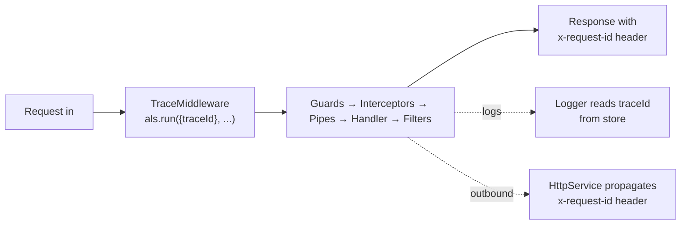

import { Aside, Steps, Tabs, TabItem } from "@astrojs/starlight/components";

> Stamp every request with a unique ID at the edge, propagate it through [[nestjs/fundamentals/guards|guards]], [[nestjs/fundamentals/interceptors|interceptors]], [[nestjs/fundamentals/pipes|pipes]], the handler, error responses, log lines, and outbound HTTP calls. Turns "an error happened" into "request `8f2a` failed at this exact step in this exact service". The propagation layer relies only on built-in `node:async_hooks` (`AsyncLocalStorage`) plus `randomUUID` from `node:crypto`.

## How it works

`AsyncLocalStorage` (from `node:async_hooks`) is a per-async-context store: anything inside the `als.run(store, callback)` callback (and any `await` chain it spawns) sees the same `store`. A [[nestjs/fundamentals/middleware|middleware]] opens the context once per request; every downstream layer ([[nestjs/fundamentals/guards|guards]] → [[nestjs/fundamentals/interceptors|interceptors]] → [[nestjs/fundamentals/pipes|pipes]] → handler → [[nestjs/fundamentals/exception-filters|exception filters]]) reads from the same store without anyone passing it as a parameter.



## Setup

No npm install for the core pattern. `AsyncLocalStorage` is in Node's standard library since 12.17. Optional: `@nestjs/axios` for outbound HTTP propagation (step 5).

<Steps>

1. **Middleware opens the context**: create the store helper and middleware:

   ```typescript
   // trace/trace-context.ts
   import { AsyncLocalStorage } from "node:async_hooks";

   export interface TraceStore {
   traceId: string;
   }

   export const traceStorage = new AsyncLocalStorage<TraceStore>();

   export const getTraceId = (): string | undefined => traceStorage.getStore()?.traceId;
   ```

   ```typescript
   // trace/trace.middleware.ts
   import { randomUUID } from "node:crypto";
   import { Injectable, NestMiddleware } from "@nestjs/common";
   import { NextFunction, Request, Response } from "express";
   import { traceStorage } from "./trace-context";

   @Injectable()
   export class TraceMiddleware implements NestMiddleware {
   use(req: Request, res: Response, next: NextFunction): void {
   const inbound = req.headers["x-request-id"];
   const traceId = (typeof inbound === "string" && inbound) || randomUUID();
   res.setHeader("x-request-id", traceId);
   traceStorage.run({ traceId }, () => next());
   }
   }
   ```

   Register on every route (Express v5 / Nest 11 wildcard):

   ```typescript
   // app.module.ts
   import { MiddlewareConsumer, Module, NestModule } from "@nestjs/common";
   import { TraceMiddleware } from "./trace/trace.middleware";

   @Module({})
   export class AppModule implements NestModule {
   configure(consumer: MiddlewareConsumer): void {
   consumer.apply(TraceMiddleware).forRoutes("{*splat}");
   }
   }
   ```

   Why middleware, not a [[nestjs/fundamentals/guards|guard]] or [[nestjs/fundamentals/interceptors|interceptor]]? Middleware is the **only** layer that runs before guards and can wrap `next()` in `als.run()` so every downstream layer sees the store.

   Request:

   ```bash
   curl -i http://localhost:3000/cats
   ```

   Response:

   ```http
   HTTP/1.1 200 OK
   x-request-id: 8f2a4c6e-7d10-4f4e-b9a1-2c5c1d9c6f8a
   content-type: application/json

   []
   ```

   When the client sends an inbound `X-Request-ID`, it's echoed back instead of replaced.

2. **Logger injects the trace ID**: subclass `ConsoleLogger` and override [`formatPid()`](https://github.com/nestjs/nest/blob/master/packages/common/services/console-logger.service.ts#L417-L419):

   ```typescript
   // trace/trace-logger.service.ts
   import { ConsoleLogger, Injectable, Scope } from "@nestjs/common";
   import { getTraceId } from "./trace-context";

   @Injectable({ scope: Scope.TRANSIENT })
   export class TraceLogger extends ConsoleLogger {
   protected formatPid(pid: number): string {
   const traceId = getTraceId();
   const base = super.formatPid(pid);
   return traceId ? `${base}[${traceId.slice(0, 8)}] ` : base;
   }
   }
   ```

   ```typescript
   // main.ts
   import { NestFactory } from "@nestjs/core";
   import { AppModule } from "./app.module";
   import { TraceLogger } from "./trace/trace-logger.service";

   async function bootstrap() {
   const app = await NestFactory.create(AppModule, { bufferLogs: true });
   app.useLogger(app.get(TraceLogger));
   await app.listen(3000);
   }
   bootstrap();
   ```

   Log line for `traceId = 8f2a4c6e-...`:

   ```text
   [Nest] 12345  - [8f2a4c6e] 04/28/2026, 10:42:13 AM     LOG [CatsController] list() called
   ```

   Outside any request (bootstrap, cron), `getTraceId()` returns `undefined` and the prefix is omitted.

3. **Exception filter adds trace ID to error bodies**: read from the store, not the request:

   ```typescript
   // trace/trace-exception.filter.ts
   import {
   ArgumentsHost,
   Catch,
   HttpException,
   HttpStatus,
   Logger,
   } from "@nestjs/common";
   import { BaseExceptionFilter } from "@nestjs/core";
   import { Response } from "express";
   import { getTraceId } from "./trace-context";

   @Catch()
   export class TraceExceptionFilter extends BaseExceptionFilter {
   private readonly logger = new Logger(TraceExceptionFilter.name);

   catch(exception: unknown, host: ArgumentsHost): void {
   const traceId = getTraceId();
   const ctx = host.switchToHttp();
   const response = ctx.getResponse<Response>();

   const status =
   exception instanceof HttpException
   ? exception.getStatus()
   : HttpStatus.INTERNAL_SERVER_ERROR;
   const message =
   exception instanceof HttpException
   ? exception.getResponse()
   : "Internal server error";

   this.logger.error({ traceId, status, exception });

   response.status(status).json({
   statusCode: status,
   traceId,
   message,
   timestamp: new Date().toISOString(),
   });
   }
   }
   ```

   Register via [[nestjs/fundamentals/global-providers|APP_FILTER]]:

   ```typescript
   // app.module.ts (additions)
   import { APP_FILTER } from "@nestjs/core";
   import { TraceExceptionFilter } from "./trace/trace-exception.filter";

   @Module({
   providers: [{ provide: APP_FILTER, useClass: TraceExceptionFilter }],
   })
   export class AppModule {}
   ```

   `curl -i http://localhost:3000/cats/999` → `404` with the same ID in header, body, and logs:

   ```json
   {
   "statusCode": 404,
   "traceId": "8f2a4c6e-7d10-4f4e-b9a1-2c5c1d9c6f8a",
   "message": "Cat 999 not found",
   "timestamp": "2026-04-28T10:42:13.456Z"
   }
   ```

4. **Interceptor times the handler**: bind globally via `APP_INTERCEPTOR`:

   ```typescript
   // trace/timing.interceptor.ts
   import {
   CallHandler,
   ExecutionContext,
   Injectable,
   Logger,
   NestInterceptor,
   } from "@nestjs/common";
   import { Observable, tap } from "rxjs";
   import { getTraceId } from "./trace-context";

   @Injectable()
   export class TimingInterceptor implements NestInterceptor {
   private readonly logger = new Logger(TimingInterceptor.name);

   intercept(context: ExecutionContext, next: CallHandler): Observable<unknown> {
   const start = Date.now();
   const handler = context.getHandler().name;
   return next.handle().pipe(
   tap(() => {
   this.logger.log({ traceId: getTraceId(), handler, ms: Date.now() - start });
   }),
   );
   }
   }
   ```

5. **Propagate to outbound HTTP** (optional): install `@nestjs/axios`, then forward the header on `HttpService.axiosRef`:

   ```bash
   npm install --save @nestjs/axios axios
   ```

   ```typescript
   // trace/http-trace.module.ts
   import { HttpModule, HttpService } from "@nestjs/axios";
   import { Module, OnModuleInit } from "@nestjs/common";
   import { getTraceId } from "./trace-context";

   @Module({
   imports: [HttpModule],
   exports: [HttpModule],
   })
   export class HttpTraceModule implements OnModuleInit {
   constructor(private readonly http: HttpService) {}

   onModuleInit(): void {
   this.http.axiosRef.interceptors.request.use((config) => {
   const traceId = getTraceId();
   if (traceId) {
   config.headers.set("x-request-id", traceId);
   }
   return config;
   });
   }
   }
   ```

</Steps>

<Aside type="caution" title="Trust inbound X-Request-ID only from trusted upstreams">

The middleware echoes any client-supplied header. On the public internet, attackers can poison logs or collide IDs. Behind a reverse proxy you control, accept the inbound value; strip it at the proxy if you mint fresh IDs there only.

</Aside>

<Aside type="caution" title="TraceLogger MUST be Scope.TRANSIENT">

Default `Scope.DEFAULT` (singleton) reuses one instance app-wide and the `formatPid` override won't pick up per-injection context names. See [Custom logger: Injecting a custom logger](https://docs.nestjs.com/techniques/logger#injecting-a-custom-logger).

</Aside>

## Non-HTTP entry points

`AsyncLocalStorage` works the same for microservice handlers, BullMQ consumers, websocket gateways, and cron jobs, but HTTP middleware doesn't run there: open the context yourself.

```typescript
// queues/emails.processor.ts (BullMQ example)
import { Processor, WorkerHost } from "@nestjs/bullmq";
import { randomUUID } from "node:crypto";
import { Job } from "bullmq";
import { traceStorage } from "../trace/trace-context";

@Processor("emails")
export class EmailsProcessor extends WorkerHost {
  async process(job: Job<{ traceId?: string; to: string }>) {
    const traceId = job.data.traceId ?? randomUUID();
    return traceStorage.run({ traceId }, () => this.send(job));
  }

  private async send(job: Job<{ to: string }>) {
    /* … */
  }
}
```

Store `getTraceId()` in the job payload when enqueuing; the consumer re-opens the context with that value.

## When to reach for it

- Microservice or multi-service architecture where one user action spans 2+ services.
- Production debugging where "find every log line for this user's failed checkout" is a daily question.
- Async background work (queues, schedules) you want to correlate with the user request that triggered it.
- Any system with `> 100 req/s` where unstructured logs become unsearchable without correlation.

## When not to

- Single-process monolith with low traffic: `[ip:port]` may be enough.
- You're already using OpenTelemetry: prefer `traceparent` and span IDs.
- Per-request DB transactions or cached values: use `Scope.REQUEST` providers or a transactional outbox. `AsyncLocalStorage` is for **observability** context, not business state.

<Tabs>
  <TabItem label="Correlation ID vs trace ID">
    A **correlation ID** is a sticker on every log line for one request: grep by it.

    A **trace ID** adds spans (`spanId`, `parentSpanId`, timings) so a backend reconstructs the call tree.

    | Question | What you need |
    | --- | --- |
    | "Show me all logs for that one failed checkout." | Correlation ID |
    | "Which of 8 services was slow, and what called what?" | Trace ID (spans) |

    This recipe builds the correlation-ID flavor (same wire format and lookup workflow). W3C `traceparent` + OpenTelemetry spans are a separate topic.
  </TabItem>
  <TabItem label="Gotchas">
    <Aside type="danger" title="Use als.run(), not als.enterWith()">

    `enterWith(store)` can leak the previous request's store on the same connection. `run(store, callback)` scopes the store to the callback's async tree. [Node: `run`](https://nodejs.org/api/async_context.html#asynclocalstoragerunstore-callback-args) vs [`enterWith`](https://nodejs.org/api/async_context.html#asynclocalstorageenterwithstore).

    </Aside>

    Don't use `Scope.REQUEST` as a substitute: Passport strategies and request-scoped providers have documented performance and DI limits ([Injection scopes: Performance](https://docs.nestjs.com/fundamentals/injection-scopes#performance)).

    Generate IDs with [`crypto.randomUUID()`](https://nodejs.org/api/crypto.html#cryptorandomuuidoptions), not `Math.random()`, if you might reuse the value as an idempotency key later.

    Old native bindings without [`AsyncResource`](https://nodejs.org/api/async_hooks.html#class-asyncresource) may drop context after `await someThirdParty()`: wrap the entry point in `runInAsyncScope`.
  </TabItem>
</Tabs>

## Common errors

| Symptom | Likely cause |
| --- | --- |
| `getTraceId()` undefined in controller | `TraceMiddleware` not registered or wrong path (`forRoutes('{*splat}')`) |
| `getTraceId()` undefined in exception filter | `useGlobalFilters(new X())` in hybrid app without `inheritAppConfig` on microservices; use `APP_FILTER` |
| `getTraceId()` undefined in queue consumer | Open context with `traceStorage.run()` in the processor |
| Same trace ID for concurrent requests | Used `enterWith()` instead of `run()` |
| Custom logger context prefix missing | `TraceLogger` without `Scope.TRANSIENT` |
| Outbound calls missing `x-request-id` | Interceptor on a fresh axios instance, not `HttpService.axiosRef` |

## See also

- [[nestjs/fundamentals/middleware|Middleware]]: where the context opens
- [[nestjs/fundamentals/exception-filters|Exception filters]]: trace ID in error bodies
- [[nestjs/fundamentals/interceptors|Interceptors]]: timing and structured logs
- [[nestjs/fundamentals/global-providers|Global enhancers]]: `APP_FILTER` / `APP_INTERCEPTOR`
- [[nestjs/fundamentals/request-lifecycle|Request lifecycle]]: pipeline order
- [Async Local Storage recipe](https://docs.nestjs.com/recipes/async-local-storage)
- [Custom logger](https://docs.nestjs.com/techniques/logger)
- [`AsyncLocalStorage` API](https://nodejs.org/api/async_context.html#class-asynclocalstorage)
