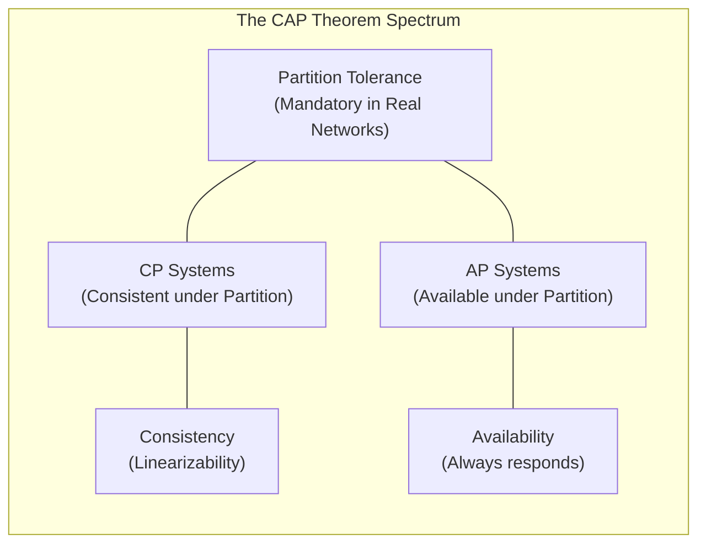
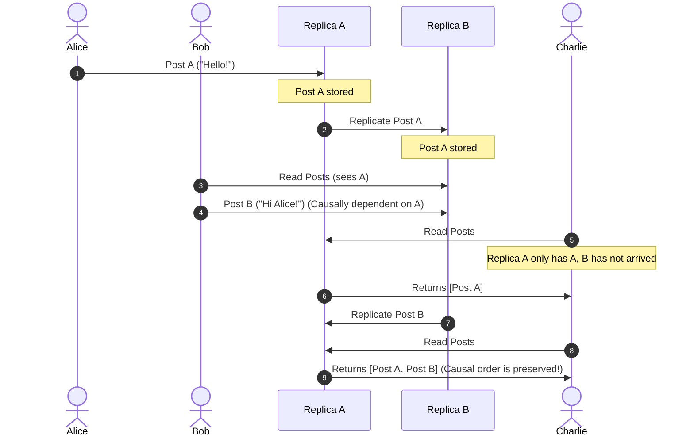
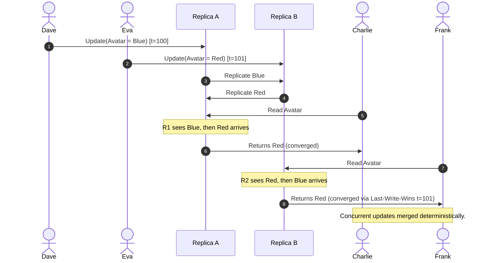

import { Aside, Steps, Tabs, TabItem } from "@astrojs/starlight/components";

> Navigating the trade-offs of the CAP theorem, linearizability, sequential consistency, causal consistency, and client-centric guarantees.

In a single-node system, data consistency is trivial: every write is instantly visible to subsequent reads. In a distributed system where data is replicated across multiple geographical locations, we must coordinate how and when updates propagate. 

A consistency model defines the contract between a distributed database and its client applications. It guarantees what values a client can expect to read when multiple processes execute concurrent reads and writes across replicated nodes.

---

## The Core Trade-off: CAP Theorem Explained

The CAP theorem states that a distributed data store can simultaneously provide at most two of the following three guarantees:

*   **Consistency (Linearizability)**: Every read receives the most recent write or an error.
*   **Availability**: Every non-failing node returns a non-error response for every request, without guaranteeing that it contains the most recent write.
*   **Partition Tolerance**: The system continues to operate despite an arbitrary number of messages being dropped or delayed by the network between nodes.



### Partition Tolerance is Non-Negotiable
In physical networks, packet loss, fiber cuts, and switch failures are inevitable. Therefore, **Partition Tolerance (P) cannot be opted out of**. When a network partition occurs, we are forced to choose between:
1.  **Consistency (CP)**: Cancel the operation or block reads/writes on partitioned nodes to prevent stale or conflicting data, sacrificing availability.
2.  **Availability (AP)**: Allow nodes to process reads and writes locally without coordinating, sacrificing consistency and allowing stale or conflicting states.

---

## The Consistency Spectrum

Distributed databases do not offer a binary choice between strong consistency and eventual consistency. Instead, systems occupy different points on a broad spectrum of guarantees.

| Consistency Model | Description | Coordination Cost | Typical Systems |
| :--- | :--- | :--- | :--- |
| **Linearizable** | Strict real-time global ordering. Reads always return the latest write. | Extremely High (Consensus required) | Google Spanner, CockroachDB |
| **Sequential** | Identical global order of operations seen by all nodes. Real-time is ignored. | High (Global logical sequencing) | Apache ZooKeeper (for writes) |
| **Causal** | Causally related operations are seen in the same order. Concurrent updates can diverge. | Medium (Vector tracking) | Cassandra (with lightweight transactions) |
| **Eventual** | Replicas converge to the same value over time if no new writes occur. | Low (Background anti-entropy) | DynamoDB, CouchDB, DNS |

*Note: For detail on partitioning strategies and hashing techniques used to distribute these data sets, see [Consistent Hashing](/knowledge-base/system-design/consistent-hashing/).*

---

## Data-Centric Consistency Models

Data-centric consistency models define system-wide, global constraints on the order in which all operations are executed.

### 1. Linearizability (Strong Consistency)
Linearizability is the strongest consistency guarantee. It imposes a strict real-time constraint: if operation B starts after operation A successfully completes, operation B must see the state left by operation A or a newer state.

<Tabs>
  <TabItem label="Linearizability Violation">
    ```mermaid
    sequenceDiagram
        autonumber
        actor C1 as Client 1 (Writer)
        actor C2 as Client 2 (Reader)
        participant N1 as Replica Node A
        participant N2 as Replica Node B

        C1->>N1: Write(x = 5)
        Note over N1: Update processed locally
        N1->>C1: Write Success
        
        C2->>N1: Read(x)
        N1->>C2: Returns x = 5 (New Value)
        
        C2->>N2: Read(x)
        Note over N2: Asynchronous replication lagging
        N2->>C2: Returns x = 0 (Stale Value!)
        Note over C2: VIOLATION: Client read stale value after reading new value!
    ```
  </TabItem>
  <TabItem label="Linearizable Execution">
    ```mermaid
    sequenceDiagram
        autonumber
        actor C1 as Client 1 (Writer)
        actor C2 as Client 2 (Reader)
        participant N1 as Replica Node A
        participant N2 as Replica Node B

        C1->>N1: Write(x = 5)
        Note over N1: Update processed locally
        N1->>C1: Write Success
        
        C2->>N1: Read(x)
        N1->>C2: Returns x = 5
        
        C2->>N2: Read(x)
        N2->>N1: Read Quorum / Sync Check
        N1->>N2: Returns x = 5
        N2->>C2: Returns x = 5 (Correct Value)
        Note over C2: COMPLIANT: Strict real-time order is enforced globally.
    ```
  </TabItem>
</Tabs>

### 2. Sequential Consistency
Sequential consistency is slightly weaker than linearizability. It guarantees that all operations appear to be executed in a single, global sequential order, and that the operations of each individual process appear in this sequence in the order specified by its program. 

Unlike linearizability, **there is no real-time clock constraint**. If Client 1 writes a value at 10:00 AM and Client 2 writes a value at 10:01 AM, sequential consistency allows the system to order Client 2's write before Client 1's write, as long as **every node in the cluster agrees on that exact same order**.

### 3. Causal Consistency
Causal consistency guarantees that operations that are causally related must be seen in the same order by every node in the system. Operations that are concurrent (not causally related) may be seen in different orders by different nodes.



If Dave and Eva write concurrent, independent updates, their orders do not need to match across different nodes. They are merged deterministically using strategies like Last-Write-Wins (LWW) or Conflict-Free Replicated Data Types (CRDTs).



---

## Client-Centric Consistency Models

When clients move between different replica nodes (for example, a mobile client reconnecting to different cell towers or CDN edge caches), they need guarantees about their own personal session histories.

### 1. Read-Your-Writes
Guarantees that a client will always see their own successful writes. A user must never submit a post, refresh the page, and see that the post has disappeared because their read request was routed to a lagging replica.

<Tabs>
  <TabItem label="Read-Your-Writes Violation">
    ```mermaid
    sequenceDiagram
        autonumber
        actor Client
        participant Primary as Primary Node
        participant Replica as Read Replica

        Client->>Primary: UpdateProfile(Bio = "Developer")
        Primary->>Client: Success (t=1)
        
        Note over Client: Refreshes page immediately
        Client->>Replica: GetProfile()
        Note over Replica: Asynchronous replication lagging
        Replica->>Client: Returns Bio = "" (Old Value!)
        Note over Client: VIOLATION: User thinks update was lost!
    ```
  </TabItem>
  <TabItem label="Sticky Router Workaround">
    ```mermaid
    sequenceDiagram
        autonumber
        actor Client
        participant Router as Session Router
        participant Primary as Primary Node
        participant Replica as Read Replica

        Client->>Router: UpdateProfile(Bio = "Developer")
        Router->>Primary: UpdateProfile
        Primary->>Router: Success
        Router->>Client: Success (Sets Client Session Cookie)
        
        Note over Client: Refreshes page immediately
        Client->>Router: GetProfile() (Session Cookie Attached)
        Note over Router: Router sticky routes client's read<br/>to the primary node
        Router->>Primary: GetProfile()
        Primary->>Router: Returns Bio = "Developer"
        Router->>Client: Returns Bio = "Developer"
        Note over Client: COMPLIANT: Client sees their own update immediately.
    ```
  </TabItem>
</Tabs>

### 2. Monotonic Reads
Guarantees that if a client reads a certain value, any subsequent read will return that same value or a newer one. The client will never observe the system "going back in time" by reading from a fresh replica followed by a lagging replica.

### 3. Monotonic Writes
Guarantees that a client's writes are processed sequentially in the order they were submitted. For example, if you edit a post and then delete it, the deletion must never be processed before the edit on any replica.

### 4. Writes-Follow-Reads
Guarantees that if a client reads a value and then performs a write, that write will causally follow the read value. Any other client that observes the write will also be able to see the read that triggered it.

---

## Gotchas and Production Considerations

<Aside type="caution" title="The PACELC Extension to CAP">
The CAP theorem only applies when a network partition (P) is active. The **PACELC theorem** expands this: **I**f there is a **P**artition, trade off **A**vailability or **C**onsistency; **E**lse, trade off **L**atency or **C**onsistency. Even in a healthy network, enforcing strong consistency requires cross-replica coordination, which slows down read and write operations.
</Aside>

### 1. Consensus Costs
Achieving linearizability requires distributed consensus algorithms like Paxos or Raft. These protocols incur severe network latency costs:
*   Every write requires round-trips to a quorum of nodes before returning success.
*   A single slow disk or network link on a quorum member can degrade write performance for the entire cluster.

### 2. Reconciling Concurrent Updates
If you choose Availability (AP) and allow concurrent local writes, you must eventually reconcile conflicting updates.
*   **Last-Write-Wins (LWW)**: Uses physical clock timestamps to pick the "latest" write. It is simple but vulnerable to clock skew, which can silently discard updates made on nodes with slightly lagging clocks.
*   **CRDTs (Conflict-Free Replicated Data Types)**: Uses mathematical structures (like grow-only sets or observed-removed sets) to merge concurrent updates deterministically without coordination.

---

## See also
*   [[system-design/consistent-hashing|Consistent Hashing & Dynamic Ring Partitioning]]
*   [[system-design/logical-clocks|Logical Clocks & Event Ordering]]
