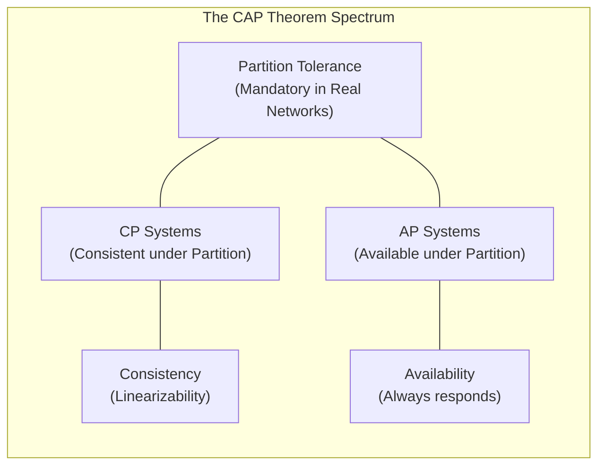
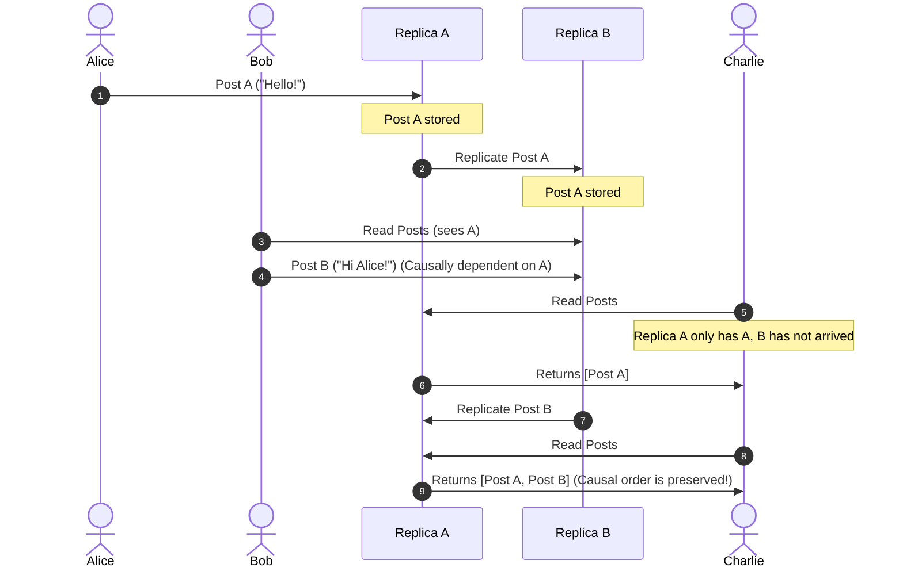
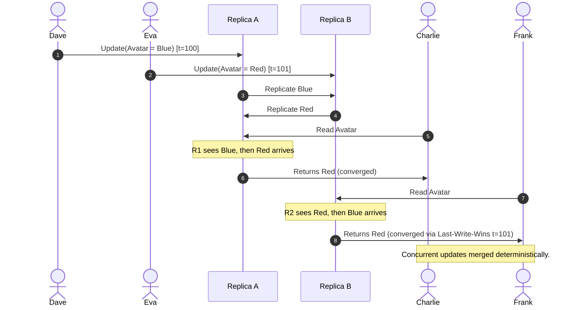

import { Aside, Steps, Tabs, TabItem } from "@astrojs/starlight/components";

> Navigating the trade-offs of the CAP theorem, linearizability, sequential consistency, causal consistency, and client-centric guarantees.

In a single-node system, data consistency is trivial: every write is instantly visible to subsequent reads. In a distributed system where data is replicated across multiple geographical locations, we must coordinate how and when updates propagate. 

A consistency model defines the contract between a distributed database and its client applications. It guarantees what values a client can expect to read when multiple processes execute concurrent reads and writes across replicated nodes.

---

## The Core Trade-off: CAP Theorem Explained

The CAP theorem states that a distributed data store can simultaneously provide at most two of the following three guarantees:

*   **Consistency (Linearizability)**: Every read receives the most recent write or an error.
*   **Availability**: Every non-failing node returns a non-error response for every request, without guaranteeing that it contains the most recent write.
*   **Partition Tolerance**: The system continues to operate despite an arbitrary number of messages being dropped or delayed by the network between nodes.



### The "Branch Office" Partition Analogy
To build immediate intuition, imagine a bank with two physical branches (one in London and one in New York). Both branches have local databases containing customer account balances. Under normal conditions, when a customer deposits money in London, the system instantly notifies the New York branch over the internet, and both databases match.

Now, imagine a **Network Partition (P)**: the fiber-optic cable under the Atlantic Ocean is cut. London and New York can no longer talk to each other. 

At this exact moment, a customer walks into the New York branch and wants to withdraw $100. We are forced to choose:
1.  **Prioritize Consistency (CP)**: New York says, "We have lost contact with London, so we don't know if you spent your money there. We must refuse your withdrawal request." The system remains consistent (no overdrafts can occur), but we have lost **Availability** (we refused a valid request).
2.  **Prioritize Availability (AP)**: New York says, "We cannot talk to London, but we want to be helpful. Here is your $100." The system remains **Available**, but we have sacrificed **Consistency**: if the customer had already withdrawn their entire balance in London five minutes ago, the databases are now out of sync, and the account is overdrawn.

Because physical network cuts (partitions) are an inevitable fact of life, **Partition Tolerance (P)** is mandatory. We can never choose "CA" (Consistency + Availability without Partition Tolerance) because we cannot prevent network failures. When a partition occurs, we must choose either **CP** or **AP**.
---

## The Consistency Spectrum

Distributed databases do not offer a binary choice between strong consistency and eventual consistency. Instead, systems occupy different points on a broad spectrum of guarantees.

| Consistency Model | Description | Coordination Cost | Typical Systems |
| :--- | :--- | :--- | :--- |
| **Linearizable** | Strict real-time global ordering. Reads always return the latest write. | Extremely High (Consensus required) | Google Spanner, CockroachDB |
| **Sequential** | Identical global order of operations seen by all nodes. Real-time is ignored. | High (Global logical sequencing) | Apache ZooKeeper (for writes) |
| **Causal** | Causally related operations are seen in the same order. Concurrent updates can diverge. | Medium (Vector tracking) | Cassandra (with lightweight transactions) |
| **Eventual** | Replicas converge to the same value over time if no new writes occur. | Low (Background anti-entropy) | DynamoDB, CouchDB, DNS |

*Note: For detail on partitioning strategies and hashing techniques used to distribute these data sets, see [Consistent Hashing](/knowledge-base/system-design/consistent-hashing/).*

---

## Data-Centric Consistency Models

Data-centric consistency models define system-wide, global constraints on the order in which all operations are executed.

### 1. Linearizability (Strong Consistency)

Linearizability is the strongest possible consistency guarantee. It imposes a strict real-time constraint: as soon as a write completes successfully, every subsequent read across any server in the system must return that new value or a newer one.

**The Google Doc Analogy**:
Imagine a shared Google Doc in "real-time" editing mode. If Alice edits a sentence on her screen and receives confirmation that the edit is saved, Bob (reading the same document a split second later) is guaranteed to see Alice's new sentence. He will never see the old, stale version. 
In distributed databases, enforcing this "instant shared vision" is extremely expensive. It requires all servers to coordinate and agree before a write is confirmed to the user, ensuring no server falls behind.

<Tabs>
  <TabItem label="Linearizability Violation">
    ```mermaid
    sequenceDiagram
        autonumber
        actor C1 as Client 1 (Writer)
        actor C2 as Client 2 (Reader)
        participant N1 as Replica Node A
        participant N2 as Replica Node B

        C1->>N1: Write(x = 5)
        Note over N1: Update processed locally
        N1->>C1: Write Success
        
        C2->>N1: Read(x)
        N1->>C2: Returns x = 5 (New Value)
        
        C2->>N2: Read(x)
        Note over N2: Asynchronous replication lagging
        N2->>C2: Returns x = 0 (Stale Value!)
        Note over C2: VIOLATION: Client read stale value after reading new value!
    ```
  </TabItem>
  <TabItem label="Linearizable Execution">
    ```mermaid
    sequenceDiagram
        autonumber
        actor C1 as Client 1 (Writer)
        actor C2 as Client 2 (Reader)
        participant N1 as Replica Node A
        participant N2 as Replica Node B

        C1->>N1: Write(x = 5)
        Note over N1: Update processed locally
        N1->>C1: Write Success
        
        C2->>N1: Read(x)
        N1->>C2: Returns x = 5
        
        C2->>N2: Read(x)
        N2->>N1: Read Quorum / Sync Check
        N1->>N2: Returns x = 5
        N2->>C2: Returns x = 5 (Correct Value)
        Note over C2: COMPLIANT: Strict real-time order is enforced globally.
    ```
  </TabItem>
</Tabs>

### 2. Sequential Consistency

Sequential consistency is slightly weaker than linearizability. It guarantees that all operations appear to be executed in a single, global sequence, and that the operations of each individual user appear in this sequence in the order they were sent.

**The Multi-Player Chat Analogy**:
Unlike linearizability, there is no real-time clock constraint. 
Imagine a global group chat. If Alice posts "Hello" at 10:00 AM and Bob posts "World" at 10:01 AM, sequential consistency allows the system to display Bob's message before Alice's message, as long as every single user in the chat room sees the messages in that exact same order (Bob then Alice). The timeline is allowed to drift from real-world wall-clock time, but everyone must share the exact same sequence of history.

### 3. Causal Consistency

Causal consistency guarantees that operations that are causally related (meaning one event influenced or caused another) must be seen in the same order by every node in the system. Operations that are concurrent (independent and unrelated) can be seen in different orders by different nodes.

**The Threaded Slack Analogy**:
Imagine a threaded conversation on Slack.
*   **Causal Relationship**: Alice asks "Do you want pizza?" and Bob replies "Yes!". Bob's reply is caused by Alice's question. Under causal consistency, every user in the workspace is guaranteed to see Alice's question before Bob's reply. It is impossible to see "Yes!" floating in isolation before the question is visible.
*   **Concurrent (Unrelated) Events**: In a completely different channel, Dave posts "It is raining in Seattle." This post has no relationship to the pizza conversation. Causal consistency allows different users to see Dave's post and Alice's question in different orders, because they are independent events.



If Dave and Eva write concurrent, independent updates, their orders do not need to match across different nodes. They are merged deterministically using strategies like Last-Write-Wins (LWW) or Conflict-Free Replicated Data Types (CRDTs).



### 4. Eventual Consistency

Eventual consistency is the weakest model, but it is highly popular because it requires zero real-time coordination, making it extremely fast. It guarantees that if no new updates are made, all replicas will eventually sync up and hold the identical value.

**The Physical Newspaper Analogy**:
Imagine a news agency printing a newspaper in different cities (London, New York, and Tokyo). 
In the morning, the print editions might show slightly different headlines because of different local print deadlines and printing speeds (lagging updates). However, by the end of the day, as journalists share all reports and update the online digital archives, all editions eventually converge to show the exact same complete history. In the meantime, readers in London and New York might temporarily see different headlines, but the system does not crash or block updates.

---

## Client-Centric Consistency Models

When clients move between different replica nodes (for example, a mobile client reconnecting to different cell towers or CDN edge caches), they need guarantees about their own personal session histories.

### 1. Read-Your-Writes

Guarantees that a client will always see their own successful updates. 

**The Social Media Profile Update Analogy**:
Imagine you update your social media bio from "Student" to "Software Engineer". When you hit save, the request goes to the primary database server. If you refresh your profile immediately, and your read request is routed to a lagging database replica that hasn't received the update yet, your bio would temporarily show "Student" again. This is a violation. Read-Your-Writes ensures that your personal sessions are pinned or stickily routed so you always see your own edits immediately.

<Tabs>
  <TabItem label="Read-Your-Writes Violation">
    ```mermaid
    sequenceDiagram
        autonumber
        actor Client
        participant Primary as Primary Node
        participant Replica as Read Replica

        Client->>Primary: UpdateProfile(Bio = "Developer")
        Primary->>Client: Success (t=1)
        
        Note over Client: Refreshes page immediately
        Client->>Replica: GetProfile()
        Note over Replica: Asynchronous replication lagging
        Replica->>Client: Returns Bio = "" (Old Value!)
        Note over Client: VIOLATION: User thinks update was lost!
    ```
  </TabItem>
  <TabItem label="Sticky Router Workaround">
    ```mermaid
    sequenceDiagram
        autonumber
        actor Client
        participant Router as Session Router
        participant Primary as Primary Node
        participant Replica as Read Replica

        Client->>Router: UpdateProfile(Bio = "Developer")
        Router->>Primary: UpdateProfile
        Primary->>Router: Success
        Router->>Client: Success (Sets Client Session Cookie)
        
        Note over Client: Refreshes page immediately
        Client->>Router: GetProfile() (Session Cookie Attached)
        Note over Router: Router sticky routes client's read<br/>to the primary node
        Router->>Primary: GetProfile()
        Primary->>Router: Returns Bio = "Developer"
        Router->>Client: Returns Bio = "Developer"
        Note over Client: COMPLIANT: Client sees their own update immediately.
    ```
  </TabItem>
</Tabs>

### 2. Monotonic Reads

Guarantees that if a client reads a certain piece of data, any subsequent read they perform will never return an older version. The system will never appear to "go back in time."

**The Feed Scroll Subscriber Analogy**:
Imagine you are scrolling through a video channel and see a subscriber count of 10,000. You refresh the page a second later, and your request lands on a lagging server that reports 9,950 subscribers. The count appears to have shrunk, which feels like time travel. Monotonic reads prevents this by ensuring that once your session has observed a value of 10,000, all subsequent reads in your session are guaranteed to return 10,000 or more, never less.

### 3. Monotonic Writes

Guarantees that a single client's write operations are processed sequentially in the exact order they were submitted.

**The Comment Edit and Delete Analogy**:
Imagine you post a comment on an article, then immediately edit it to fix a typo, and then decide to delete it entirely. Monotonic writes guarantees that these three actions (Post → Edit → Delete) are applied in that exact order on every database replica. Without this, a lagging replica might receive the Delete instruction before the Edit instruction, resulting in the edited comment reappearing on that server forever.

### 4. Writes-Follow-Reads

Guarantees that if a client reads a value and then performs a write, that write will causally follow the read value. Anyone else who sees your write is guaranteed to see the read that triggered it.

**The Comment Reply Analogy**:
Imagine you read a post saying "Who wants to go hiking tomorrow?" (Post A). You immediately post a reply saying "Count me in!" (Post B). Post B only makes sense in the context of Post A. Writes-Follow-Reads guarantees that no user on the site will ever see your reply ("Count me in!") without also being able to see the original invitation post. The reply is causally bound to follow the read that inspired it.

---

## Gotchas and Production Considerations

<Aside type="caution" title="The PACELC Extension to CAP">
The CAP theorem only applies when a network partition (P) is active. The **PACELC theorem** expands this: **I**f there is a **P**artition, trade off **A**vailability or **C**onsistency; **E**lse, trade off **L**atency or **C**onsistency. Even in a healthy network, enforcing strong consistency requires cross-replica coordination, which slows down read and write operations.
</Aside>

### 1. Consensus Costs
Achieving linearizability requires distributed consensus algorithms like Paxos or Raft. These protocols incur severe network latency costs:
*   Every write requires round-trips to a quorum of nodes before returning success.
*   A single slow disk or network link on a quorum member can degrade write performance for the entire cluster.

### 2. Reconciling Concurrent Updates
If you choose Availability (AP) and allow concurrent local writes, you must eventually reconcile conflicting updates.
*   **Last-Write-Wins (LWW)**: Uses physical clock timestamps to pick the "latest" write. It is simple but vulnerable to clock skew, which can silently discard updates made on nodes with slightly lagging clocks.
*   **CRDTs (Conflict-Free Replicated Data Types)**: Uses mathematical structures (like grow-only sets or observed-removed sets) to merge concurrent updates deterministically without coordination.

---

## See also
*   [[system-design/consistent-hashing|Consistent Hashing & Dynamic Ring Partitioning]]
*   [[system-design/logical-clocks|Logical Clocks & Event Ordering]]
