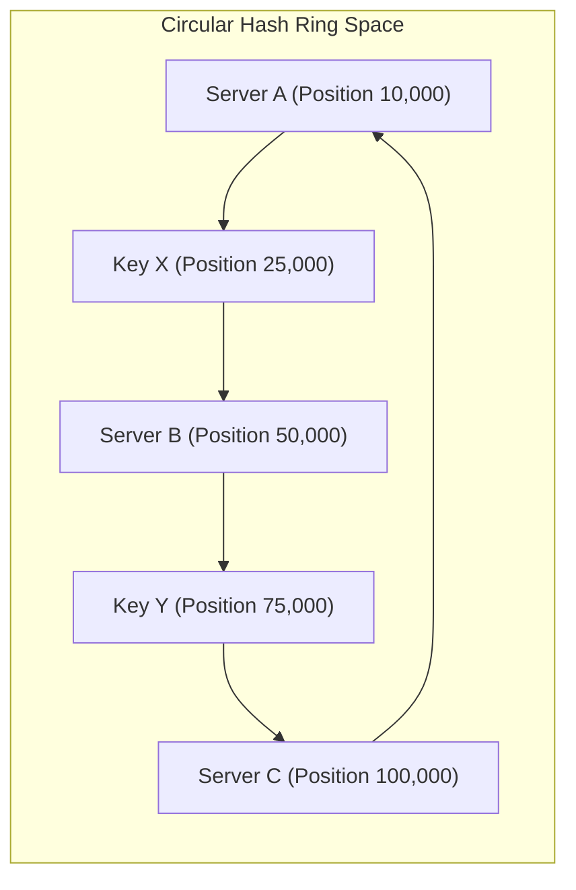

import { Aside, Steps, Tabs, TabItem } from "@astrojs/starlight/components";

> Distributing data across dynamic clusters with minimal rehashing when nodes scale up or down.

In a distributed database or caching cluster, routing requests efficiently is critical. Traditional modulo hashing maps keys directly to specific servers, but this approach breaks down under dynamic scaling. Consistent hashing solves this bottleneck by guaranteeing that when the node count changes, only a minimal fraction of keys require relocation.

## Naive Hashing: The Modulo-N Bottleneck

Imagine you have a website with a cluster of `N` servers caching user session data. When a request comes in, how do you decide which server stores that user's session? 

A simple, traditional strategy is **modulo hashing** (also known as Modulo-N). We compute a numerical hash of the user's key and divide it by the number of active servers (`N`). The **remainder** of that division determines the server index:

```
Server Index = Hash(Key) mod N
```

> **What is modulo (mod)?**
> Modulo is simply the remainder left over after division. It is the same math we use every day to tell time on a 12-hour clock. For example, "14 o'clock" is 2:00 because 14 divided by 12 leaves a remainder of 2 (`14 mod 12 = 2`). Similarly, if a user's ID hashes to the number 12 and we have 5 servers, `12 mod 5 = 2` (since 5 goes into 12 twice, leaving a remainder of 2). The session goes to Server 2.

### The Scaling Failure

Modulo-N hashing works perfectly, until the size of your server cluster changes.

Imagine we have 5 servers (which we will represent as `N = 5`) and distribute 100 session keys across them. If one server crashes, or if we scale up by adding a 6th server (`N = 6`), the divisor in our modulo formula changes. Because the divisor shifts, **almost every key now maps to a completely different server index.**

Let's trace what happens to three sample session keys when we scale from 5 servers to 6:

| Key | Hash Value | Index with 5 Servers (`Hash mod 5`) | Index with 6 Servers (`Hash mod 6`) | Status After Scaling |
| :--- | :--- | :--- | :--- | :--- |
| `session-alice` | **12** | `12 mod 5 = 2` (Server 2) | `12 mod 6 = 0` (Server 0) | **MOVED** (Cache Miss!) |
| `session-bob` | **23** | `23 mod 5 = 3` (Server 3) | `23 mod 6 = 5` (Server 5) | **MOVED** (Cache Miss!) |
| `session-charlie`| **30** | `30 mod 5 = 0` (Server 0) | `30 mod 6 = 0` (Server 0) | **STAYS** (Cache Hit) |

Notice how Alice's and Bob's sessions have shifted to entirely new servers.

Why did this happen, and how bad is it mathematically? 
When you have `N` servers and you add one more (making the new total `N + 1` servers), the probability of any given key remaining on its original server is only **`1 / (N + 1)`**. 

Let's break that down with real numbers:
*   **The formula:** `1 / (N + 1)`
*   **With our servers:** Since we scaled to 6 servers, the chance of a key staying on the same server is only **`1 / 6` (about 16.7%)**.
*   **The moving keys:** If only `1 / 6` of the keys stay, that means the remaining **`5 / 6` of all keys (83.3%)** are suddenly sent to the wrong servers!

In a production caching layer (like Redis or Memcached), this causes a massive **cache stampede**: almost all read requests fail because the data is now looked up on the wrong server. The application is forced to query the primary database all at once for these missing values, which frequently overloads and crashes the database.

---

## The Consistent Hashing Ring

Consistent Hashing solves this scaling bottleneck by decoupling key routing from the exact number of active servers. 

Instead of dividing key hashes by the number of servers, consistent hashing places both servers and keys onto a large, fixed circular space known as a **hash ring**. This circle is typically mapped from 0 to 4,294,967,295. This specific number (equal to 2³² - 1) is the standard range of a 32-bit unsigned integer, providing billions of distinct positions around the ring.



### The Clockwise Routing Protocol

1.  **Map Servers**: We hash each physical server's identifier (for example, `Hash("Server-A")`) to get a large number, putting the server on that specific slot on the 4.3-billion-slot circle.
2.  **Map Keys**: We hash the incoming data key (for example, `Hash("session-alice")`) using the same hash function to get another slot number on the circle.
3.  **Route Clockwise**: To locate the server responsible for storing a key, we start at the key's slot and travel clockwise around the ring until we encounter the very first server.

Let's look at the diagram above:
*   **Key X** hashes to position 25,000. 
*   Traveling clockwise (upward in numbers), the first server we encounter is **Server B** at position 50,000.
*   Therefore, Key X is routed to Server B.

If Server B crashes and is removed, Key X's clockwise path now passes right through position 50,000 and finds **Server C** at position 100,000. Only the keys that mapped to Server B are affected and need to be re-routed. All other keys on the ring (like those routed to Server A) stay exactly where they are.

---

## Mitigating Hotspots: Virtual Nodes (VNodes)

In a basic consistent hashing ring, physical servers are represented by a single point on the ring. This presents two distinct load balancing risks:
*   **Non-Uniform Distribution**: Random hashing can place servers close together, leaving large empty gaps on the ring. The server clockwise-next to a large gap becomes a hotspot.
*   **Neighbor Straining**: If a node fails, its entire key load cascades directly to its single clockwise neighbor, potentially triggering a chain reaction of node failures.

**Virtual Nodes (VNodes)** solve this. Instead of hashing a physical server only once, we map each physical server to multiple virtual positions on the ring (usually represented by the variable `V`, for example, using `Hash("Server-A-0")`, `Hash("Server-A-1")`, and so on).

*   A physical server with 100 VNodes is scattered uniformly across the entire ring.
*   If a physical server fails, its VNodes are removed. Its load is distributed evenly across multiple different clockwise neighbors, preventing neighbor straining.

---

## TypeScript Implementation

Below is a self-contained, fully typed TypeScript implementation of a Consistent Hashing ring using standard node crypto MD5 hashes and binary search (bisect style) for highly efficient lookups. This achieves **O(log K)** time complexity, where `K` is the total number of virtual nodes on the ring, meaning search times scale logarithmically and take only a tiny handful of steps even with millions of keys.

```typescript
import * as crypto from "node:crypto";

/**
 * Computes a 32-bit unsigned integer hash position from a key using MD5.
 */
function hashToRingPosition(key: string): number {
  const hex = crypto.createHash("md5").update(key).digest("hex");
  // Convert the first 8 hex characters to a 32-bit unsigned integer
  return parseInt(hex.slice(0, 8), 16);
}

export class ConsistentHashRing {
  private readonly numReplicas: number;
  private readonly ring = new Map<number, string>();
  private sortedKeys: number[] = [];
  private readonly servers = new Set<string>();

  /**
   * @param servers List of initial physical server names
   * @param numReplicas Number of virtual nodes per physical server
   */
  constructor(servers: string[], numReplicas: number = 100) {
    this.numReplicas = numReplicas;
    for (const server of servers) {
      this.addServer(server);
    }
  }

  /**
   * Adds a physical server and its virtual nodes to the ring.
   */
  public addServer(server: string): void {
    if (this.servers.has(server)) return;
    this.servers.add(server);

    for (let i = 0; i < this.numReplicas; i++) {
      const hash = hashToRingPosition(`${server}-${i}`);
      this.ring.set(hash, server);
      this.sortedKeys.push(hash);
    }
    // Re-sort the keys to allow binary search lookups
    this.sortedKeys.sort((a, b) => a - b);
  }

  /**
   * Removes a physical server and all its virtual nodes from the ring.
   */
  public removeServer(server: string): void {
    if (!this.servers.has(server)) return;
    this.servers.delete(server);

    for (let i = 0; i < this.numReplicas; i++) {
      const hash = hashToRingPosition(`${server}-${i}`);
      this.ring.delete(hash);
    }
    // Filter out removed hashes
    this.sortedKeys = this.sortedKeys.filter((key) => this.ring.has(key));
  }

  /**
   * Locates the closest clockwise physical server for a given key.
   */
  public getServer(key: string): string | null {
    if (this.ring.size === 0) return null;

    const hash = hashToRingPosition(key);
    
    // Binary search (bisect-right style) to find the first position >= hash
    let low = 0;
    let high = this.sortedKeys.length;

    while (low < high) {
      const mid = Math.floor((low + high) / 2);
      if (this.sortedKeys[mid] < hash) {
        low = mid + 1;
      } else {
        high = mid;
      }
    }

    // Wrap around to index 0 if we reached the end of the sorted keys array
    const index = low % this.sortedKeys.length;
    return this.ring.get(this.sortedKeys[index]) ?? null;
  }

  /**
   * Executes a load distribution simulation over 100,000 keys.
   */
  public simulateDistribution(numKeys: number = 100000): Record<string, number> {
    const stats: Record<string, number> = {};
    for (const server of this.servers) {
      stats[server] = 0;
    }

    for (let i = 0; i < numKeys; i++) {
      const assignedNode = this.getServer(`user-session-id-${i}`);
      if (assignedNode) {
        stats[assignedNode]++;
      }
    }

    return stats;
  }
}
```

### Simulating Cluster Balancing
Let us run a simulation comparing a low virtual node count (3 replicas per server) against a higher virtual node count (150 replicas per server) using 100,000 random session keys across a 5-node cluster.

<Tabs>
  <TabItem label="Simulation Code">
  ```typescript
  // Assumes the ConsistentHashRing class defined in the previous section is saved as "./consistent-hashing.ts"
  import { ConsistentHashRing } from "./consistent-hashing";

  const servers = ["Node-0", "Node-1", "Node-2", "Node-3", "Node-4"];

  // Low replica ring (High variance, hotspots common)
  const ringLow = new ConsistentHashRing(servers, 3);
  console.log("3 VNodes:", ringLow.simulateDistribution(100000));

  // High replica ring (Symmetric balance)
  const ringHigh = new ConsistentHashRing(servers, 150);
  console.log("150 VNodes:", ringHigh.simulateDistribution(100000));
  ```
  </TabItem>
  <TabItem label="Simulated Output">
  ```json
  {
    "3_VNodes_Output": {
      "Node-0": 11024,
      "Node-1": 34105,
      "Node-2": 8941,
      "Node-3": 21893,
      "Node-4": 24037
    },
    "150_VNodes_Output": {
      "Node-0": 20431,
      "Node-1": 19684,
      "Node-2": 20112,
      "Node-3": 19890,
      "Node-4": 19883
    }
  }
  ```
  </TabItem>
</Tabs>

Notice how 150 VNodes divides the load almost symmetrically (approximately 20,000 keys per node), whereas 3 VNodes creates massive hotspots (Node-1 carries triple the load of Node-2).

---

## Gotchas and Production Considerations

<Aside type="caution" title="Memory and Search Complexity Trade-offs">
Increasing the number of virtual nodes improves cluster balance but increases costs:
*   **Memory Growth:** The memory footprint grows linearly with both the number of servers and virtual nodes, represented by the time/space complexity **O(N × V)** (where `N` is physical servers and `V` is virtual nodes per server).
*   **Lookup Overhead:** Finding the right server takes slightly longer because the binary search has to traverse a larger list. This is represented by the search complexity **O(log(N × V))**.

In high-throughput routing servers, a VNode count between 100 and 200 is generally the sweet spot between balanced distribution and search speed.
</Aside>

### 1. Heterogeneous Server Capacities
If Node-0 has double the RAM/CPU of Node-1, you can assign it double the VNodes (namely, 200 replicas for Node-0 and 100 replicas for Node-1). This forces the hash ring to route proportionally more keys to Node-0, mapping capacity directly to cluster load.

### 2. Cascading Cache Stampedes
If a server goes down, its keys immediately shift to the next clockwise server. If the keys are temporary cache layers, the clockwise neighbor will experience a sudden cache miss stampede. Distributed systems mitigate this by replicating each key to multiple successive clockwise servers on the ring (referred to as a replication factor, `R`) instead of just a single server.

---

## See also
*   [[system-design/consistency-models|CAP Theorem & Consistency Models]]
*   [[system-design/logical-clocks|Logical Clocks & Event Ordering]]
