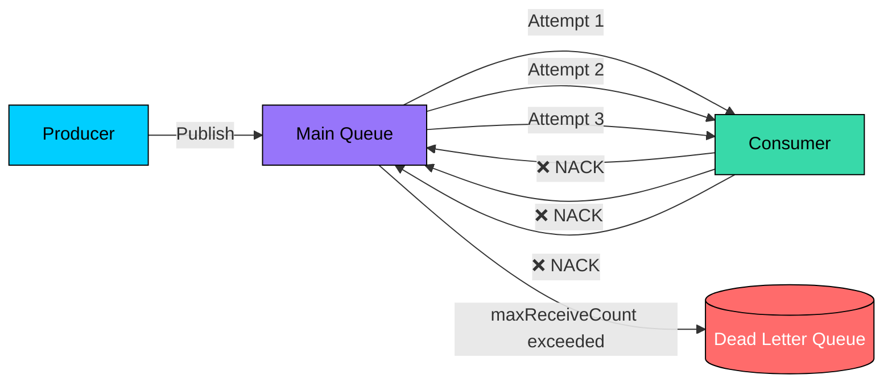

> Designing fail-safe channels for messages that cannot be processed: detecting poison pills, configuring retry budgets with exponential backoff, capturing diagnostic metadata, and building recovery workflows that bring failed messages back into the processing pipeline.

import { Aside, Steps, Tabs, TabItem } from "@astrojs/starlight/components";
import FlowSimulator from '/src/components/interactive/FlowSimulator.astro';

<Aside type="tip" title="Prerequisites">

This note is part of the **[[system-design|Systems Design Track]]**. Before studying dead letter queues, make sure you understand:
- [[system-design/message-queues|Asynchronous Message Queues]]: Broker architecture, acknowledgment models, and message lifecycle.
- [[system-design/delivery-semantics|Delivery Semantics]]: At-least-once delivery and why retries can create duplicates.

</Aside>

In an [[system-design/delivery-semantics|at-least-once delivery]] system, a broker retries failed messages until they are acknowledged. But what happens when a message can *never* be processed successfully? Without a safety valve, it cycles endlessly through the retry loop, consuming resources and blocking the queue. **Dead letter queues** (DLQs) are that safety valve — a dedicated destination where undeliverable messages are routed for inspection, diagnosis, and recovery.

---

## Poison Pills

A **poison pill** is a message that repeatedly fails processing and can never succeed with the current consumer logic. Common causes:

| Cause | Example |
| :--- | :--- |
| **Malformed payload** | Missing required fields, invalid JSON, encoding errors |
| **Schema mismatch** | Message uses schema v3 but the consumer only understands v2 |
| **Consumer bug** | A code path throws an unhandled exception for a specific input combination |
| **Downstream failure** | A required external service is permanently down (not just a transient timeout) |
| **Expired business context** | A promotional discount referenced in the message was deleted before processing |

Without DLQ routing, a poison pill creates a **head-of-line blocking** problem: the failing message occupies the consumer's processing slot, delaying all messages behind it in the queue.

---

## DLQ Architecture

### How messages reach the DLQ

The broker counts the number of times a message has been delivered. When that count exceeds a configurable **maximum receive count**, the broker automatically moves the message to the DLQ instead of redelivering it.



### Platform-specific mechanisms

<Tabs>
<TabItem label="Amazon SQS">

[Amazon SQS dead-letter queues](https://docs.aws.amazon.com/AWSSimpleQueueService/latest/SQSDeveloperGuide/sqs-dead-letter-queues.html) use a **redrive policy** attached to the source queue:

```json
{
  "deadLetterTargetArn": "arn:aws:sqs:us-east-1:123456789012:my-dlq",
  "maxReceiveCount": 3
}
```

After a message has been received `maxReceiveCount` times without being deleted (acknowledged), SQS automatically moves it to the specified DLQ. The DLQ must be the **same queue type** (Standard↔Standard, FIFO↔FIFO) as the source queue.

SQS also supports **DLQ redrive**: you can move messages from the DLQ back to the source queue (or a custom destination) via the console, CLI, or API.

</TabItem>
<TabItem label="RabbitMQ">

[RabbitMQ dead lettering](https://www.rabbitmq.com/docs/dlx) uses **dead letter exchanges** (DLX). A message is dead-lettered when any of these occur:

1. The consumer negatively acknowledges it (`basic.reject` or `basic.nack` with `requeue=false`)
2. The message's per-message TTL expires
3. The queue exceeds its length limit
4. A quorum queue's delivery-limit is exceeded

DLX routing is configured via queue policies:

```bash
rabbitmqctl set_policy DLX ".*" \
  '{"dead-letter-exchange":"my-dlx","dead-letter-routing-key":"failed"}' \
  --apply-to queues
```

Unlike SQS, RabbitMQ's DLX is a normal exchange — you can route dead-lettered messages to different queues based on the routing key, enabling categorized failure handling.

</TabItem>
<TabItem label="Apache Kafka">

Kafka does not have a built-in DLQ mechanism at the broker level. Dead letter topics (DLTs) are implemented by the **consumer application**:

```typescript
interface KafkaMessage {
  topic: string;
  partition: number;
  offset: string;
  key: string;
  value: string;
  headers: Record<string, string>;
}

interface KafkaProducer {
  send(record: { topic: string; messages: Array<{ key: string; value: string; headers: Record<string, string> }> }): Promise<void>;
}

const DLT_TOPIC = "my-topic.DLT";
const MAX_RETRIES = 3;

async function processWithDLT(
  message: KafkaMessage,
  producer: KafkaProducer,
): Promise<void> {
  const attempt = parseInt(message.headers["x-retry-count"] ?? "0", 10);

  try {
    await processBusinessLogic(message);
  } catch (error) {
    if (attempt >= MAX_RETRIES) {
      // Route to dead letter topic with diagnostic headers
      await producer.send({
        topic: DLT_TOPIC,
        messages: [{
          key: message.key,
          value: message.value,
          headers: {
            ...message.headers,
            "x-original-topic": message.topic,
            "x-failure-reason": String(error),
            "x-failed-at": new Date().toISOString(),
            "x-retry-count": String(attempt),
          },
        }],
      });
    } else {
      // Re-publish to retry topic with incremented count
      throw error; // Let the consumer framework handle retry
    }
  }
}

async function processBusinessLogic(message: KafkaMessage): Promise<void> {
  // Application-specific processing
}
```

</TabItem>
</Tabs>

### Per-queue vs shared DLQ

| Approach | Pros | Cons |
| :--- | :--- | :--- |
| **Per-queue DLQ** | Easy to trace which source queue a failed message came from; isolated monitoring and alerting | More infrastructure to manage; one DLQ per source queue |
| **Shared DLQ** | Centralized monitoring; fewer resources to manage | Must include source-queue metadata in messages to trace origin; risk of cross-contamination between failure categories |

<Aside type="tip" title="Recommendation">
Start with per-queue DLQs for critical pipelines (payments, orders) and shared DLQs for non-critical workloads (analytics, logging). The traceability benefit of per-queue DLQs outweighs the management overhead for business-critical flows.
</Aside>

---

## Retry Strategies

Before a message reaches the DLQ, the system should retry transient failures. The retry strategy determines how aggressively and how long the system keeps trying.

### Fixed-delay retry

Wait a constant interval between each retry attempt. Simple but suboptimal for transient failures caused by downstream overload — all failed messages retry simultaneously, amplifying the spike.

### Exponential backoff

Double the wait interval after each failure. This spreads retries over time, giving the downstream system time to recover:

| Attempt | Delay | Cumulative wait |
| :---: | :---: | :---: |
| 1 | 1 s | 1 s |
| 2 | 2 s | 3 s |
| 3 | 4 s | 7 s |
| 4 | 8 s | 15 s |
| 5 | 16 s | 31 s |

### Exponential backoff with jitter

Add a random offset to each backoff interval to prevent the **thundering herd** problem. Without jitter, all messages that failed at the same time retry at the same time, recreating the spike:

```
delay = min(maxDelay, baseDelay × 2^attempt + random(0, baseDelay))
```

<Aside type="caution" title="Always cap your backoff">
Without a maximum delay cap, exponential backoff can grow to minutes or hours. Set a `maxDelay` ceiling (e.g., 60 seconds) and a `maxAttempts` limit (e.g., 5 retries) to bound total retry duration.
</Aside>

### Retry budgets

A **retry budget** limits the total number of retries a system allows per time window. Instead of per-message retry limits, the system tracks the ratio of retry traffic to total traffic. If retries exceed a threshold (e.g., 10% of all requests), new retries are suppressed. This prevents cascade amplification where a struggling downstream service receives more retry traffic than original traffic.

---

## DLQ Metadata Envelope

A message in a DLQ is useless for diagnosis without context about *why* it failed. Every DLQ entry should carry a metadata envelope alongside the original payload:

```json
{
  "id": "dlq-2024-0815-001",
  "originalMessageId": "msg-492831",
  "sourceQueue": "orders.process",
  "firstReceivedAt": "2024-08-15T10:23:11Z",
  "deadLetteredAt": "2024-08-15T10:25:44Z",
  "attemptCount": 3,
  "lastError": {
    "errorClass": "PaymentGatewayTimeout",
    "message": "Connection to payment.api timed out after 5000ms",
    "stackTrace": "at PaymentClient.charge (payment-client.ts:47)..."
  },
  "consumerMetadata": {
    "consumerId": "worker-pod-3a8f",
    "consumerVersion": "2.14.1",
    "hostname": "orders-worker-3a8f-xyz"
  },
  "originalPayload": {
    "orderId": "order_492",
    "amount": 150.00,
    "currency": "USD"
  }
}
```

This envelope enables:

*   **Root cause triage**: The `lastError` field immediately points to the failure category (timeout? validation? auth?).
*   **Version tracking**: `consumerVersion` reveals whether a specific deployment introduced the bug.
*   **Replay safety**: `originalMessageId` enables idempotent replay — the recovery consumer can check whether the message was already successfully processed.

---

## Recovery Workflows

Messages in a DLQ are not garbage — they represent real business events that need resolution. There are three recovery strategies:

### 1. Fix and replay

The most common recovery: identify the bug, deploy a fix, and replay the DLQ messages through the pipeline.

<Steps>

1. **Inspect** the DLQ to understand the failure pattern (single bad payload? mass downstream outage?).
2. **Fix** the consumer code or downstream service that caused the failure.
3. **Deploy** the fix to production.
4. **Replay** messages from the DLQ back into the source queue. In SQS, use [DLQ redrive](https://docs.aws.amazon.com/AWSSimpleQueueService/latest/SQSDeveloperGuide/sqs-dead-letter-queues.html). In Kafka/RabbitMQ, a recovery consumer reads from the DLT/DLX and re-publishes to the original topic.
5. **Verify** that the replayed messages process successfully and the DLQ drains.

</Steps>

<Aside type="caution" title="Replay idempotency">
If time has passed since the original failure, the downstream state may have changed. Replay consumers must be [[system-design/delivery-semantics#idempotency-strategies|idempotent]] — replaying a "create order" message that was already manually resolved must not create a second order.
</Aside>

### 2. Transform and redirect

Some messages fail because their payload is invalid but the business intent is recoverable. A DLQ processor can **transform** the payload (fix a missing field, convert a schema version) and route it to the correct queue.

### 3. Audit and drop

For messages that represent irrecoverable failures (expired promotions, deleted user accounts), log them for audit purposes and remove them from the DLQ. Always capture the reason for dropping — "silently deleting DLQ messages" is an anti-pattern that hides systemic issues.

---

## Monitoring and Alerting

A DLQ that nobody watches is as dangerous as no DLQ at all. Critical metrics to track:

| Metric | Alert threshold | Why |
| :--- | :--- | :--- |
| **DLQ depth** (message count) | > 0 for critical queues | Any message in a DLQ represents a processing failure |
| **DLQ growth rate** | Sustained increase over 5 minutes | Indicates a systemic issue, not a single poison pill |
| **Oldest message age** | > retention policy | Messages approaching TTL expiration risk permanent data loss |
| **DLQ-to-main-queue ratio** | > 1% of main queue throughput | Signals a consumer reliability problem |

<Aside type="caution" title="Set DLQ retention longer than source">
If the DLQ retention period is shorter than the source queue, messages can expire from the DLQ before the team has time to investigate. Set DLQ retention to at least 2× the source queue retention (SQS max: 14 days).
</Aside>

---

## Putting It All Together

<FlowSimulator
  title="DLQ lifecycle: retry → dead-letter → recovery"
  nodes={[
    { id: "queue", label: "Main Queue", col: 0 },
    { id: "consumer", label: "Consumer", col: 1 },
    { id: "dlq", label: "Dead Letter Queue", col: 2 },
    { id: "operator", label: "Operator", col: 3 },
  ]}
  flows={[
    { label: "Transient failure recovers", steps: [
      { from: "queue", to: "consumer", message: "Deliver (attempt 1)", description: "Main queue delivers the message to a consumer. The consumer starts processing the order." },
      { from: "consumer", to: "queue", message: "❌ NACK (timeout)", description: "The payment API times out. The consumer negatively acknowledges the message, which returns it to the queue for retry after a backoff delay." },
      { from: "queue", to: "consumer", message: "Redeliver (attempt 2)", description: "After the backoff delay, the queue redelivers the message. The payment API is back up." },
      { from: "consumer", to: "queue", message: "✅ ACK (success)", description: "Consumer processes successfully and acknowledges. The message is deleted from the queue. No DLQ needed — the transient failure was resolved by retry." },
    ]},
    { label: "Poison pill → DLQ", steps: [
      { from: "queue", to: "consumer", message: "Deliver (attempt 1)", description: "Main queue delivers a message with a malformed payload (missing required 'currency' field)." },
      { from: "consumer", to: "queue", message: "❌ NACK (validation)", description: "Consumer fails on validation. The message returns to the queue. Retrying won't help — the payload is permanently invalid." },
      { from: "queue", to: "consumer", message: "Redeliver (attempt 2)", description: "Queue redelivers. Consumer fails again with the same validation error." },
      { from: "queue", to: "dlq", message: "→ DLQ (max retries)", description: "After the maxReceiveCount is exceeded, the broker moves the message to the DLQ with all its diagnostic metadata." },
    ]},
    { label: "DLQ recovery after fix", steps: [
      { from: "dlq", to: "operator", message: "Alert: DLQ depth > 0", description: "Monitoring detects messages in the DLQ. The operator inspects the DLQ metadata and identifies a consumer bug." },
      { from: "operator", to: "consumer", message: "Deploy fix v2.15", description: "The operator deploys a code fix that handles the previously-failing message format." },
      { from: "operator", to: "queue", message: "Redrive DLQ → Main", description: "The operator triggers a DLQ redrive, moving all DLQ messages back into the main queue for reprocessing." },
      { from: "queue", to: "consumer", message: "Reprocess (success)", description: "The fixed consumer processes all previously-failed messages successfully. DLQ drains to zero." },
    ]},
  ]}
  speed={1600}
/>

---

## See Also

*   [[system-design/message-queues|Asynchronous Message Queues]] — Parent note covering broker architecture and message lifecycle.
*   [[system-design/delivery-semantics|Delivery Semantics]] — At-least-once delivery and idempotent consumer strategies.
*   [[system-design/messaging-patterns|Messaging Patterns]] — Competing consumers, fan-out, and consumer group distribution models.
*   [[system-design/distributed-transactions|Distributed Transactions & Saga Patterns]] — Compensating transactions and saga failure recovery.
*   [Amazon SQS Dead-Letter Queues](https://docs.aws.amazon.com/AWSSimpleQueueService/latest/SQSDeveloperGuide/sqs-dead-letter-queues.html) — Official AWS docs on DLQ configuration and redrive.
*   [RabbitMQ Dead Letter Exchanges](https://www.rabbitmq.com/docs/dlx) — Official RabbitMQ docs on DLX triggers and routing.
