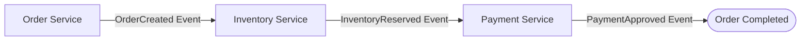

> Foundational concepts and architectural patterns for coordinating atomic multi-service updates, contrasting locking protocols with [[system-design/consistency-models|eventual consistency]] sagas, and securing reliable event routing.

import { Aside, Steps, Tabs, TabItem } from "@astrojs/starlight/components";
import FlowSimulator from '/src/components/interactive/FlowSimulator.astro';

<Aside type="note" title="Prerequisites">

This note is part of the **[[system-design|Systems Design Track]]**. Before resolving distributed state consistency, transaction choreography, and multi-service event rollbacks, make sure you understand:
- [[system-design/consistent-hashing|Consistent Hashing]]: Master circular hashing ring spaces and virtual nodes data balancing.
- [[system-design/message-queues|Asynchronous Message Queues]]: Master decoupled compute architectures, event brokers vs logs, and [[system-design/delivery-semantics|delivery semantics]].
- [[system-design/consistency-models|Consistency Models]]: Master CAP spectrum tradeoffs and sequential/causal guarantees.

</Aside>

In single database architectures, maintaining data integrity is straightforward. When a user places an order, the application opens a local transaction, writes to both the Orders and Inventory tables, and commits. The database guarantees ACID (Atomicity, Consistency, Isolation, Durability) properties, ensuring either both writes succeed or both are rolled back.

In a distributed microservices architecture, however, every service owns its own private database. The Order Service writes to Postgres, the Inventory Service writes to DynamoDB, and the Payment Service talks to a third party stripe API. Maintaining atomic updates across these physical database boundaries requires moving beyond local database transactions to distributed coordination.

---

## Two-Phase Commit (2PC)

The [Two-Phase Commit (2PC)](https://www.microsoft.com/en-us/research/wp-content/uploads/2016/02/tr-2003-96.pdf) protocol is a classic distributed atomic commit protocol that guarantees absolute atomicity across multiple nodes. It utilizes a central coordinator process to direct the transaction lifecycle across several participant databases.

```
[Coordinator] -------- Phase 1: Prepare --------> [Participants (Lock & Vote)]
[Coordinator] <------- Votes (Yes/No) ---------- [Participants]

[Coordinator] -------- Phase 2: Commit/Abort ----> [Participants (Write & Unlock)]
```

### 1. Phase 1: Prepare
1.  The Coordinator generates a unique transaction ID.
2.  It sends a **Prepare** message across the network to all participant databases.
3.  Each participant starts a local transaction, locks the target rows, evaluates constraints (e.g., verifying if stock is available), and writes updates to its transaction log (write ahead log).
4.  Each participant votes: sends **VOTE_COMMIT** (success) or **VOTE_ABORT** (failure) back to the coordinator.

### 2. Phase 2: Commit
1.  **Global Commit**: If all participants vote VOTE_COMMIT, the Coordinator sends a **Commit** command to every participant. Each participant commits the local transaction, releases its database locks, and returns an acknowledgment.
2.  **Global Abort**: If even a single participant votes VOTE_ABORT (or if network timeouts occur), the Coordinator sends an **Abort** command. Every participant rolls back its local transaction and releases all locks.

### Critical Limitations of 2PC
While 2PC guarantees strong consistency, it introduces severe bottlenecks in high throughput web scale systems:
*   **Blocking Locking**: Nodes must hold database locks from the start of Phase 1 until they receive the final Commit command in Phase 2. If the coordinator crashes mid transaction, all participant databases remain locked indefinitely, leading to resource pool starvation.
*   **Latency Accumulation**: A 2PC transaction's latency is the sum of the slowest participant's disk write time and network round trips, severely throttling aggregate system write throughput.
*   **Lack of Scale**: 2PC relies on participants supporting standard transactional protocols (like XA transactions), making it incompatible with modern NoSQL databases or third party SaaS APIs.

---

## The Saga Pattern (BASE Consistency)

To overcome the performance limits of 2PC, modern distributed systems trade strict ACID properties for **BASE** (Basically Available, Soft State, Eventual Consistency) using the **Saga Pattern**.

A [Saga](https://doi.org/10.1145/38713.38742) coordinates a business transaction through a sequence of local transactions. Each step in the Saga executes a local transaction in a single service and commits instantly, releasing database locks immediately. 
*   If all local transactions succeed, the Saga is complete.
*   If a local transaction fails, the Saga must coordinate a series of **compensating transactions** to roll back the changes made by the previous steps.

```
Local Transaction 1 (Committed) ---> Local Transaction 2 (Committed) ---> Local Transaction 3 (FAILED)
                                                                                  |
Compensating Transaction 1 <------- Compensating Transaction 2 <------------------+
(Reverse Semantic Update)           (Reverse Semantic Update)
```

Because intermediate steps commit their data immediately, a Saga cannot use native database rollbacks. It must execute compensating transactions that semantically reverse previous changes (e.g., if step 2 charged a credit card, the compensating step must issue a refund).

---

## Saga Coordination Strategies

Sagas are coordinated using one of two primary architectural strategies: Choreography (event driven) or Orchestration (command driven).

### 1. Choreography Sagas (Decentralized Event Flow)

In Choreography, there is no central orchestrator. Instead, services communicate by publishing and consuming events. Each service performs its local transaction and publishes an event that triggers the next service's local transaction.



#### Compensating Flow in Choreography
If the payment step fails:
1.  Payment Service publishes a `PaymentFailed` event.
2.  Inventory Service consumes `PaymentFailed` and executes its compensating transaction to release the reserved stock, publishing an `InventoryReleased` event.
3.  Order Service consumes `InventoryReleased` and marks the order as cancelled.

*   *Pros*: Lightweight, simple to stand up for small workflows, low coupling as services only react to events.
*   *Cons*: Difficult to trace as workflows grow. Adding new steps requires modifying event subscriptions across multiple services, risking circular dependency loops.

<FlowSimulator
  title="Choreography saga flow"
  nodes={[
    { id: "order", label: "Order Service", col: 0 },
    { id: "inventory", label: "Inventory Service", col: 1 },
    { id: "payment", label: "Payment Service", col: 2 },
    { id: "result", label: "Result", col: 3 },
  ]}
  flows={[
    { label: "Happy path", steps: [
      { from: "order", to: "inventory", message: "OrderCreated", description: "User places an order. Order Service commits locally and publishes an OrderCreated event to the event bus." },
      { from: "inventory", to: "payment", message: "InventoryReserved", description: "Inventory Service consumes OrderCreated, reserves stock in its local DB, and publishes InventoryReserved." },
      { from: "payment", to: "result", message: "PaymentApproved", description: "Payment Service charges the card successfully. The saga completes: all three services committed independently." },
    ]},
    { label: "Compensation (payment fails)", steps: [
      { from: "order", to: "inventory", message: "OrderCreated", description: "Same start: Order Service publishes OrderCreated after committing the order locally." },
      { from: "inventory", to: "payment", message: "InventoryReserved", description: "Inventory Service reserves stock and forwards InventoryReserved to Payment Service." },
      { from: "payment", to: "inventory", message: "PaymentFailed", description: "Payment fails (insufficient funds). Payment Service publishes PaymentFailed: compensation begins." },
      { from: "inventory", to: "order", message: "InventoryReleased", description: "Inventory Service consumes PaymentFailed and runs its compensating transaction: release the reserved stock." },
      { from: "order", to: "result", message: "OrderCancelled", description: "Order Service consumes InventoryReleased and marks the order as cancelled. All services are consistent again." },
    ]},
  ]}
  speed={1400}
/>

### 2. Orchestration Sagas (Central Coordinator)

In Orchestration, a dedicated coordinator service (the Orchestrator) directs all workflow decisions. The Orchestrator sends command messages to services, receives responses, and decides which step or compensation to trigger next.

#### Compensating Flow in Orchestration
If charging the card fails:
1.  Payment Service returns a `PaymentFailed` message to the Orchestrator.
2.  The Orchestrator catches the error, halts the workflow, and sends a `ReleaseStock` command to the Inventory Service.
3.  Once the Inventory Service acknowledges the release, the Orchestrator sends a `CancelOrder` command to the Order Service.

*   *Pros*: Highly visible. The entire workflow logic is centralized in one state machine, making debugging and metrics tracking straightforward.
*   *Cons*: Creates tight coupling. The orchestrator must understand the API/commands of every participant service, and it presents a central point of logic complexity.

<FlowSimulator
  title="Orchestration saga flow"
  nodes={[
    { id: "orch", label: "Saga Orchestrator", col: 1 },
    { id: "inv", label: "Inventory Service", col: 0 },
    { id: "pay", label: "Payment Service", col: 1 },
    { id: "order", label: "Order Service", col: 2 },
  ]}
  flows={[
    { label: "Happy path", steps: [
      { from: "orch", to: "inv", message: "Reserve Stock", description: "Orchestrator starts the saga. It sends a Reserve Stock command to the Inventory Service." },
      { from: "inv", to: "orch", message: "Stock Reserved", description: "Inventory Service reserves stock and responds with Stock Reserved." },
      { from: "orch", to: "pay", message: "Charge Card", description: "Orchestrator sends a Charge Card command to the Payment Service." },
      { from: "pay", to: "orch", message: "Card Charged", description: "Payment Service charges the card successfully and responds." },
      { from: "orch", to: "order", message: "Approve Order", description: "All services committed. Orchestrator approves the order: saga completes." },
    ]},
    { label: "Compensation (payment fails)", steps: [
      { from: "orch", to: "inv", message: "Reserve Stock", description: "Same start: Orchestrator sends Reserve Stock command." },
      { from: "inv", to: "orch", message: "Stock Reserved", description: "Inventory Service reserves stock successfully." },
      { from: "orch", to: "pay", message: "Charge Card", description: "Orchestrator sends Charge Card command to Payment Service." },
      { from: "pay", to: "orch", message: "PaymentFailed", description: "Payment fails. Payment Service returns PaymentFailed: Orchestrator catches the error and starts compensation." },
      { from: "orch", to: "inv", message: "Release Stock", description: "Orchestrator sends Release Stock compensation command to Inventory Service." },
      { from: "orch", to: "order", message: "Cancel Order", description: "Orchestrator cancels the order. All services are consistent again." },
    ]},
  ]}
  speed={1400}
/>

---

## TypeScript Saga Orchestrator Simulation

Below is a self-contained, fully typed TypeScript implementation of an Orchestration Saga. It models an execution pipeline that executes forward commands and triggers compensations in exact reverse order on failure.

```ts
export interface SagaStep {
  name: string;
  execute: () => Promise<void>;
  compensate: () => Promise<void>;
}

export class SagaOrchestrator {
  private steps: SagaStep[] = [];
  private completedSteps: SagaStep[] = [];

  /**
   * Adds a step to the Saga execution queue.
   */
  public addStep(step: SagaStep): this {
    this.steps.push(step);
    return this;
  }

  /**
   * Runs the forward execution pipeline. 
   * Triggers reverse compensation rollback if any step fails.
   */
  public async execute(): Promise<boolean> {
    for (const step of this.steps) {
      try {
        await step.execute();
        this.completedSteps.push(step);
      } catch (error) {
        await this.rollback();
        return false;
      }
    }
    return true;
  }

  /**
   * Executes compensations in reverse order for all completed steps.
   */
  private async rollback(): Promise<void> {
    const rollbackQueue = [...this.completedSteps].reverse();
    for (const step of rollbackQueue) {
      try {
        await step.compensate();
      } catch (compensationError) {
        // In production, failed compensations must route to an alert DLQ
      }
    }
  }
}
```

---

## Operational Gotchas in Saga Architectures

Moving to a Saga design introduces subtle but severe operational risks that can corrupt business data if left unmitigated.

<Aside type="caution" title="High-Stakes Saga Failure Modes">
Because local transactions in intermediate steps are committed immediately without global locks, you must actively design against data inconsistency, out-of-order execution, and dual-write bugs.
</Aside>

### 1. The Dual Write Bug (Resolved by Transactional Outbox)

In a typical Saga step, a service updates its local database and publishes an event to a [[system-design/message-queues|message broker]].
*   **The Bug**: If the database write succeeds but the server crashes before sending the event to Kafka, the downstream services never learn about the transaction. If you swap the order (publish first, then write), the broker sends the event but the database write fails, causing the exact same desynchronization.
*   **The Solution: The Transactional Outbox Pattern**: Instead of publishing directly to the message broker, the application inserts the event into a dedicated `Outbox` table within the **same local database transaction**. Because it is one transaction, both the business write and the outbox event write are guaranteed to succeed or fail together. A separate event publisher process reads the Outbox table (using polling or log based Change Data Capture like Debezium) and forwards the events to the message broker.

```
[Application] ---> Local DB Transaction ---> (Writes to Order Table)
                                         ---> (Writes to Outbox Table)
                                                    |
[Outbox Publisher (CDC / Debezium)] <---------------+
  |
  +--- Reads Outbox Table ---> Publishes Event to ---> [Message Broker]
```

### 2. Lack of Transaction Isolation (The ACID vs. BASE Dilemma)

Local transactions in a Saga commit immediately. This means intermediate states are visible to other parallel processes, breaking the **Isolation** guarantee of ACID.
*   **The Bug (Dirty Read)**: User A places an order. Step 1 commits the order. User B queries the database and sees the order. Payment fails, and a compensating transaction rolls back User A's order. User B now sees data that legally never existed.
*   **The Mitigation**:
    1.  **Semantic Lock**: Set the state of the entity to `PENDING` (e.g., `PENDING_PAYMENT`). Any reading service treats pending states differently, blocking updates until the Saga completes.
    2.  **Commutative Updates**: Design transactions so order does not matter (e.g., modifying bank balances via delta operations rather than absolute overrides).
    3.  **Version Checks**: Ensure compensating commands verify that the entity version matches the target version before applying rollbacks to prevent overriding subsequent modifications.

### 3. Idempotency Invariants
Due to network retries, a service can receive the same Saga command or compensating event multiple times.
*   **The Gotcha**: If a payment service receives `RefundPayment` twice due to a broker retry, it could issue two refunds to the customer.
*   **The Mitigation**: Every command must carry a unique Saga ID and Step ID. Before processing, services must verify if the specific Step ID has already run, rejecting duplicate invocations. (See [[system-design/message-queues|Asynchronous Message Queues]] for details on distributed [[system-design/delivery-semantics|idempotency]] locks).

---

## See Also

*   [[system-design/message-queues|Asynchronous Message Queues]]: Master event routing, dead-letter retries, and consumer idempotency design.
*   [[system-design/consistency-models|Consistency Models]]: Study CAP theorem limits, sequential consistency spectrums, and linearizability.
*   [[system-design/consistent-hashing|Consistent Hashing]]: Distribute database partitions dynamically across hash ring structures.
*   [[system-design/rate-limiting|Rate Limiting & Traffic Shaping]]: Implement gateway rate limiting to prevent traffic floods from overwhelming multi-service transaction queues.
*   [Saga Pattern](https://microservices.io/patterns/data/saga.html) : Chris Richardson's canonical reference for the [Saga coordination strategies](#saga-coordination-strategies) section.
