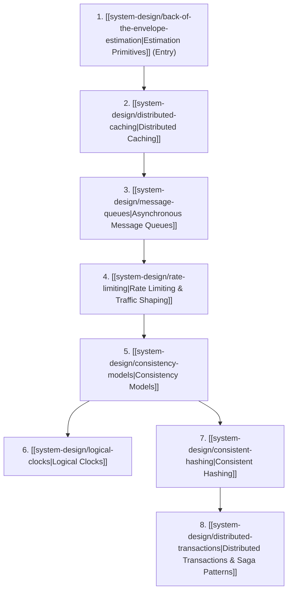

import { Card, CardGrid, Steps, Tabs, TabItem } from "@astrojs/starlight/components";

> Foundational concepts and mathematical primitives for designing robust, distributed, and highly available systems.

## What is Systems Design?

Systems design is the practice of building large-scale software systems that run across multiple computers (called nodes or servers) to handle massive traffic and data volumes reliably.

In a single-computer system, building software is straightforward: there is a single processor, a single system clock, and a single memory space. But when your system grows so large that it must be split across dozens, hundreds, or thousands of machines, everything changes:
*   **No shared memory**: How do we decide which server stores which user's data?
*   **No instant updates**: If a user updates their profile picture, how does every other server learn about it without slowing down the site?
*   **No single truth of time**: Computers have physical clocks that drift. How do we know which event happened first if servers disagree on what time it is?

[[system-design/back-of-the-envelope-estimation|Estimation Primitives]], [[system-design/distributed-caching|Distributed Caching]], [[system-design/message-queues|Asynchronous Message Queues]], [[system-design/rate-limiting|Rate Limiting & Traffic Shaping]], [[system-design/consistency-models|Consistency Models]], [[system-design/logical-clocks|Logical Clocks]], [[system-design/consistent-hashing|Consistent Hashing]], and [[system-design/distributed-transactions|Distributed Transactions & Saga Patterns]] are the core foundational pillars of distributed software architecture.

## TL;DR

*   **Estimation Primitives**: Frames system capacities and constraints using powers of two, network latencies, and SLA uptime compounding formulas. See [[system-design/back-of-the-envelope-estimation|Estimation Primitives]].
*   **Distributed Caching**: Analyzes read/write synchronization patterns, LRU eviction models, and high-load database stampede mitigations. See [[system-design/distributed-caching|Distributed Caching]].
*   **Asynchronous Message Queues**: Decouples compute, routes pub/sub event fanout, clarifies delivery semantics, and establishes dead-letter recovery pipelines. See [[system-design/message-queues|Asynchronous Message Queues]].
*   **Rate Limiting & Traffic Shaping**: Regulates API requests and protects downstream compute from spikes using Token Bucket, Leaky Bucket, and Sliding Window algorithms. See [[system-design/rate-limiting|Rate Limiting & Traffic Shaping]].
*   **Consistency Models**: Frames partition-tolerance trade-offs via the CAP theorem, defining consistency spectrums from Strong/Linearizable to Client-Centric and Eventual models. See [[system-design/consistency-models|Consistency Models]].
*   **Logical Clocks**: Captures causality and order of events in asynchronous distributed systems where physical time synchronization is unreliable. See [[system-design/logical-clocks|Logical Clocks]].
*   **Consistent Hashing**: Minimizes data migration during cluster resizing by mapping keys and nodes to a circular hash ring topology. See [[system-design/consistent-hashing|Consistent Hashing]].
*   **Distributed Transactions & Saga Patterns**: Coordinates multi-service state changes using Two-Phase Commit or Sagas with compensating workflows. See [[system-design/distributed-transactions|Distributed Transactions & Saga Patterns]].

## Learning Pathway Sequence

For a progressive learning flow, we recommend mastering quantitative estimation and cache distribution before diving into traffic regulation, consistency spectrums, event coordination, and ring distribution:

## Choose a path

<Tabs>
  <TabItem label="Core Architecture">
    <Steps>

    1. [[system-design/back-of-the-envelope-estimation|Estimation Primitives]]: Master the power-of-two scale, Jeff Dean latency numbers, compounding SLA availability math, and raw QPS/storage blueprints.
    2. [[system-design/distributed-caching|Distributed Caching]]: Analyze read/write strategies, LRU cache memory, cache invalidation models, and database stampede gotchas.
    3. [[system-design/message-queues|Asynchronous Message Queues]]: Decouple compute, analyze Pub/Sub vs. Point-to-Point, trace delivery semantics, and design resilient Dead Letter Queues.
    4. [[system-design/rate-limiting|Rate Limiting & Traffic Shaping]]: Master Token Bucket, Leaky Bucket, and sliding window counter algorithms at the edge.
    5. [[system-design/consistency-models|Consistency Models]]: Understand the CAP theorem, sequential/causal models, and client-centric guarantees like Read-Your-Writes.
    6. [[system-design/logical-clocks|Logical Clocks]]: Solve time synchronization limits using Lamport Timestamps and Vector Clocks for causal histories.
    7. [[system-design/consistent-hashing|Consistent Hashing]]: Master data partitioning, circular hashing rings, and hotspot mitigation with virtual nodes.
    8. [[system-design/distributed-transactions|Distributed Transactions & Saga Patterns]]: Master Two-Phase Commit (2PC) and Saga patterns (Orchestration vs. Choreography) with compensating transactions.

    </Steps>
  </TabItem>
  <TabItem label="Algorithmic Primitives">
    <Steps>

    1. **Quantitative Calculations**: Practice step-by-step arithmetic to estimate storage footprint, bandwidth requirements, and caching memory size: [[system-design/back-of-the-envelope-estimation#worked-example-capstone-high-scale-photo-platform|Worked Example Blueprint]].
    2. **Cache Eviction Simulation**: Build and analyze an O(1) Least Recently Used cache using a doubly linked list and Map: [[system-design/distributed-caching#typescript-lru-cache-implementation|TypeScript LRU Cache Code]].
    3. **Idempotency & DLQ Pipeline**: Model At-Least-Once delivery duplication, message deduplication, and dead-letter queue routing pipelines: [[system-design/message-queues#delivery-semantics-and-the-two-generals-limit|Delivery Semantics & DLQ]].
    4. **Rate Limiting Simulator**: Build a fully typed TypeScript sliding window log rate limiter using millisecond log sets: [[system-design/rate-limiting#typescript-sliding-window-log-limiter|TypeScript Sliding Window Limiter]].
    5. **TypeScript Implementation**: Walk through a fully typed hash ring class using MD5 and O(log N) binary search: [[system-design/consistent-hashing#typescript-implementation|Consistent Hashing Code]].
    6. **Causal Timeline Verifications**: Compare vector clocks and trace event ordering: [[system-design/logical-clocks#visualizing-logical-clocks|Causal Tracing]].
    7. **Saga Workflow Orchestrator**: Build a self-contained orchestrator managing forward steps and backward compensation rollbacks: [[system-design/distributed-transactions#typescript-saga-orchestrator-simulation|TypeScript Saga Orchestrator Code]].

    </Steps>
  </TabItem>
</Tabs>

## Start here

<CardGrid>
  <Card title="Estimation Primitives" icon="calculator">
    
<a href="/knowledge-base/system-design/back-of-the-envelope-estimation/">Quantitative scale</a>: Latency, availability nines, and worked math blueprints.

  </Card>
  <Card title="Distributed Caching" icon="setting">
    
<a href="/knowledge-base/system-design/distributed-caching/">Cache tiers</a>: Read/Write strategies, LRU cache TS simulation, and stampede defenses.

  </Card>
  <Card title="Asynchronous Message Queues" icon="email">
    
<a href="/knowledge-base/system-design/message-queues/">Message brokers</a>: P2P vs Pub/Sub, traditional vs log-based event [[effect-ts/streams|streams]], and DLQs.

  </Card>
  <Card title="Rate Limiting & Traffic Shaping" icon="lock">
    
<a href="/knowledge-base/system-design/rate-limiting/">Traffic shaping</a>: Token bucket, leaky bucket, sliding window log counters, and security gotchas.

  </Card>
  <Card title="Consistency Models" icon="matrix">
    
<a href="/knowledge-base/system-design/consistency-models/">Consistency spectrum</a>: CAP theorem, linearizability, and client models.

  </Card>
  <Card title="Logical Clocks" icon="random">
    
<a href="/knowledge-base/system-design/logical-clocks/">Logical time</a>: NTP limits, Lamport, and Vector clocks.

  </Card>
  <Card title="Consistent Hashing" icon="puzzle">
    
<a href="/knowledge-base/system-design/consistent-hashing/">Partitioning ring</a>: VNodes, balancing, and TS implementation.

  </Card>
  <Card title="Distributed Transactions & Saga Patterns" icon="setting">
    
<a href="/knowledge-base/system-design/distributed-transactions/">Transaction patterns</a>: 2PC limits, Saga Orchestrator/Choreography, and Transactional Outbox.

  </Card>
</CardGrid>

## Guides Summary

| Guide | MOC Link | Key Primitives |
| --- | --- | --- |
| Estimation Primitives | [Estimation Primitives](/knowledge-base/system-design/back-of-the-envelope-estimation/) | Powers of two, Latency numbers, SLA nines, QPS math |
| Distributed Caching | [Distributed Caching](/knowledge-base/system-design/distributed-caching/) | Read/Write patterns, Eviction LRU/LFU, Cache Stampede |
| Asynchronous Message Queues | [Asynchronous Message Queues](/knowledge-base/system-design/message-queues/) | P2P vs Pub/Sub, Brokers vs Logs, Delivery Semantics, Idempotency, DLQs |
| Rate Limiting & Traffic Shaping | [Rate Limiting & Traffic Shaping](/knowledge-base/system-design/rate-limiting/) | Token Bucket, Leaky Bucket, Sliding Window, Horizontal Lua scripts |
| Consistency Models | [Consistency Models](/knowledge-base/system-design/consistency-models/) | CAP spectrum, Linearizability, Causal ordering |
| Logical Clocks | [Logical Clocks](/knowledge-base/system-design/logical-clocks/) | Lamport timestamps, Vector clocks, NTP skew |
| Consistent Hashing | [Consistent Hashing](/knowledge-base/system-design/consistent-hashing/) | Circular rings, Virtual Nodes, MD5 search |
| Distributed Transactions & Saga Patterns | [Distributed Transactions & Saga Patterns](/knowledge-base/system-design/distributed-transactions/) | 2PC, Saga Orchestrator, Saga Choreography, Transactional Outbox, Compensating rollbacks |

## Planned Concepts

To expand our distributed systems curriculum and prepare for advanced real-world architectures, the following core topics are planned to be added next:

- **Distributed Consensus & Coordination**: Master election, split-brain mitigation, heartbeats, and leader coordination using consensus algorithms like Raft and Paxos.
- **Storage Internals & Advanced Data Structures**: Analyzing B-Trees vs. LSM Trees for read/write performance, and using Bloom Filters, Merkle Trees, and Geohashes for efficient distributed data storage.

