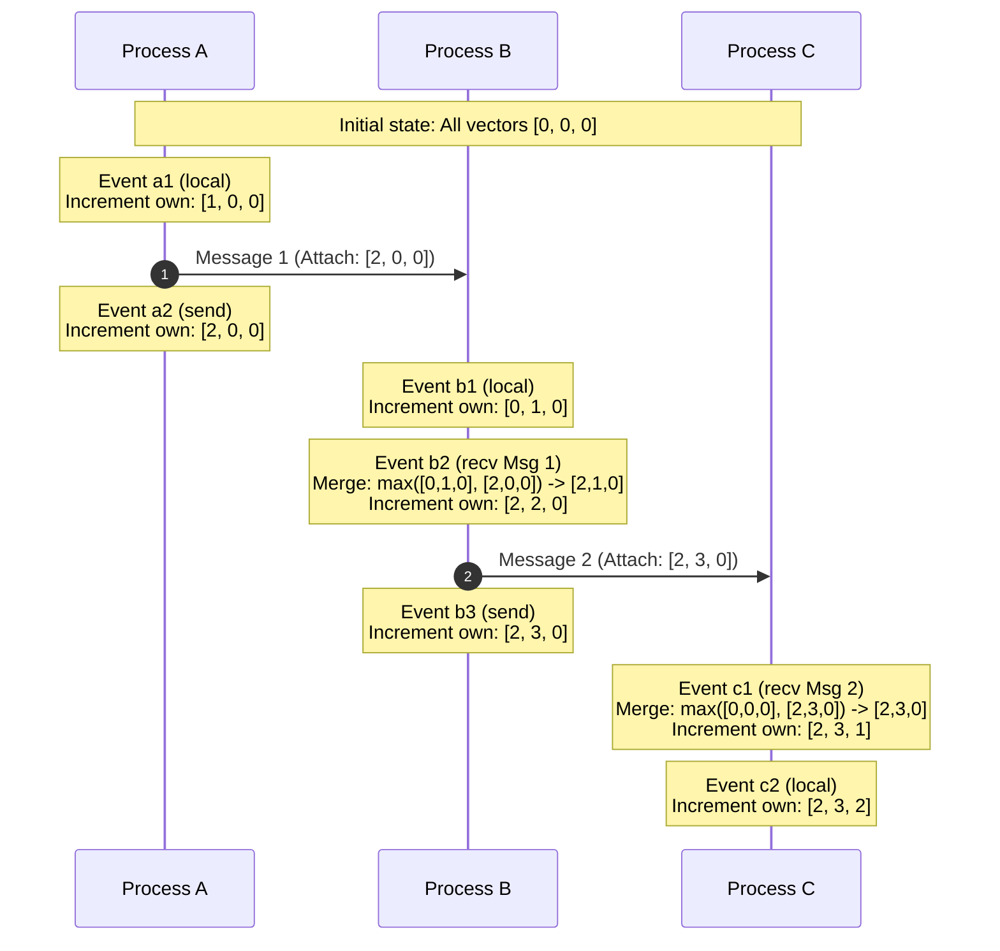

import { Aside, Steps, Tabs, TabItem } from "@astrojs/starlight/components";

> Solving the impossibility of absolute physical time in distributed networks using Lamport Timestamps and Vector Clocks.

In centralized systems, ordering events is simple: the operating system maintains a single physical system clock, and every event receives a sequential timestamp. In a distributed system with nodes scattered across networks, coordinating events in physical time becomes an intractable problem. 

Because physical clocks drift, distributed databases cannot rely on network time to establish a globally correct order of operations. Logical clocks solve this by tracking the causal relationships between events rather than matching them to real-world time.

---

## The Problem of Time in Distributed Systems

Physical clocks inside server hardware rely on quartz crystal oscillators, which are susceptible to microscopic variations. Over time, these clocks drift from actual real-world time and skew relative to each other.

### Why NTP is Insufficient for Ordering
Distributed systems use the Network Time Protocol (NTP) to periodically sync server clocks with UTC reference servers. However, NTP has physical limits:
*   **Network Jitter**: Variable network delays cause synchronization offsets, leaving server times slightly out of alignment.
*   **Monotonicity Violations**: If a server's clock drifts ahead and NTP attempts to correct it, the system clock might jump backward. This can cause a newer event to receive an older timestamp, breaking database transaction logs.
*   **Clock Skew Bounds**: Even in optimized local clusters, clock skew typically ranges between 1 and 50 milliseconds. For high-throughput systems processing thousands of transactions per millisecond, this window is a lifetime.

### Leslie Lamport's Happen-Before Relation
In 1978, Leslie Lamport defined the **happen-before relation** (denoted by `->`), establishing a strict mathematical basis for partial ordering in asynchronous systems without reference to physical clocks:

*   **Local Rule**: If events `a` and `b` occur within the same process, and `a` occurs before `b`, then `a -> b`.
*   **Network Rule**: If event `a` is the sending of a message by one process, and event `b` is the receipt of that same message by another process, then `a -> b`.
*   **Transitivity**: If `a -> b` and `b -> c`, then `a -> c`.
*   **Concurrency**: If neither `a -> b` nor `b -> a` can be proven, the events are concurrent (denoted by `a || b`).

---

## Lamport Timestamps

A Lamport Timestamp is a simple, monotonically increasing logical counter maintained by each process. It maps every event to a single integer value, guaranteeing that causal order is preserved.

### The Algorithm Rules

<Steps>

1.  **Initialize**: Each process `P_i` starts its local logical clock at `C_i = 0`.

2.  **Local Event**: Before executing a local event (or sending a message), the process increments its clock:
    ```
    C_i = C_i + 1
    ```

3.  **Send Message**: The process attaches its updated local clock value `C_i` to the network message:
    ```
    Payload = (data, C_i)
    ```

4.  **Receive Message**: When process `P_j` receives a message containing timestamp `t`, it synchronizes its local clock:
    ```
    C_j = max(C_j, t) + 1
    ```

</Steps>

### The Limitation of Lamport Timestamps
If event `a` causally precedes event `b` (`a -> b`), we are guaranteed that their Lamport timestamps reflect this order:
```
a -> b implies C(a) < C(b)
```

However, **the converse is not true**:
```
C(a) < C(b) does not imply a -> b
```

If we observe two events with timestamps `C(a) = 2` and `C(b) = 3`, we cannot determine if they are causally related or if they occurred concurrently in separate processes. For databases requiring precise conflict detection (such as detecting concurrent offline writes), Lamport Timestamps are not sufficient.

---

## Vector Clocks

Vector Clocks extend Lamport Timestamps to capture full causal history. Instead of a single integer, a process maintains a vector (an array) of logical clocks representing its current knowledge of all nodes in the system.

In a cluster of `N` nodes, each node `P_i` maintains a vector `V_i` of size `N`, where `V_i[j]` represents the latest logical tick node `P_i` knows node `P_j` has executed.

### The Algorithm Rules

<Steps>

1.  **Initialize**: Each process `P_i` initializes its vector to zeros:
    ```
    V_i = [0, 0, ..., 0]
    ```

2.  **Local Event**: Before executing a local event (or sending a message), process `P_i` increments its own index in its vector:
    ```
    V_i[i] = V_i[i] + 1
    ```

3.  **Send Message**: Process `P_i` attaches its entire local vector `V_i` to the message.

4.  **Receive Message**: When process `P_j` receives a message carrying vector `W`, it merges the incoming state:
    *   It updates every element in its vector to the maximum value:
        ```
        V_j[k] = max(V_j[k], W[k])  for all k in [0, N-1]
        ```
    *   It increments its own index in its vector to mark the receipt event:
        ```
        V_j[j] = V_j[j] + 1
        ```

</Steps>

---

## Visualizing Logical Clocks

The following sequence timeline traces three concurrent processes (A, B, and C) managing event ordering and message exchanges via Vector Clocks.



### Detecting Conflicts and Concurrency
Vector Clocks allow us to mathematically prove whether two events `a` and `b` are causally related or concurrent:

*   **Causal Precedence**: Event `a` causally preceded `b` (`a -> b`) if and only if `V(a)` is strictly less than `V(b)`:
    ```
    V(a) <= V(b)  iff (for all k, V(a)[k] <= V(b)[k]) AND (exists k, V(a)[k] < V(b)[k])
    ```
*   **Concurrency / Conflict**: If neither `V(a) <= V(b)` nor `V(b) <= V(a)` is true, the events are concurrent (`a || b`). This signals that concurrent modifications occurred, requiring application-level conflict resolution.

---

## Comparison Matrix

| Guarantees & Cost | Lamport Timestamps | Vector Clocks |
| :--- | :--- | :--- |
| **Clock State Size** | O(1) (Single integer counter) | O(N) (Integer array for N processes) |
| **Causal Ordering** | Weak: If `a -> b`, then `C(a) < C(b)`. Converse is false. | Strong: `a -> b` if and only if `V(a) < V(b)`. |
| **Conflict Detection** | Impossible. Concurrent events receive overlapping timestamps. | Perfect. Detects concurrent updates when vectors are incomparable. |
| **Message Overhead** | Negligible (Adds a single integer to each message). | Scalability Bottleneck (Adds N integers to each message). |

---

## Gotchas and Production Considerations

<Aside type="caution" title="The Vector Clock Scalability Bottleneck">
Because a vector's size scales linearly with the number of nodes (`O(N)`), vector clocks become extremely expensive in large, dynamically scaling systems. If a system has 10,000 active nodes, every write must carry a vector of 10,000 integers. Production systems (like Riak or Dynamo) resolve this using **pruning policies**, dropping the oldest node timestamps when a vector exceeds a set size limit, sacrificing some historical precision.
</Aside>

### 1. Dynamic Membership Changes
Adding or removing nodes from a cluster alters the vector size. In production, clusters handle this by mapping process IDs to dynamic maps (`Map<NodeID, Counter>`) instead of static arrays.

### 2. Physical Clock Hybrids (HLC)
To combine the causal safety of logical clocks with the intuitive, real-time ordering of physical clocks, modern databases (like CockroachDB and MongoDB) use **Hybrid Logical Clocks (HLC)**. HLCs maintain a logical clock that closely tracks physical time (UTC) but falls back to incrementing logical counters when physical time skew makes ordering ambiguous.

---

## See also
*   [[system-design/consistent-hashing|Consistent Hashing & Dynamic Ring Partitioning]]
*   [[system-design/consistency-models|CAP Theorem & Consistency Models]]
