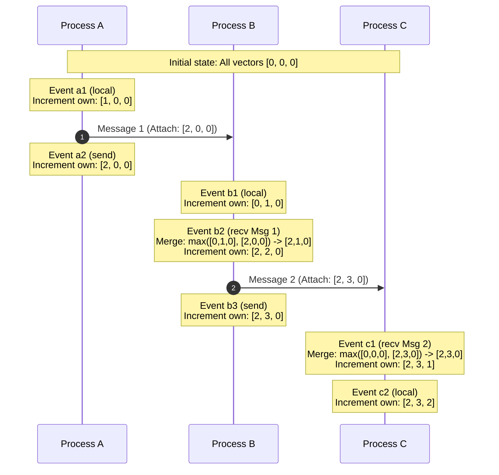

import { Aside, Steps, Tabs, TabItem } from "@astrojs/starlight/components";

> Solving the impossibility of absolute physical time in distributed networks using Lamport Timestamps and Vector Clocks.

<Aside type="tip" title="Prerequisites">

This note is part of the **[Systems Design Track](/knowledge-base/system-design/)**. Before resolving time sync limits, make sure you understand:
- [[system-design/consistency-models|Consistency Models]]: Frame the CAP partition boundaries and eventual vs causal consistency spectrums.

</Aside>

In centralized systems, ordering events is simple: the operating system maintains a single physical system clock, and every event receives a sequential timestamp. In a distributed system with nodes scattered across networks, coordinating events in physical time becomes an intractable problem. 

Because physical clocks drift, distributed databases cannot rely on network time to establish a globally correct order of operations. Logical clocks solve this by tracking the causal relationships between events rather than matching them to real-world time.

---

## The Problem of Time in Distributed Systems

Physical clocks inside server hardware rely on quartz crystal oscillators, which are susceptible to microscopic variations. Over time, these clocks drift from actual real-world time and skew relative to each other.

**The Wristwatch Skew Analogy**:
Imagine two high-frequency financial traders, Alice in London and Bob in New York, trying to record the exact millisecond a stock is bought and sold. They each wear highly accurate wristwatches, and at the start of the day, they synchronize their watches to a central atomic clock in London.
However, because of microscopic temperature changes and physical differences in their watches' internal crystals, Alice's watch drifts ahead by 5 milliseconds, while Bob's watch drifts behind by 5 milliseconds. 
If Alice buys a stock and Bob sells it 2 milliseconds later, Bob's watch might register the sell event before Alice's watch registers the buy event. To an outside observer looking at the logs, the sell happened before the buy, which is physically impossible. 

In a distributed network of computers, this "physical time skew" is an unavoidable reality.

### Why NTP is Insufficient for Ordering

Distributed systems use the Network Time Protocol (NTP) to periodically synchronize server clocks over the internet with reference clocks. However, NTP has severe physical limitations:
*   **Network Jitter**: Variable network delays cause synchronization offsets, leaving server times slightly out of alignment.
*   **Time Jumps (Monotonicity Violations)**: If a server's clock drifts ahead and NTP attempts to correct it, the system clock might jump backward. This can cause a newer event to receive an older timestamp, breaking database transaction logs.
*   **Clock Skew Bounds**: Even in optimized local clusters, clock skew typically ranges between 1 and 50 milliseconds. For high-throughput systems processing thousands of transactions per millisecond, this window is a lifetime.

### Leslie Lamport's Happen-Before Relation

In 1978, computer scientist Leslie Lamport proved that we do not need physical clocks to order events. Instead, we can establish order by tracking cause and effect. He defined the **happen-before relation** (denoted by `->`), establishing a strict basis for ordering events in distributed systems:

**The Physical Mail Analogy**:
Imagine Alice in London writes a physical letter, puts it in an envelope, and mails it to Bob in New York.
*   **Local Rule (Same Person)**: Alice writing the letter (Event A) must happen before Alice seals the envelope (Event B). Since these happen in the same process, we know the order: `A -> B`.
*   **Network Rule (Message Flow)**: Alice mailing the letter (Event B) must happen before Bob receives and opens the letter (Event C). Bob cannot read a letter that hasn't been sent yet. Therefore, `B -> C`.
*   **Transitivity (Causal Chain)**: By logical connection, because Alice wrote the letter before mailing it (`A -> B`), and Bob received it after it was mailed (`B -> C`), we can confidently prove that Alice wrote the letter before Bob read it (`A -> C`).
*   **Concurrency (Independent Events)**: Meanwhile, in Tokyo, Charlie is drinking a cup of tea (Event D). D has no relationship to Alice or Bob. Since Event D did not cause Alice's letter, and Alice's letter did not cause Event D, they are **concurrent** (denoted by `A || D`). They are independent, and their real-world order does not matter causally.

---

## Lamport Timestamps

A Lamport Timestamp is a simple, monotonically increasing logical counter maintained by each process. It maps every event to a single integer value, guaranteeing that causal order is preserved.

### The Algorithm Rules

<Steps>

1.  **Initialize**: Each process starts its local logical clock at `0`.

2.  **Local Event**: Before executing a local event (like saving a document or sending a message), the process increments its clock by 1:
    ```
    Clock = Clock + 1
    ```

3.  **Send Message**: The process attaches its updated local clock value to the network message:
    ```
    Message Payload = (data, Clock)
    ```

4.  **Receive Message**: When another process receives a message containing the sender's clock timestamp `t`, it synchronizes its local clock:
    ```
    Clock = max(Clock, t) + 1
    ```
    This ensures the receiver's clock is always pushed ahead of the sender's clock, preserving the cause-and-effect timeline.

</Steps>

### The Limitation of Lamport Timestamps

If event `a` causally precedes event `b` (`a -> b`), we are guaranteed that their Lamport timestamps reflect this order:
```
a -> b implies Clock(a) < Clock(b)
```

However, **the converse is not true**:
```
Clock(a) < Clock(b) does not imply a -> b
```

**The Parallel Diaries Analogy**:
Imagine Alice in London and Bob in New York are writing in their own personal diaries. Each time they write an entry, they increment their page counter.
*   Alice writes an entry on Page 2 of her diary.
*   Bob writes an entry on Page 3 of his diary.
*   Because Page 3 is greater than Page 2, a reader might assume that Alice's Page 2 entry happened before Bob's Page 3 entry, or even caused it. 
*   But they are completely separate diaries! Bob has never read Alice's diary, and Alice has never read Bob's. Their events are concurrent and independent. The page numbers alone cannot prove whether one person's writing influenced the other's.

For databases requiring precise conflict detection (such as detecting concurrent offline edits), Lamport Timestamps are not sufficient because we cannot reconstruct causal history from the numbers alone.

---

## Vector Clocks

Vector Clocks extend Lamport Timestamps to capture full causal history. Instead of a single integer, a process maintains a vector (an array) of logical clocks representing its current knowledge of all nodes in the system.

**The Shared Timeline Log Analogy**:
Instead of separate personal diaries, imagine each node maintains a "shared timeline log book" represented by an array (like `[A, B, C]`). 
*   The first slot `A` represents the current page number of Alice's work.
*   The second slot `B` represents the current page number of Bob's work.
*   The third slot `C` represents the current page number of Charlie's work.
*   Whenever Alice performs local work, she increments her own page counter `A`.
*   Whenever Alice sends a message to Bob, she shares her log book showing `[A=3, B=1, C=0]`.
*   When Bob receives this, he merges the information, updating his own log book to match the maximum page numbers he has now seen, and then increments his own counter `B`.
*   By looking at a vector clock, we can instantly tell exactly which page numbers from other nodes were read and incorporated before an event occurred.

In a cluster of `N` nodes, each node `P_i` maintains a vector `V_i` of size `N`, where `V_i[j]` represents the latest logical tick node `P_i` knows node `P_j` has executed.

### The Algorithm Rules

<Steps>

1.  **Initialize**: Each process `P_i` initializes its vector to zeros:
    ```
    V_i = [0, 0, ..., 0]
    ```

2.  **Local Event**: Before executing a local event (or sending a message), process `P_i` increments its own index in its vector:
    ```
    V_i[i] = V_i[i] + 1
    ```

3.  **Send Message**: Process `P_i` attaches its entire local vector `V_i` to the message.

4.  **Receive Message**: When process `P_j` receives a message carrying vector `W`, it merges the incoming [[effect-ts/state|state]]:
    *   It updates every element in its vector to the maximum value:
        ```
        V_j[k] = max(V_j[k], W[k])  for all k in [0, N-1]
        ```
    *   It increments its own index in its vector to mark the receipt event:
        ```
        V_j[j] = V_j[j] + 1
        ```

</Steps>

---

## Visualizing Logical Clocks

The following sequence timeline traces three concurrent processes (A, B, and C) managing event ordering and message exchanges via Vector Clocks.



### Detecting Conflicts and Concurrency
Vector Clocks allow us to mathematically prove whether two events `a` and `b` are causally related or concurrent:

*   **Causal Precedence**: Event `a` causally preceded `b` (`a -> b`) if and only if `V(a)` is strictly less than `V(b)`:
    ```
    V(a) <= V(b)  iff (for all k, V(a)[k] <= V(b)[k]) AND (exists k, V(a)[k] < V(b)[k])
    ```
*   **Concurrency / Conflict**: If neither `V(a) <= V(b)` nor `V(b) <= V(a)` is true, the events are concurrent (`a || b`). This signals that concurrent modifications occurred, requiring application-level conflict resolution.

---

## Comparison Matrix

| Guarantees & Cost | Lamport Timestamps | Vector Clocks |
| :--- | :--- | :--- |
| **Clock State Size** | O(1) (Single integer counter) | O(N) (Integer array for N processes) |
| **Causal Ordering** | Weak: If `a -> b`, then `C(a) < C(b)`. Converse is false. | Strong: `a -> b` if and only if `V(a) < V(b)`. |
| **Conflict Detection** | Impossible. Concurrent events receive overlapping timestamps. | Perfect. Detects concurrent updates when vectors are incomparable. |
| **Message Overhead** | Negligible (Adds a single integer to each message). | Scalability Bottleneck (Adds N integers to each message). |

---

## Gotchas and Production Considerations

<Aside type="caution" title="The Vector Clock Scalability Bottleneck">
Because a vector's size scales linearly with the number of nodes (`O(N)`), vector clocks become extremely expensive in large, dynamically scaling systems. If a system has 10,000 active nodes, every write must carry a vector of 10,000 integers. Production systems (like Riak or Dynamo) resolve this using **pruning policies**, dropping the oldest node timestamps when a vector exceeds a set size limit, sacrificing some historical precision.
</Aside>

### 1. Dynamic Membership Changes
Adding or removing nodes from a cluster alters the vector size. In production, clusters handle this by mapping process IDs to dynamic maps (`Map<NodeID, Counter>`) instead of static arrays.

### 2. Physical Clock Hybrids (HLC)
To combine the causal safety of logical clocks with the intuitive, real-time ordering of physical clocks, modern databases (like CockroachDB and MongoDB) use **Hybrid Logical Clocks (HLC)**. HLCs maintain a logical clock that closely tracks physical time (UTC) but falls back to incrementing logical counters when physical time skew makes ordering ambiguous.

---

## See also
*   [[system-design/consistent-hashing|Consistent Hashing & Dynamic Ring Partitioning]]
*   [[system-design/consistency-models|CAP Theorem & Consistency Models]]
