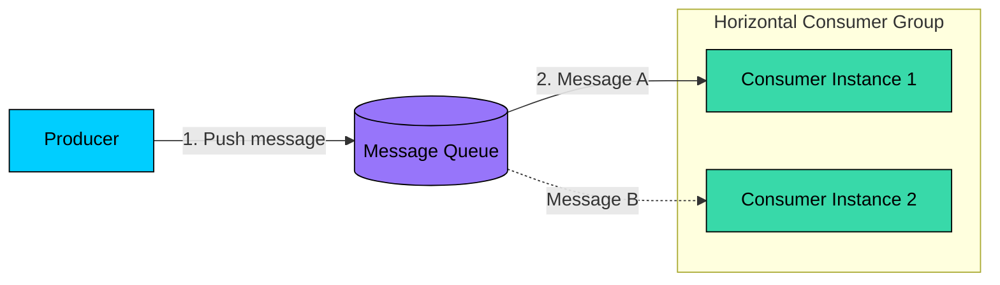
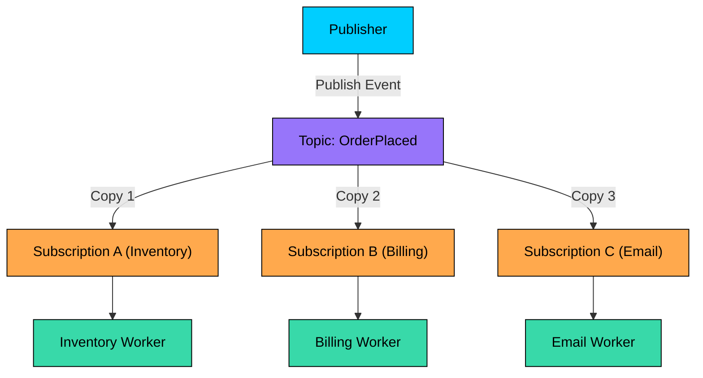
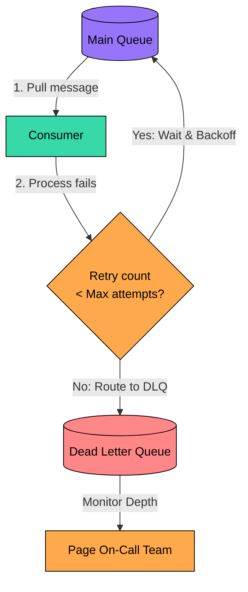

> Decoupling system computations using asynchronous messaging primitives, contrasting transient message brokers with log-based event streaming, and securing [[system-design/delivery-semantics|at-least-once]] delivery with idempotent consumer architectures.

import { Aside, Steps, Tabs, TabItem } from "@astrojs/starlight/components";
import FlowSimulator from '/src/components/interactive/FlowSimulator.astro';
import DecisionGuide from '/src/components/interactive/DecisionGuide.astro';

<Aside type="tip" title="Prerequisites">

This note is part of the **[[system-design|Systems Design Track]]**. Before queuing messages, make sure you understand:
- [[system-design/distributed-caching|Distributed Caching]]: Master read-through, write-through, and write-behind caching synchronization patterns before analyzing queue buffers.
- [[system-design/consistency-models|Consistency Models]]: Master CAP partition boundaries, eventual consistency, and transactional delivery guarantees.

</Aside>

Synchronous request-response communication (like REST over HTTP or gRPC) binds microservices together in a tight, temporal execution chain. If Service A must call Service B synchronously, Service A is bound by Service B's latency, availability, and scaling limits. A failure in Service B cascades directly back to Service A, threatening system-wide uptime.

Asynchronous message queues solve this bottleneck. By introducing an intermediary buffer (a message broker or event log), services can communicate asynchronously. Producers push events into the queue and immediately return, allowing background consumers to process workloads at their own pace. This decoupling levels out traffic spikes, enhances system fault tolerance, and scales horizontal workers independently.

---

## Messaging Paradigms: P2P vs. Publish-Subscribe

Distributed messaging generally falls into two primary communication patterns, each optimized for different consumption models:

### 1. Point-to-Point (P2P / [[system-design/messaging-patterns|Competing Consumers]])

In a Point-to-Point model, messages are sent from a producer to a single named queue. One or more consumer instances listen to the queue, but **each individual message is delivered to exactly one consumer instance**.

*   **How it works**: The broker acts as a workload distributor. If Consumer Instance 1 pulls Message A, Message A is locked and hidden from Consumer Instance 2.
*   **Primary Use Case**: Task processing systems (like rendering video slices, customizing uploaded images, or running heavy SQL reports) where work must be shared among competing workers to prevent duplicate processing.

### 2. Publish-Subscribe (Pub/Sub Event [[system-design/messaging-patterns|Fan-Out]])

In a Publish-Subscribe model, publishers broadcast messages to a logical named channel called a **Topic**. Multiple independent downstream services register interest by creating distinct subscriptions to that topic. **Every subscription receives its own copy of the message**.

*   **How it works**: The topic acts as a broadcasting hub. When an event (like `OrderPlaced`) arrives, the topic clones and routes it to every registered subscription. Within each subscription, a competing consumer group can process that subscription's copy.
*   **Primary Use Case**: Event-driven architectures where multiple decoupled domains need to react to a single business event simultaneously.

<FlowSimulator
  title="Messaging paradigms"
  nodes={[
    { id: "producer", label: "Producer", col: 0 },
    { id: "queue", label: "Queue / Topic", col: 1 },
    { id: "consumer1", label: "Consumer 1", col: 2 },
    { id: "consumer2", label: "Consumer 2", col: 2 },
    { id: "consumer3", label: "Consumer 3", col: 2 },
  ]}
  flows={[
    { label: "Point-to-Point", steps: [
      { from: "producer", to: "queue", message: "Push Message A", description: "Producer sends Message A into the queue. The queue stores it and waits until a consumer is free to pick it up." },
      { from: "queue", to: "consumer1", message: "Deliver A (locked)", description: "Queue delivers Message A to Consumer 1 and locks it — no other consumer can see or process this message. This guarantees exactly-once delivery." },
      { from: "producer", to: "queue", message: "Push Message B", description: "Producer sends a second message. The queue picks the next available consumer (rotating through them one by one, called round-robin) so work is spread evenly." },
      { from: "queue", to: "consumer2", message: "Deliver B (locked)", description: "Message B goes to Consumer 2 because Consumer 1 is still busy. Each message is handled by exactly one consumer — multiple consumers share the load but never duplicate work." },
    ]},
    { label: "Pub/Sub Fanout", steps: [
      { from: "producer", to: "queue", message: "Publish OrderPlaced", description: "Publisher broadcasts an OrderPlaced event to the Topic. The topic will clone it to every subscription." },
      { from: "queue", to: "consumer1", message: "Copy → Inventory", description: "Inventory subscription receives its own copy of the event. It will reserve stock independently.", group: 1 },
      { from: "queue", to: "consumer2", message: "Copy → Billing", description: "Billing subscription receives the same event. It will process payment independently and in parallel.", group: 1 },
      { from: "queue", to: "consumer3", message: "Copy → Email", description: "Email subscription receives the event too. All three services react to the same event without knowing about each other.", group: 1 },
    ]},
  ]}
  speed={1400}
/>

---

## Architectural Comparison: Message Brokers vs. Event Streams

Asynchronous platforms are divided into two fundamentally different architectures: **Traditional Message Brokers** and **Log-Based Event Streamers**. Choosing the correct one determines how data is persisted, processed, and scaled.

### Traditional Message Brokers (e.g., RabbitMQ, Amazon SQS)

Traditional brokers focus on transient delivery using a **smart broker, dumb consumer** model. 

*   **Transient Storage**: Messages are treated as temporary tasks. The broker keeps messages in memory or on disk until a consumer pulls them and sends a successful acknowledgment (ACK). Upon receiving the ACK, the broker immediately deletes the message.
*   **State Control**: The broker is responsible for tracking which consumer has locked which message, managing visibility timeouts, and coordinating message retries.
*   **Routing Logic**: Supports rich routing features (like header-based routing, wildcards, and direct exchanges), allowing complex routing graphs inside the broker itself.

### Log-Based Event Streamers (e.g., Apache Kafka, Apache Pulsar)

Event streams treat messages as a durable, chronological history using a **dumb broker, smart consumer** model.

*   **Durable Append-Only Log**: Messages are written to disk as an append-only, sequential log. Messages are **never** deleted upon consumption; they persist on disk until a configured time-to-live or size-based retention policy is met (for example, keeping data for 7 days).
*   **State Control**: The broker does not track consumer state. Instead, each consumer tracks its own read position using an integer pointer called an **Offset**. To consume messages, the consumer simply reads sequentially from that offset.
*   **Replayability**: Because messages are not deleted, a consumer can roll back its offset and replay the entire message history from scratch. This is invaluable for recovering from bugs or training new machine learning models on historical data.

### Design Trade-Off Matrix
 
The following matrix contrasts these two paradigms across primary operational dimensions.
 
| Dimension | Traditional Message Brokers | Log-Based Event Streamers |
| :--- | :--- | :--- |
| [**Storage Engine**](#architectural-comparison-message-brokers-vs-event-streams) | Volatile, transient queues (deleted on ACK) | Durable, append-only sequential log on disk |
| [**Consumer State**](#architectural-comparison-message-brokers-vs-event-streams) | Tracked by the broker (ACKs, locks) | Tracked by the consumer (log read offset) |
| [**Message Replay**](#log-based-event-streamers-eg-apache-kafka-apache-pulsar) | No (destructive consumption) | Yes (rewind offset to reread history) |
| [**Routing Power**](#traditional-message-brokers-eg-rabbitmq-amazon-sqs) | High (exchange routing, wildcards) | Low (routing is determined by Partition keys) |
| [**Parallelism Scale**](#log-based-event-streamers-eg-apache-kafka-apache-pulsar) | Limited by single-queue locking overhead | Massive (horizontal partitions scale out) |
| **Typical Tech** | RabbitMQ, [SQS](/knowledge-base/aws/sqs/), ActiveMQ | Apache Kafka, Apache Pulsar, Kinesis |

<DecisionGuide
  title="Which messaging architecture?"
  steps={[
    { id: "start", question: "Do you need to replay past messages?", options: [
      { label: "Yes, replay and audit trail are essential", next: "r-stream" },
      { label: "No, consume once and delete", next: "routing" },
    ]},
    { id: "routing", question: "Do you need complex message routing (headers, wildcards, exchanges)?", options: [
      { label: "Yes, rich routing logic", next: "r-broker" },
      { label: "No, simple partition-based routing", next: "scale" },
    ]},
    { id: "scale", question: "What throughput scale do you need?", options: [
      { label: "Millions of events/sec, massive parallelism", next: "r-stream" },
      { label: "Moderate (thousands/sec), simpler ops", next: "r-broker" },
    ]},
    { id: "r-stream", result: "Log-Based Event Stream (Kafka, Pulsar, Kinesis)", explanation: "Durable append-only log. Consumers track their own offset and can replay history. Scales via partitions. Best for event sourcing, analytics pipelines, and audit trails.", link: "#log-based-event-streamers-eg-apache-kafka-apache-pulsar" },
    { id: "r-broker", result: "Traditional Message Broker (RabbitMQ, SQS)", explanation: "Transient delivery with smart broker. Messages deleted on ACK. Rich routing via exchanges. Best for task queues, work distribution, and moderate-scale workflows.", link: "#traditional-message-brokers-eg-rabbitmq-amazon-sqs" },
  ]}
/>
 
---

## Delivery Protocols: Push vs. Pull Delivery

How messages are transferred between the broker and the consumer defines the system's backpressure and latency characteristics:

### Push-Based Delivery

The broker actively pushes messages to registered consumer instances as soon as they arrive in the queue.

*   **Pros**: Ultra-low latency. The consumer receives the message immediately without polling delays.
*   **Cons**: Lacks natural backpressure. If traffic spikes, a fast broker can overwhelm a slow consumer with too many parallel pushes, exhausting the consumer's memory or process resources. Traditional push brokers mitigate this using a `prefetch limit` to cap in-flight messages.

### Pull-Based Delivery

Consumers actively poll the broker for batches of messages when they have available processing capacity.

*   **Pros**: Natural backpressure management. A slow or struggling consumer simply slows down its polling rate. The consumer is never overwhelmed because it controls exactly when and how many messages it retrieves.
*   **Cons**: Polling latency. If the queue is empty, continuous polling can waste CPU cycles and network bandwidth. Log-based event streamers like Kafka solve this using **Long Polling**: the pull request blocks and waits at the broker until a minimum batch size or timeout is reached.

---

## Delivery Semantics and the Two Generals Limit

Distributed messaging must navigate the **Two Generals' Problem** — the impossibility of coordinating state perfectly over an unreliable channel. Messaging platforms offer three tiers of delivery guarantees, each trading off reliability, performance, and complexity:

| Semantic | Guarantee | Key trade-off |
| :--- | :--- | :--- |
| **At-most-once** | Delivered 0 or 1 times | Fast, no duplicates, but messages may be lost |
| **At-least-once** | Delivered 1+ times | No data loss, but consumers must handle duplicates |
| **Exactly-once** | Processed exactly 1 time | Zero loss and zero duplicates, but highest complexity |

Most business-critical systems use **at-least-once delivery** paired with **idempotent consumers** to prevent data loss while safely handling duplicates.

<Aside type="tip" title="Deep dive">
For the full treatment — the Broker's Dilemma, Kafka's transactional exactly-once, and three idempotency engineering patterns — see [[system-design/delivery-semantics|Delivery Semantics]].
</Aside>

---

## Poison Pills & Dead Letter Queues

When a message repeatedly fails to process, it cannot remain at the head of the queue — doing so blocks all subsequent messages, a problem called **head-of-line blocking**. These unprocessable messages are called **poison pills**.

To maintain throughput, systems route poison pills to a **[[system-design/dead-letter-queues|Dead Letter Queue (DLQ)]]** — a dedicated holding queue for failed messages. The broker counts delivery attempts and, once a configured `maxReceiveCount` is exceeded, automatically moves the message to the DLQ.

<Aside type="tip" title="Deep dive">
For the full treatment — retry strategies (exponential backoff with jitter), DLQ metadata envelopes, per-queue vs shared DLQs, recovery workflows, and monitoring best practices — see [[system-design/dead-letter-queues|Dead Letter Queues]].
</Aside>

---

## See Also
*   [[system-design/messaging-patterns|Messaging Patterns]] — Competing consumers, fan-out, consumer groups, and shared subscription models.
*   [[system-design/delivery-semantics|Delivery Semantics]] — At-most-once, at-least-once, exactly-once guarantees and idempotency strategies.
*   [[system-design/dead-letter-queues|Dead Letter Queues]] — DLQ architecture, retry strategies, and recovery workflows.
*   [[system-design/distributed-transactions|Distributed Transactions & Saga Patterns]] — Coordinating multi-service state changes.
*   [[system-design/back-of-the-envelope-estimation|Back-of-the-Envelope Estimation Primitives]]
*   [[system-design/distributed-caching|Distributed Caching & Invalidation]]
*   [[system-design/consistency-models|CAP Theorem & Consistency Models]]
*   [[system-design/consistent-hashing|Consistent Hashing & Dynamic Ring Partitioning]]
*   [[system-design/logical-clocks|Logical Clocks & Event Ordering]]
