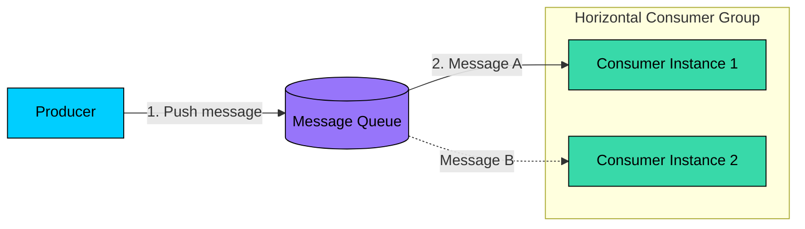
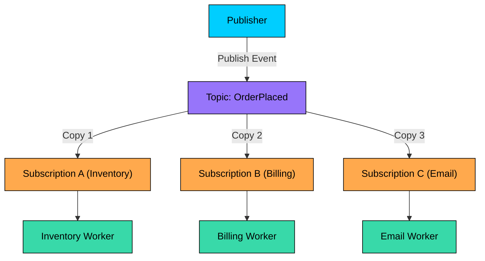
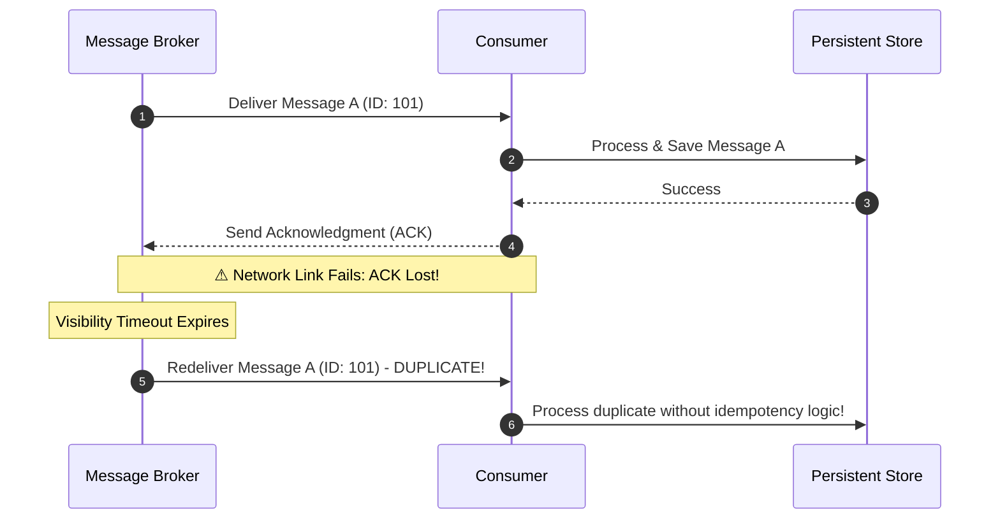
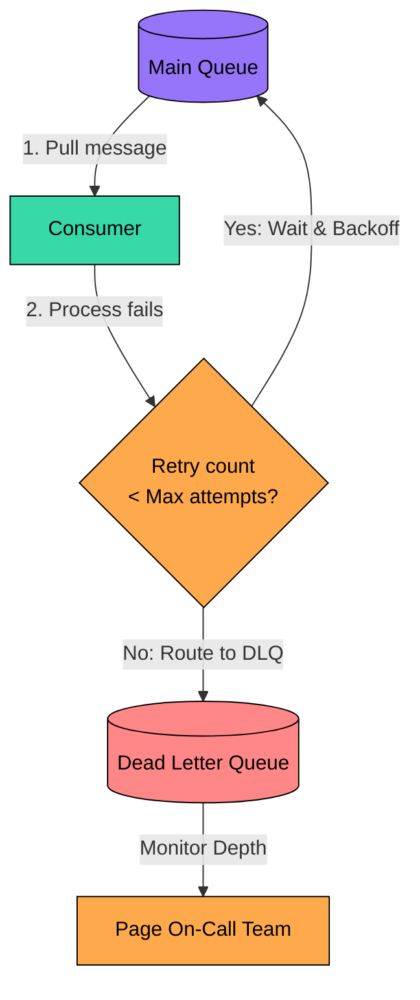

import { Aside, Steps, Tabs, TabItem } from "@astrojs/starlight/components";

> Decoupling system computations using asynchronous messaging primitives, contrasting transient message brokers with log-based event streaming, and securing at-least-once delivery with idempotent consumer architectures.

<Aside type="tip" title="Prerequisites">

This note is part of the **[[system-design|Systems Design Track]]**. Before queuing messages, make sure you understand:
- [[system-design/distributed-caching|Distributed Caching]]: Master read-through, write-through, and write-behind caching synchronization patterns before analyzing queue buffers.
- [[system-design/consistency-models|Consistency Models]]: Master CAP partition boundaries, eventual consistency, and transactional delivery guarantees.

</Aside>

Synchronous request-response communication (like REST over [[effect-ts/platform|HTTP]] or gRPC) binds microservices together in a tight, temporal execution chain. If Service A must call Service B synchronously, Service A is bound by Service B's latency, availability, and scaling limits. A failure in Service B cascades directly back to Service A, threatening system-wide uptime.

Asynchronous message queues solve this bottleneck. By introducing an intermediary buffer (a message broker or event log), services can communicate asynchronously. Producers push events into the queue and immediately return, allowing background consumers to process workloads at their own pace. This decoupling levels out traffic spikes, enhances system fault tolerance, and scales horizontal workers independently.

---

## Messaging Paradigms: P2P vs. Publish-Subscribe

Distributed messaging generally falls into two primary communication patterns, each optimized for different consumption models:

### 1. Point-to-Point (P2P / Competing Consumers)

In a Point-to-Point model, messages are sent from a producer to a single named queue. One or more consumer instances listen to the queue, but **each individual message is delivered to exactly one consumer instance**.



*   **How it works**: The broker acts as a workload distributor. If Consumer Instance 1 pulls Message A, Message A is locked and hidden from Consumer Instance 2.
*   **Primary Use Case**: Task processing systems (like rendering video slices, customizing uploaded images, or running heavy SQL reports) where work must be shared among competing workers to prevent duplicate processing.

### 2. Publish-Subscribe (Pub/Sub Event Fanout)

In a Publish-Subscribe model, publishers broadcast messages to a logical named channel called a **Topic**. Multiple independent downstream services register interest by creating distinct subscriptions to that topic. **Every subscription receives its own copy of the message**.



*   **How it works**: The topic acts as a broadcasting hub. When an event (like `OrderPlaced`) arrives, the topic clones and routes it to every registered subscription. Within each subscription, a competing consumer group can process that subscription's copy.
*   **Primary Use Case**: Event-driven architectures where multiple decoupled domains need to react to a single business event simultaneously.

---

## Architectural Comparison: Message Brokers vs. Event Streams

Asynchronous platforms are divided into two fundamentally different architectures: **Traditional Message Brokers** and **Log-Based Event Streamers**. Choosing the correct one determines how data is persisted, processed, and scaled.

### Traditional Message Brokers (e.g., RabbitMQ, Amazon SQS)

Traditional brokers focus on transient delivery using a **smart broker, dumb consumer** model. 

*   **Transient Storage**: Messages are treated as temporary tasks. The broker keeps messages in memory or on disk until a consumer pulls them and sends a successful acknowledgment (ACK). Upon receiving the ACK, the broker immediately deletes the message.
*   **[[effect-ts/state|State]] Control**: The broker is responsible for tracking which consumer has locked which message, managing visibility timeouts, and coordinating message retries.
*   **Routing Logic**: Supports rich routing features (like header-based routing, wildcards, and direct exchanges), allowing complex routing graphs inside the broker itself.

### Log-Based Event Streamers (e.g., Apache Kafka, Apache Pulsar)

Event [[effect-ts/streams|streams]] treat messages as a durable, chronological history using a **dumb broker, smart consumer** model.

*   **Durable Append-Only Log**: Messages are written to disk as an append-only, sequential log. Messages are **never** deleted upon consumption; they persist on disk until a configured time-to-live or size-based retention policy is met (for example, keeping data for 7 days).
*   **State Control**: The broker does not track consumer state. Instead, each consumer tracks its own read position using an integer pointer called an **Offset**. To consume messages, the consumer simply reads sequentially from that offset.
*   **Replayability**: Because messages are not deleted, a consumer can roll back its offset and replay the entire message history from scratch. This is invaluable for recovering from bugs or training new machine learning models on historical data.

### Design Trade-Off Matrix
 
The following matrix contrasts these two paradigms across primary operational dimensions.
 
| Dimension | Traditional Message Brokers | Log-Based Event Streamers |
| :--- | :--- | :--- |
| [**Storage Engine**](#architectural-comparison-message-brokers-vs-event-streams) | Volatile, transient queues (deleted on ACK) | Durable, append-only sequential log on disk |
| [**Consumer State**](#architectural-comparison-message-brokers-vs-event-streams) | Tracked by the broker (ACKs, locks) | Tracked by the consumer (log read offset) |
| [**Message Replay**](#log-based-event-streamers-eg-apache-kafka-apache-pulsar) | No (destructive consumption) | Yes (rewind offset to reread history) |
| [**Routing Power**](#traditional-message-brokers-eg-rabbitmq-amazon-sqs) | High (exchange routing, wildcards) | Low (routing is determined by Partition keys) |
| [**Parallelism Scale**](#log-based-event-streamers-eg-apache-kafka-apache-pulsar) | Limited by single-queue locking overhead | Massive (horizontal partitions scale out) |
| **Typical Tech** | RabbitMQ, [SQS](/knowledge-base/aws/sqs/), ActiveMQ | Apache Kafka, Apache Pulsar, Kinesis |
 
---

## Delivery Protocols: Push vs. Pull Delivery

How messages are transferred between the broker and the consumer defines the system's backpressure and latency characteristics:

### Push-Based Delivery

The broker actively pushes messages to registered consumer instances as soon as they arrive in the queue.

*   **Pros**: Ultra-low latency. The consumer receives the message immediately without polling delays.
*   **Cons**: Lacks natural backpressure. If traffic spikes, a fast broker can overwhelm a slow consumer with too many parallel pushes, exhausting the consumer's memory or process resources. Traditional push brokers mitigate this using a `prefetch limit` to cap in-flight messages.

### Pull-Based Delivery

Consumers actively poll the broker for batches of messages when they have available processing capacity.

*   **Pros**: Natural backpressure management. A slow or struggling consumer simply slows down its polling rate. The consumer is never overwhelmed because it controls exactly when and how many messages it retrieves.
*   **Cons**: Polling latency. If the queue is empty, continuous polling can waste CPU cycles and network bandwidth. Log-based event streamers like Kafka solve this using **Long Polling**: the pull request blocks and waits at the broker until a minimum batch size or timeout is reached.

---

## Delivery Semantics and the Two Generals Limit

In a perfect world, a message is sent once and processed once. However, because distributed systems run across unreliable network networks, we must navigate the **Two Generals' Problem** (the impossibility of coordinating state perfectly over an unstable channel). 

Messaging platforms offer three levels of delivery guarantees:

### 1. At-Most-Once Delivery

Messages are delivered zero or one times. The sender makes a single attempt to deliver the message but never retries.

*   **Implementation**: The broker dispatches the message and immediately deletes it or updates its offset before waiting for the consumer to finish. If the consumer crashes during processing, the message is lost forever.
*   **Use Case**: Ephemeral metrics, [[effect-ts/observability|telemetry]], or sensor logs where speed is critical and minor data loss is acceptable.

### 2. At-Least-Once Delivery

Messages are guaranteed to be delivered one or more times. The broker keeps retrying until it receives a successful acknowledgment from the consumer.

*   **The Broker's Dilemma**: If a consumer successfully processes a message but the network fails before the acknowledgment reaches the broker, the broker cannot distinguish between a consumer crash and a network disconnect. To guarantee no data loss, the broker must retry, leading to duplicate delivery.



*   **Use Case**: Most business-critical workflows (like order processing, billing, or shipping) where data loss is unacceptable. **This requires consumers to be Idempotent**.

<Aside type="caution" title="At-Least-Once Duplicate Hazard">
Because network retries can redeliver previously processed messages, you must design every consumer to be strictly idempotent. Failing to do so exposes system domains to critical duplicate charge, double shipping, or data corruption bugs.
</Aside>

### 3. Exactly-Once Delivery

Messages are guaranteed to be processed exactly once, with zero data loss and zero duplicate effects.

*   **How it is achieved**: True exactly-once delivery across external systems is impossible without absolute consensus. However, within controlled ecosystems like Apache Kafka, it is achieved through:
    1.  **Idempotent Producers**: Producers attach unique transactional IDs and sequential numbers to every message. If a retry occurs, the broker detects the duplicate sequence number and drops it.
    2.  **Transactional Coordination**: The consumer writes its processing outputs and commits its read offsets inside a unified atomic transaction. If any step fails, the entire transaction rolls back.

---

## Designing Idempotent Consumers

Because most distributed systems rely on **At-Least-Once** delivery to prevent data loss, the downstream consumer must be designed to handle duplicate messages safely. An operation is idempotent if executing it multiple times yields the same system state as executing it once.

Here are three concrete engineering blueprints for achieving idempotency:

### 1. Natural Idempotency (State-Setting)

Design write operations to be naturally idempotent by setting absolute states rather than running relative updates.

*   **Non-Idempotent**: `UPDATE accounts SET balance = balance + 100 WHERE id = 5`. If delivered twice, the balance increases by 200.
*   **Idempotent**: `UPDATE accounts SET balance = 500 WHERE id = 5` or `UPDATE orders SET status = 'SHIPPED' WHERE id = 12`. No matter how many times this query runs, the final status remains `SHIPPED`.

### 2. Unique Database Constraints

Leverage the relational database's transaction engine to reject duplicate insertions.

```sql
-- Ensure the order_id has a UNIQUE constraint
ALTER TABLE payments ADD CONSTRAINT unique_order_payment UNIQUE (order_id);

-- Insert payment record. If a duplicate arrives, do nothing
INSERT INTO payments (payment_id, order_id, amount, status)
VALUES ('pay_883', 'order_492', 150.00, 'COMPLETED')
ON CONFLICT (order_id) DO NOTHING;
```

This completely prevents duplicate entries at the storage layer without requiring complex distributed locks.

### 3. Distributed Deduplication Store (Idempotency Key Pattern)

For operations that trigger external side effects (like sending an email or charging a credit card via a third-party API), the consumer must check an external deduplication store (like a Redis cluster) before executing business logic.

```typescript
interface Message {
  id: string; // Globally unique message identifier
  payload: any;
}

interface RedisClient {
  set(key: string, value: string, ...args: (string | number)[]): Promise<string | null>;
  del(key: string): Promise<number>;
}

export class IdempotentConsumer {
  private readonly redisClient: RedisClient; // Redis client wrapper
  private readonly dedupeTTL = 86400; // 24-hour key expiration

  constructor(redisClient: RedisClient) {
    this.redisClient = redisClient;
  }

  public async process(message: Message): Promise<void> {
    const lockKey = `dedupe:lock:${message.id}`;

    // Attempt to acquire an atomic lock in Redis using SETNX (SET if Not Exists)
    const acquired = await this.redisClient.set(lockKey, "PROCESSING", "NX", "EX", this.dedupeTTL);

    if (!acquired) {
      console.warn(`Duplicate message detected and skipped: ${message.id}`);
      return;
    }

    try {
      // 1. Execute business logic (e.g., charge credit card)
      await this.executePayment(message.payload);

      // 2. Update status in the deduplication store
      await this.redisClient.set(lockKey, "PROCESSED", "KEEPTTL");
    } catch (error) {
      // Release lock on transient failure so the message can be retried safely
      await this.redisClient.del(lockKey);
      throw error;
    }
  }

  private async executePayment(payload: any): Promise<void> {
    // Payment provider integration logic
  }
}
```

---

## Poison Pills & Dead Letter Queue (DLQ) Pipelines

When a message repeatedly fails to process, it cannot remain at the head of the queue. If it does, it blocks all subsequent messages, causing massive consumer lag. These unprocessable messages are called **Poison Pills**.

Common causes of poison pills include:
*   **Malformed payloads**: The message payload has syntax errors or violates the expected JSON [[effect-ts/schema|schema]].
*   **Business [[nestjs/recipes/validation|validation]] failures**: The message contains references to missing resources (like a deleted user).
*   **Software bugs**: The consumer code crashes on specific edge cases in the payload.

### The Dead Letter Queue (DLQ) Pipeline

To maintain high throughput and reliability, systems use a **Dead Letter Queue (DLQ)**. This is a secondary, dedicated holding queue for failed messages:



1.  **Consume**: The consumer pulls a message from the main queue.
2.  **Fail & Retry**: Processing fails. The consumer rejects the message, and the broker puts it back in the main queue.
3.  **Backoff**: To prevent overloading the consumer, the system applies **Exponential Backoff** (compounding the wait time between retries, e.g. 1s ➔ 2s ➔ 4s ➔ 8s).
4.  **Dead-Lettering**: If the retry count exceeds the maximum limit (typically 3 to 5 attempts), the broker redirects the message to the Dead Letter Queue.
5.  **Notify**: An alarm triggers (such as a Datadog alert on SQS `ApproximateNumberOfMessagesVisible`) to notify the engineering team.

### DLQ Metadata Envelope

A premium DLQ implementation wraps the original message in an envelope containing diagnostic metadata. This is essential for troubleshooting:

```json
{
  "original_queue": "order-processing-queue",
  "first_received": "2026-05-23T13:00:00Z",
  "dead_lettered": "2026-05-23T13:05:00Z",
  "retry_attempts": 5,
  "failed_consumer_id": "pod-worker-x93",
  "exception_class": "ValidationError",
  "exception_message": "Missing property 'shipping_address'",
  "original_payload": {
    "order_id": "ord_8829",
    "customer_id": "usr_99",
    "amount": 99.99
  }
}
```

### Operational Workflows for DLQ Recovery

Once a poison pill lands in the DLQ, engineers must choose one of three recovery actions:

1.  **Manual Inspection & Repair**:
    *   *Scenario*: The message failed because of a transient external API bug or missing database record.
    *   *Action*: Fix the underlying issue (e.g. restore the database record), then use a replay tool to move the message back to the main queue for reprocessing.
2.  **Code Correction & Replay**:
    *   *Scenario*: The message is valid, but a bug in the consumer caused the crash.
    *   *Action*: Hot-fix the consumer code, deploy the update, and then trigger a batch replay of all accumulated DLQ messages.
3.  **Audit & Drop**:
    *   *Scenario*: The message is completely malformed and has no business value.
    *   *Action*: Log the message to long-term audit storage (like S3 or Glacier) for compliance, and delete it from the DLQ to keep the queue clean.

<Aside type="caution" title="DLQ Replay Side-Effect Risks">
Before triggering a batch replay of Dead Letter Queue messages, you must guarantee that downstream consumers are 100% idempotent. If a consumer executed part of the transaction before failing and does not support idempotency, replaying the DLQ message will duplicate those side-effects.
</Aside>

---

## See Also
*   [[system-design/back-of-the-envelope-estimation|Back-of-the-Envelope Estimation Primitives]]
*   [[system-design/distributed-caching|Distributed Caching & Invalidation]]
*   [[system-design/consistency-models|CAP Theorem & Consistency Models]]
*   [[system-design/consistent-hashing|Consistent Hashing & Dynamic Ring Partitioning]]
*   [[system-design/logical-clocks|Logical Clocks & Event Ordering]]
