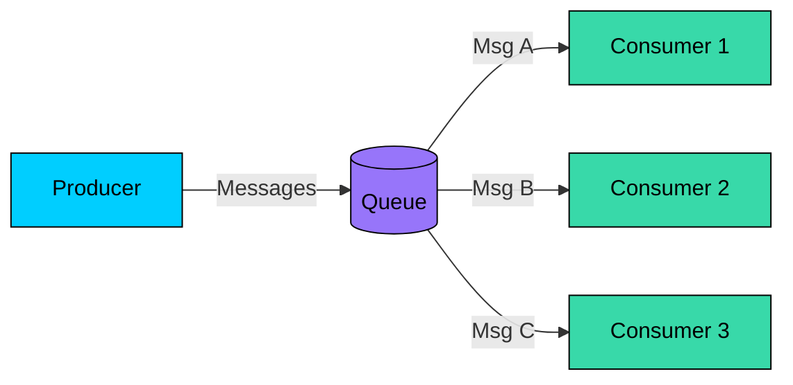
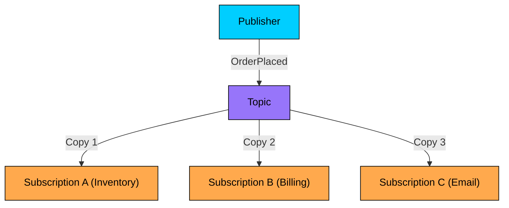
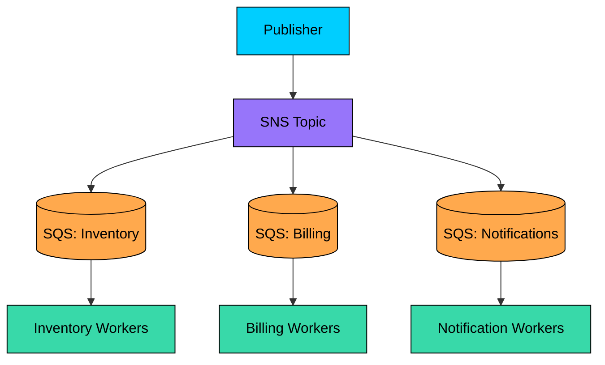
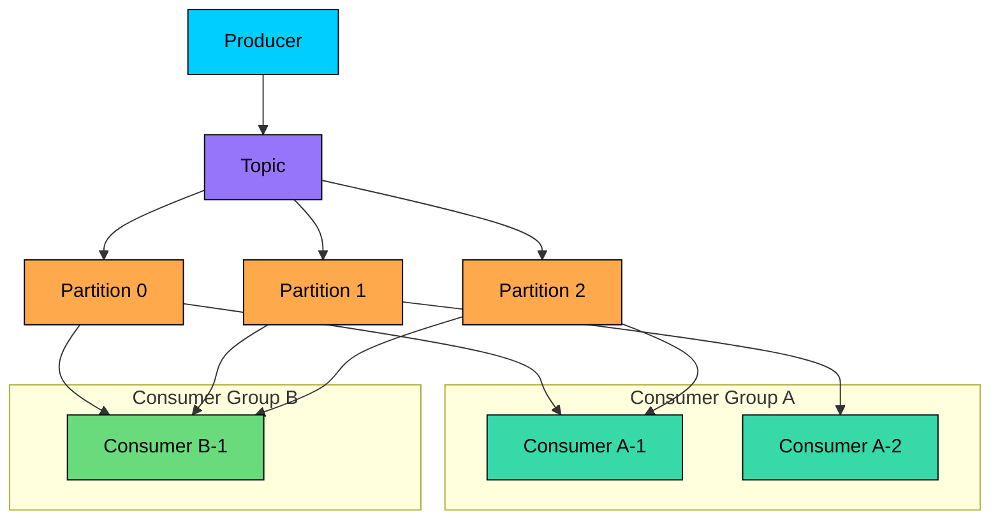
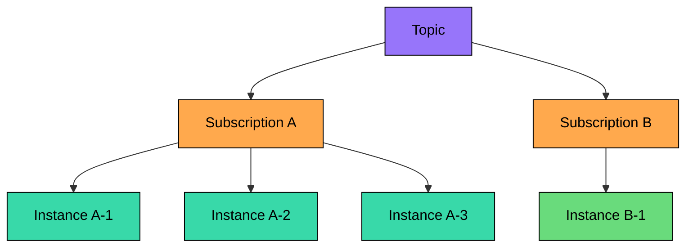

> Classifying how messages flow from producers to consumers: single-delivery work distribution, broadcast fan-out, partitioned consumer groups, and hybrid shared subscription models.

import { Aside, Steps, Tabs, TabItem } from "@astrojs/starlight/components";
import FlowSimulator from '/src/components/interactive/FlowSimulator.astro';
import DecisionGuide from '/src/components/interactive/DecisionGuide.astro';

<Aside type="tip" title="Prerequisites">

This note is part of the **[[system-design|Systems Design Track]]**. Before studying messaging patterns, make sure you understand:
- [[system-design/message-queues|Asynchronous Message Queues]]: Core broker vs log architecture, P2P vs Pub/Sub paradigms, and push vs pull delivery protocols.

</Aside>

[[system-design/message-queues|Asynchronous message queues]] decouple producers from consumers, but the *way* messages are distributed from a queue or topic to consumer instances determines throughput, ordering guarantees, and fault behavior. This note examines the four primary distribution patterns and when to choose each.

---

## Competing Consumers

In the competing consumers pattern, multiple consumer instances listen to a single queue. The broker delivers each message to **exactly one** consumer, distributing work across the pool.

### How it works

1. A producer pushes a message into the queue.
2. The broker selects one consumer from the pool and locks the message so no other consumer can see it. In [Amazon SQS](https://docs.aws.amazon.com/AWSSimpleQueueService/latest/SQSDeveloperGuide/sqs-visibility-timeout.html), this lock is called the **visibility timeout** (default: 30 seconds). In [RabbitMQ](https://www.rabbitmq.com/docs/consumers), a `basic.consume` call with manual acknowledgments holds the message until the consumer sends an ACK or NACK.
3. If the consumer processes successfully and acknowledges, the broker deletes the message. If the consumer crashes or the lock expires, the message becomes visible again for another consumer to pick up.

### Dispatch strategies

| Strategy | Behavior | Broker example |
| :--- | :--- | :--- |
| **Round-robin** | Broker rotates delivery across consumers one by one | RabbitMQ default (`basic.consume`) |
| **Weighted** | Consumers with more capacity receive proportionally more messages | Custom prefetch tuning |
| **Prefetch-limited** | Each consumer receives up to *N* unacknowledged messages at a time; slower consumers naturally receive fewer messages | RabbitMQ `prefetch_count`, SQS `MaxNumberOfMessages` |

<Aside type="caution" title="No ordering guarantee">
When multiple consumers pull from a single queue, **global message ordering is not preserved**. If Consumer 1 receives Message A before Consumer 2 receives Message B, there is no guarantee that Message A finishes processing first. If ordering matters, use partitioned consumer groups or a single consumer.
</Aside>

### When to use

*   **Task distribution**: Video transcoding, image resizing, PDF generation — work that can be parallelized across stateless workers.
*   **Load leveling**: Absorbing traffic spikes by queuing requests and processing at a steady rate.
*   **Background jobs**: Email sending, report generation, webhook delivery.

---

## Fan-Out

In the fan-out pattern, a publisher broadcasts a message to a **topic**, and every subscription attached to that topic receives its own independent copy. No message is shared — each subscriber processes the full stream.

### How it works

1. A publisher sends a message to a named topic.
2. The topic clones the message and delivers a copy to every registered subscription.
3. Each subscription processes its copy independently — one subscription's failure does not affect the others.

### Filtered fan-out

Not every subscriber needs every message. Most pub/sub systems support **subscription filters** that route only matching messages:

*   **[Amazon SNS](https://docs.aws.amazon.com/sns/latest/dg/sns-message-filtering.html)**: Message attribute-based filter policies on each subscription. The filter is evaluated at the SNS layer — non-matching messages are never delivered to the subscriber's queue.
*   **[Apache Kafka](https://kafka.apache.org/documentation/)**: Filtering is consumer-side. Kafka does not filter at the broker; consumers receive all messages from their assigned partitions and discard non-matching ones in application code.
*   **RabbitMQ**: Exchange types (`direct`, `topic`, `headers`) provide broker-side routing. A `topic` exchange matches routing keys with wildcard patterns like `orders.*` or `#.shipped`.

### The SNS → SQS fan-out pattern

A common AWS architecture combines [SNS fan-out with SQS queues](https://docs.aws.amazon.com/sns/latest/dg/sns-sqs-as-subscriber.html) as subscribers. SNS handles the broadcast, and each SQS queue provides durable, independently-scalable competing consumer processing:

This combines two patterns: fan-out (SNS broadcasts to all subscriptions) plus competing consumers (each SQS queue distributes work across its own worker pool).

### When to use

*   **Event-driven architectures**: Multiple decoupled services react to a single business event (order placed → inventory, billing, and notification services).
*   **CQRS and event sourcing**: Broadcasting state change events to build independent read models.
*   **Cross-domain notifications**: A payment service does not need to know which downstream services care about `PaymentCompleted`.

---

## Consumer Groups

Consumer groups solve the problem of scaling pub/sub consumers while preserving ordering. A consumer group is a set of consumer instances that **share** the partitions of a topic. Within a group, each partition is assigned to exactly one consumer — but different groups each receive the full stream independently.

### The one-partition-one-consumer constraint

In [Apache Kafka](https://kafka.apache.org/documentation/#consumerconfigs), a single partition is consumed by **at most one consumer** within a consumer group. This constraint guarantees that messages within a partition are processed in order by a single thread. If the number of consumers in a group exceeds the number of partitions, the extra consumers sit idle.

### Partition assignment strategies

When consumers join or leave a group, the group **rebalances** — partitions are redistributed. Kafka supports several [partition assignment strategies](https://kafka.apache.org/documentation/#consumerconfigs):

| Strategy | Behavior |
| :--- | :--- |
| **Range** | Partitions assigned to consumers in contiguous ranges. Consumer 1 gets partitions 0–2, Consumer 2 gets 3–5. |
| **Round-robin** | Partitions distributed one by one across consumers in rotation. |
| **Sticky** | Minimizes partition movement during rebalancing by keeping existing assignments stable. |
| **Cooperative Sticky** | Incremental rebalancing — only reassigns partitions that must move, avoiding stop-the-world pauses. |

### Consumer groups as a unifying model

Consumer groups unify the competing consumers and fan-out patterns:

*   **Competing consumers**: All consumers in one group → each message processed by exactly one consumer.
*   **Fan-out**: Multiple groups subscribe to the same topic → each group receives the full stream independently.

### When to use

*   **Ordered processing at scale**: Financial event streams, audit logs, user activity tracking where per-key ordering matters.
*   **Multi-team consumption**: Team A's consumer group processes for analytics while Team B's consumer group processes for billing — same topic, independent consumption.

---

## Shared Subscriptions

Shared subscriptions combine fan-out with competing consumers at the subscription level. A topic fans out to multiple subscriptions (each representing a different service), but within each subscription, messages are load-balanced across multiple consumer instances.

This is the model used by Google Cloud Pub/Sub and MQTT 5.0. Each subscription receives the full message stream (fan-out), but the subscription distributes individual messages across its pool of subscribers (competing consumers).

### Durable vs. ephemeral subscriptions

| Type | Behavior | Use case |
| :--- | :--- | :--- |
| **Durable** | Messages accumulate in a buffer while the subscriber is disconnected. On reconnect, all missed messages are delivered. | Business-critical processing where message loss is unacceptable |
| **Ephemeral** | Messages delivered only to currently connected subscribers. Disconnected subscribers miss messages permanently. | Real-time dashboards, live metrics, cache invalidation |

### When to use

*   **Microservice architectures** where each service needs the full event stream but runs multiple replicas for availability.
*   **Managed pub/sub platforms** (Google Cloud Pub/Sub, Azure Service Bus) that natively support subscription-level load balancing.

---

## Choosing a Pattern

<FlowSimulator
  title="Messaging pattern comparison"
  nodes={[
    { id: "producer", label: "Producer", col: 0 },
    { id: "broker", label: "Queue / Topic", col: 1 },
    { id: "consumer1", label: "Consumer 1", col: 2 },
    { id: "consumer2", label: "Consumer 2", col: 2 },
    { id: "consumer3", label: "Consumer 3", col: 2 },
  ]}
  flows={[
    { label: "Competing Consumers", steps: [
      { from: "producer", to: "broker", message: "Push Message A", description: "Producer sends Message A into the queue. The broker stores it until a consumer is available." },
      { from: "broker", to: "consumer1", message: "Deliver A (locked)", description: "Broker delivers Message A to Consumer 1 and locks it. No other consumer can see or process this message — this is the competing consumers guarantee." },
      { from: "producer", to: "broker", message: "Push Message B", description: "Producer sends Message B. The broker picks the next available consumer using round-robin or prefetch-based dispatch." },
      { from: "broker", to: "consumer2", message: "Deliver B (locked)", description: "Message B goes to Consumer 2. Each message is handled by exactly one consumer — multiple consumers share the load but never duplicate work." },
    ]},
    { label: "Fan-Out", steps: [
      { from: "producer", to: "broker", message: "Publish OrderPlaced", description: "Publisher broadcasts an OrderPlaced event to the Topic. The topic will clone the message to every subscription." },
      { from: "broker", to: "consumer1", message: "Copy → Inventory", description: "Subscription A (Inventory) receives its own copy. It will process the event independently.", group: 1 },
      { from: "broker", to: "consumer2", message: "Copy → Billing", description: "Subscription B (Billing) receives the same event. All subscriptions process the same event in parallel.", group: 1 },
      { from: "broker", to: "consumer3", message: "Copy → Email", description: "Subscription C (Email) receives the event too. Each subscription is fully independent — one failure doesn't affect the others.", group: 1 },
    ]},
    { label: "Consumer Group", steps: [
      { from: "producer", to: "broker", message: "Write to Partition 0", description: "Producer writes an event with key 'user-42' to the topic. The partition is determined by hash(key) % numPartitions." },
      { from: "broker", to: "consumer1", message: "Partition 0 → Consumer 1", description: "Partition 0 is assigned to Consumer 1 in Group A. All messages in this partition are processed in order by this single consumer." },
      { from: "producer", to: "broker", message: "Write to Partition 1", description: "Another event with a different key lands on Partition 1. Different partition, potentially different consumer." },
      { from: "broker", to: "consumer2", message: "Partition 1 → Consumer 2", description: "Partition 1 is assigned to Consumer 2 in Group A. Ordering is guaranteed within each partition, but not across partitions." },
    ]},
  ]}
  speed={1400}
/>

<DecisionGuide
  title="Which messaging pattern?"
  steps={[
    { id: "start", question: "Does each message need to reach multiple independent services?", options: [
      { label: "Yes — multiple services must react to the same event", next: "fanout-scale" },
      { label: "No — each message should be processed by exactly one worker", next: "r-competing" },
    ]},
    { id: "fanout-scale", question: "Does each service run multiple replicas that need to share the work within their subscription?", options: [
      { label: "Yes — each service has a worker pool that should load-balance", next: "ordering" },
      { label: "No — each service has one consumer instance", next: "r-fanout" },
    ]},
    { id: "ordering", question: "Do you need strict per-key ordering within each service's consumption?", options: [
      { label: "Yes — messages with the same key must be processed in order", next: "r-consumer-group" },
      { label: "No — ordering doesn't matter, just distribute work evenly", next: "r-shared-sub" },
    ]},
    { id: "r-competing", result: "Competing Consumers", explanation: "Use a simple queue with multiple workers pulling messages. Each message is delivered to exactly one consumer. Best for task queues, background jobs, and load leveling.", link: "#competing-consumers" },
    { id: "r-fanout", result: "Fan-Out (Pub/Sub)", explanation: "Use a topic with one subscription per service. Each subscription receives the full stream. Best for event-driven architectures where multiple decoupled services react to a single business event.", link: "#fan-out" },
    { id: "r-consumer-group", result: "Consumer Groups", explanation: "Use a partitioned topic with consumer groups. Each group gets the full stream; within a group, each partition is assigned to one consumer for ordered processing. Best for Kafka-style event streaming at scale.", link: "#consumer-groups" },
    { id: "r-shared-sub", result: "Shared Subscriptions", explanation: "Use a topic with subscription-level load balancing. Each subscription receives the full stream and distributes messages across its connected instances. Best for managed pub/sub platforms.", link: "#shared-subscriptions" },
  ]}
/>

---

## See Also

*   [[system-design/message-queues|Asynchronous Message Queues]] — Parent note covering broker vs log architecture and push vs pull delivery.
*   [[system-design/delivery-semantics|Delivery Semantics]] — At-most-once, at-least-once, exactly-once guarantees and idempotency strategies.
*   [[system-design/dead-letter-queues|Dead Letter Queues]] — DLQ patterns, retry strategies, and poison pill recovery.
*   [[system-design/distributed-transactions|Distributed Transactions & Saga Patterns]] — Coordinating multi-service state changes using compensating workflows.
*   [Apache Kafka Consumer Configuration](https://kafka.apache.org/documentation/#consumerconfigs) — Official Kafka docs on consumer groups, partition assignment, and rebalancing.
*   [Amazon SQS Visibility Timeout](https://docs.aws.amazon.com/AWSSimpleQueueService/latest/SQSDeveloperGuide/sqs-visibility-timeout.html) — Official AWS docs on message locking mechanics.
