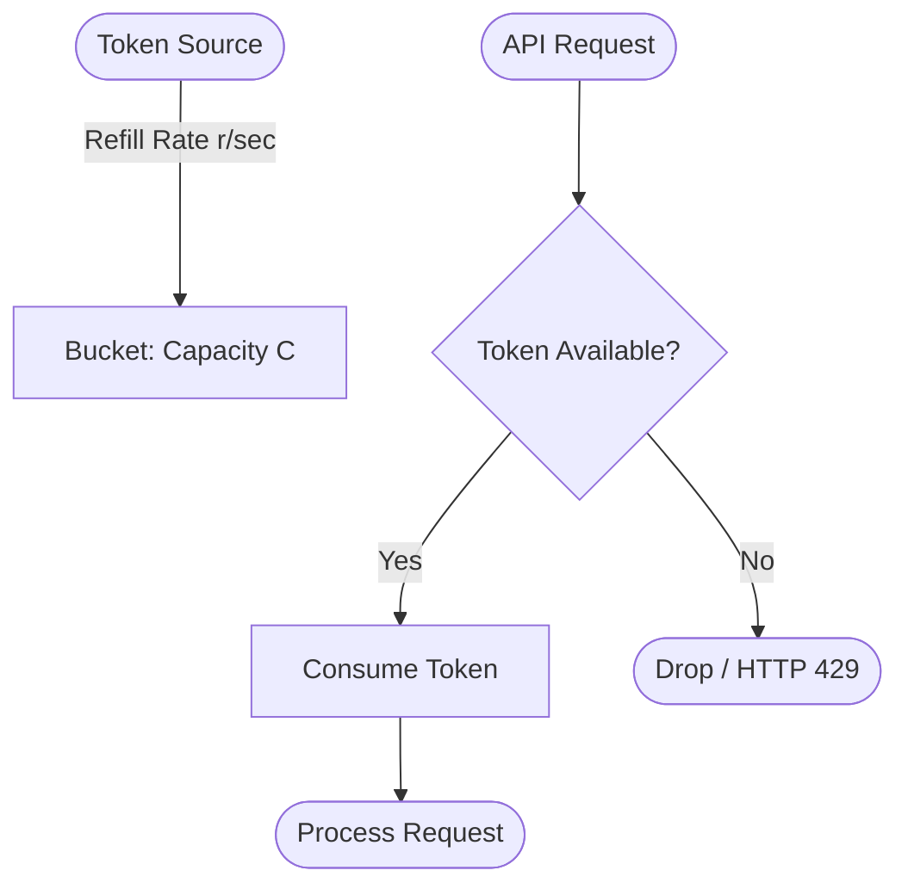
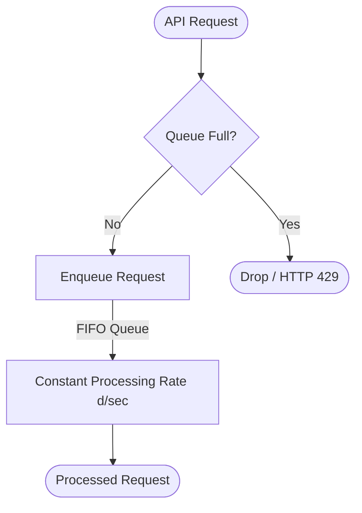

import { Aside, Steps, Tabs, TabItem } from "@astrojs/starlight/components";

> Foundational conceptual framework and mathematical algorithms for regulating API requests, defending downstream services, and shaping network traffic spikes.

<Aside type="tip" title="Prerequisites">

This note is part of the **[[system-design|Systems Design Track]]**. Before diving into rate limiting and traffic shaping, make sure you understand:
- [[system-design/message-queues|Asynchronous Message Queues]]: Master decoupled compute architectures, Pub/Sub channels, delivery semantics, and dead-letter recovery queues.
- [[system-design/back-of-the-envelope-estimation|Back-of-the-Envelope Estimation]]: Master performance limits, capacity planning constants, and throughput scaling math.
- [[system-design/distributed-caching|Distributed Caching]]: Master read/write caching strategies, Redis cluster topologies, and operational gotchas.

</Aside>

Rate limiting is the practice of monitoring and restricting the number of requests a client can make to a server or service within a specified timeframe. In large scale distributed systems, it acts as a primary defense mechanism, protecting database pools, computing layers, and third party APIs from cascading failures, denial of service (DoS) attacks, and resource exhaustion.

Without robust rate limiting, a single runaway client script or a coordinated credential stuffing attack can consume a cluster's entire request queue, starving legitimate traffic and inducing service wide downtime.

---

## Core Limiting Algorithms

Designing a rate limiter requires balancing mathematical accuracy, memory consumption, and runtime execution complexity. Five classic algorithmic primitives form the baseline of modern traffic shaping infrastructure.

### 1. Token Bucket

The Token Bucket algorithm models a bucket of fixed capacity that holds tokens. Tokens are added to the bucket at a constant fill rate. When a request arrives, the system attempts to draw a token from the bucket. If a token is available, the request is processed, and the token is consumed. If the bucket is empty, the request is rejected immediately.

*   **Mechanism**: A bucket with capacity $C$ fills with tokens at a rate of $r$ tokens per second.
*   **Burst Support**: Highly supportive. If a client is idle, the bucket fills up to $C$. When a spike of $C$ requests arrives simultaneously, they are all allowed through instantly, after which the rate is capped strictly at $r$ per second.
*   **Memory Efficiency**: Highly efficient. Requires storing only two fields: the current token count and the timestamp of the last replenishment.
*   **Use Case**: Standard APIs that experience natural traffic burstiness but require strict average limits over time.



### 2. Leaky Bucket

The Leaky Bucket algorithm models a bucket with a small hole at the bottom. Requests are poured into the bucket like water, forming a queue. The server processes requests at a constant, smooth rate by dripping them out of the bottom hole. If the inflow rate exceeds the outflow rate, the bucket fills up. Once the bucket is completely full, incoming water overflows, meaning new requests are dropped.

*   **Mechanism**: A queue of size $Q$ leaks requests at a constant output rate of $d$ requests per second.
*   **Burst Support**: None. It smooths out bursty traffic into a completely flat, predictable stream of processing.
*   **Memory Efficiency**: Low to medium. Requires maintaining a physical FIFO queue to hold the pending requests.
*   **Use Case**: Ingress processing for asynchronous worker threads or database write pipelines where downstream systems cannot tolerate sudden load variations.



### 3. Fixed Window Counter

The Fixed Window Counter divides time into static, equal sized windows (e.g., one minute windows starting at 12:00, 12:01, etc.). Each window maintains a single integer counter. Every incoming request increments the counter. If the counter exceeds the defined limit, requests are rejected until the current window expires and a new window resets the counter to zero.

*   **Mechanism**: If a request timestamp fits in the range of the current active window, the counter is incremented. If the counter exceeds the limit, the request is rejected.
*   **Burst Support**: Vulnerable to boundary bursts. A client can exploit this by sending all allowed requests at the very end of one window and another full batch at the very start of the next window. This results in double the rate limit passing through in a fraction of a single window size.
*   **Memory Efficiency**: Extremely high. Requires only one integer counter per client per active window.
*   **Use Case**: Simple rate limiting scenarios where absolute precision at window boundaries is not critical.

### 4. Sliding Window Log

The Sliding Window Log solves the boundary burst problem of the Fixed Window by keeping an accurate log of all request timestamps for each client. When a request arrives, the log is inspected, all timestamps older than the sliding window boundary are pruned, and the remaining log length is counted. If the length is less than the limit, the new timestamp is appended and the request is allowed.

*   **Mechanism**: Retains a sorted set of Unix timestamps representing previous request times.
*   **Boundary Precision**: 100% accurate. Bypassing the limit via boundary tricks is mathematically impossible.
*   **Memory Efficiency**: Poor. Because every request requires appending a new timestamp to a list, memory consumption scales linearly with the traffic volume, making it highly vulnerable to memory exhaustion under high QPS.
*   **Use Case**: High value, low volume operations (such as authentication challenges or password reset endpoints).

### 5. Sliding Window Counter

The Sliding Window Counter is a hybrid algorithm that combines the memory efficiency of the Fixed Window Counter with the boundary precision of the Sliding Window Log. Instead of storing every timestamp, it keeps track of only the request count of the current window and the request count of the previous window. When a request arrives, it estimates the request rate by calculating a weighted sum of both windows based on the exact progress through the current window.

*   **Mechanism**: The request rate is estimated as a weighted sum of the current and previous windows:
    
    `Rate = N_prev * (1 - (Current Window Progress / Window Size)) + N_curr`
    
    Where `N_prev` is the request count in the previous window, and `N_curr` is the request count in the current window.
*   **Boundary Precision**: Extremely high. Although it is an approximation, the error rate is under 5%, completely preventing boundary burst exploits without storing individual logs.
*   **Memory Efficiency**: Outstanding. Stores only two counters per client key.
*   **Use Case**: Production grade API gateways handling high volume public developer traffic.

---

## Architectural Comparison Matrix

| Algorithmic Criteria | Token Bucket | Leaky Bucket | Fixed Window | [Sliding Log](#typescript-sliding-window-log-limiter) | Sliding Counter |
| :--- | :--- | :--- | :--- | :--- | :--- |
| **Burst Tolerance** | Full (up to Capacity) | None (Smooth flow) | High (Vulnerable) | Full | Balanced |
| **Memory Footprint** | Extremely Low | Medium (Queue state) | Extremely Low | Extremely High | Extremely Low |
| **Boundary Accuracy** | High | High | Low (Double limit) | Absolute | High (Approximate) |
| **Implementation Complexity** | Low | Low | Low | High | Medium |
| **Primary Technology Fit** | API Gateways | Worker Queues | Simple Scripts | Redis / Memory Map | Production Gateways |

*Note: For detail on how standard clients use these concepts, check the [[nestjs/recipes/rate-limiting|NestJS Rate Limiting Recipe]].*

---

## TypeScript Sliding Window Log Limiter

Below is a self-contained, fully typed implementation of the Sliding Window Log algorithm. It illustrates how to perform precise log pruning and limit assertion using Unix millisecond timestamps.

```ts
export class SlidingWindowLimiter {
  private logs: Map<string, number[]> = new Map();

  /**
   * Evaluates if a request from a specific client is allowed under rate limits.
   * Evicts outdated timestamps and appends the new request time if allowed.
   *
   * @param clientId Unique identifier for the client session or IP
   * @param limit Maximum number of requests allowed in the window
   * @param windowMs Timeframe window in milliseconds
   * @returns boolean True if allowed, False if rate limited
   */
  public isAllowed(clientId: string, limit: number, windowMs: number): boolean {
    const now = Date.now();
    const boundary = now - windowMs;

    // Fetch existing request timestamps for the client
    const clientLogs = this.logs.get(clientId) || [];

    // Evict all timestamps that fall outside the current sliding window
    const activeLogs = clientLogs.filter(timestamp => timestamp >= boundary);

    // Evaluate against the configured limit
    if (activeLogs.length < limit) {
      activeLogs.push(now);
      this.logs.set(clientId, activeLogs);
      return true;
    }

    // Update the cleaned log even if request is blocked to save memory
    this.logs.set(clientId, activeLogs);
    return false;
  }

  /**
   * Explicitly purges expired entries to prevent memory leaks in long-running processes.
   *
   * @param windowMs Timeframe window in milliseconds
   */
  public pruneExpired(windowMs: number): void {
    const now = Date.now();
    const boundary = now - windowMs;

    for (const [clientId, clientLogs] of this.logs.entries()) {
      const activeLogs = clientLogs.filter(timestamp => timestamp >= boundary);
      if (activeLogs.length === 0) {
        this.logs.delete(clientId);
      } else {
        this.logs.set(clientId, activeLogs);
      }
    }
  }
}
```

---

## Deployment Architectures

Rate limiting can be deployed at multiple layers of a system. The choice of architecture dictates how latency, horizontal scalability, and application complexity behave.

```
[Client] ---> [API Gateway / Envoy] ---> [Application Tier] ---> [Redis Cache Tier]
                 (Layer 7 Limiter)         (Local Middleware)      (Distributed State)
```

### 1. Client-Side Limiting
Implementing rate limits within the client application (such as mobile apps or web frontends) before the network call is made.
*   *Pros*: Eliminates unnecessary network egress cost and gateway overhead. Excellent user experience if structured as optimistic delay queues.
*   *Cons*: Entirely untrusted. Any client can bypass the logic by calling the HTTP endpoint directly or spoofing the client SDK.

### 2. API Gateway / Reverse Proxy
Rate limiting is handled at the network edge via a dedicated proxy (e.g., Nginx, Envoy, or AWS API Gateway) before the request ever reaches application servers.
*   *Pros*: Zero overhead on application code. Rejects malicious traffic early, protecting thread pools and compute resources from starvation.
*   *Cons*: Complex routing rules. Can create a single point of failure (SPOF) if proxy layers are not scaled independently.

### 3. Distributed Cache Tier (Shared Middleware)
Application servers invoke a shared, centralized cache like Redis to store and evaluate rate limiting state.
*   *Pros*: Allows scaling the compute layer horizontally while maintaining a single, unified global limit across all servers.
*   *Cons*: Introduces network hops (1 to 2 milliseconds of latency) for every incoming request to inspect Redis state.

---

## Operational Security Gotchas

Deploying rate limiting in production environments exposes severe architectural vulnerabilities that can bypass defenses or block legitimate users if unaddressed.

<Aside type="caution" title="Production Rate Limiting Vulnerabilities">
Failure to secure the rate limiter can expose system gateways to resource starvation, partition desyncs, or spoofing attacks that bypass traffic regulation entirely.
</Aside>

### 1. Horizontal Race Conditions (The Read-Modify-Write Problem)

In distributed architectures where multiple application servers talk to a shared Redis cluster, rate limiting logic is vulnerable to concurrent write conflicts. If two requests for the same client land on two different servers at the same millisecond, both servers will query Redis for the current count, both will receive the same value (e.g., 99 out of 100), both will declare the request allowed, and both will increment the counter to 101. The limit has been breached.

#### The Solution: Atomic Operations
To resolve this, all rate limiting steps (read, check, increment) must execute as a single, atomic unit.
1.  **Lua Scripting**: Redis supports executing Lua scripts. Because Redis runs scripts in a single thread, the entire script runs without interruption from other commands:
    ```lua
    local key = KEYS[1]
    local limit = tonumber(ARGV[1])
    local window = tonumber(ARGV[2])
    
    local current = redis.call('get', key)
    if current and tonumber(current) >= limit then
        return 0
    else
        redis.call('incr', key)
        if not current then
            redis.call('expire', key, window)
        end
        return 1
    end
    ```
2.  **Redis Transactions**: Using `MULTI` and `EXEC` combined with `WATCH` on the client key to trigger optimistic lock rollbacks if another thread writes to the key during evaluation.

### 2. NAT Office Blocks (IP Rate Limiting Collisions)

Rate limiting purely by IP address is a dangerous default. Large offices, universities, or public Wi-Fi networks route thousands of independent devices through a single Network Address Translation (NAT) router. To the internet, this traffic appears as a single IP address.
*   **The Bug**: If a university has a rate limit of 100 requests per minute, a single active classroom can instantly consume the limit, blocking the entire university from accessing your site.
*   **The Mitigation**: For unauthenticated routes, use a hybrid fingerprint (IP + User Agent + Accept Headers). For authenticated routes, strictly route limiting logic by User ID or JWT API Keys instead of the physical IP address.

### 3. Reverse Proxy Trust (X-Forwarded-For Spoofing)

When rate limiting at the application layer behind a load balancer or CDN (such as Cloudflare or AWS ALB), the raw TCP connection IP will always be the internal IP of the load balancer. To get the real client IP, application servers inspect the `X-Forwarded-For` header.
*   **The Attack**: If the application server blindly trusts this header, a malicious client can send custom HTTP requests with a fake `X-Forwarded-For: 1.2.3.4` header. By randomizing this header value with each request, the attacker completely bypasses the rate limiter.
*   **The Mitigation**: Configure application web servers to trust `X-Forwarded-For` only from verified internal IP CIDR blocks (e.g., your VPC subnet). Explicitly strip out external client provided headers at the outer edge API Gateway layer.

---

## See Also

*   [[system-design/back-of-the-envelope-estimation|Estimation Primitives]]: Calculate total bandwidth and QPS limits needed for rate limit thresholds.
*   [[system-design/distributed-caching|Distributed Caching]]: Learn how to scale global rate limiting using high-performance Redis cache clusters.
*   [[system-design/message-queues|Asynchronous Message Queues]]: Use message queues to absorb spikes when traffic shaping requires queueing instead of dropping requests.
*   [[nestjs/recipes/rate-limiting|NestJS Rate Limiting Recipe]]: Hands-on implementation of application-level guards using NestJS Throttler.
*   [Redis Eval Command Documentation](https://redis.io/commands/eval/): Official API guide on scripting atomic operations in Redis database tiers.
